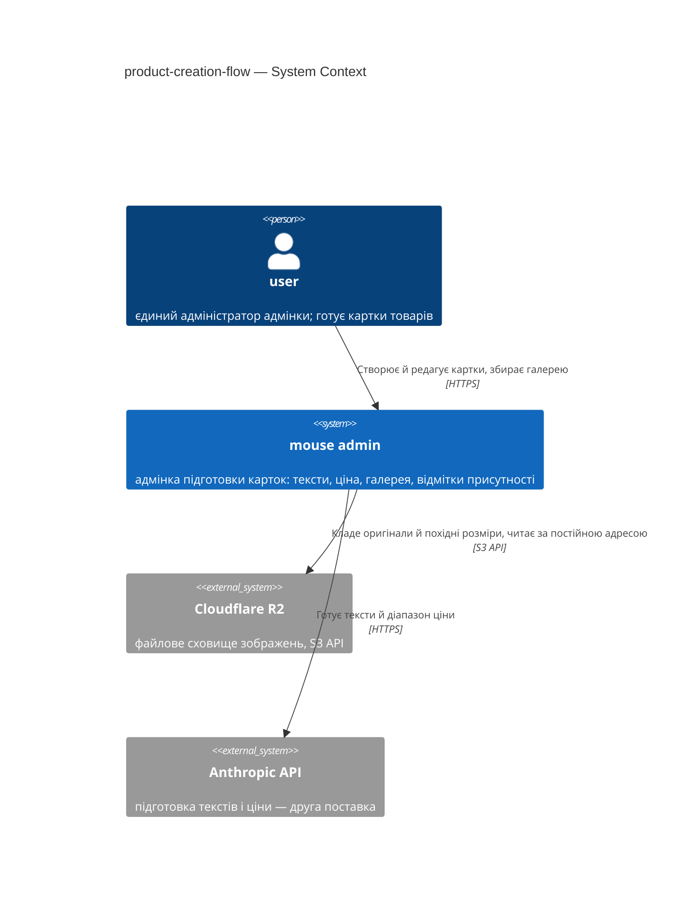
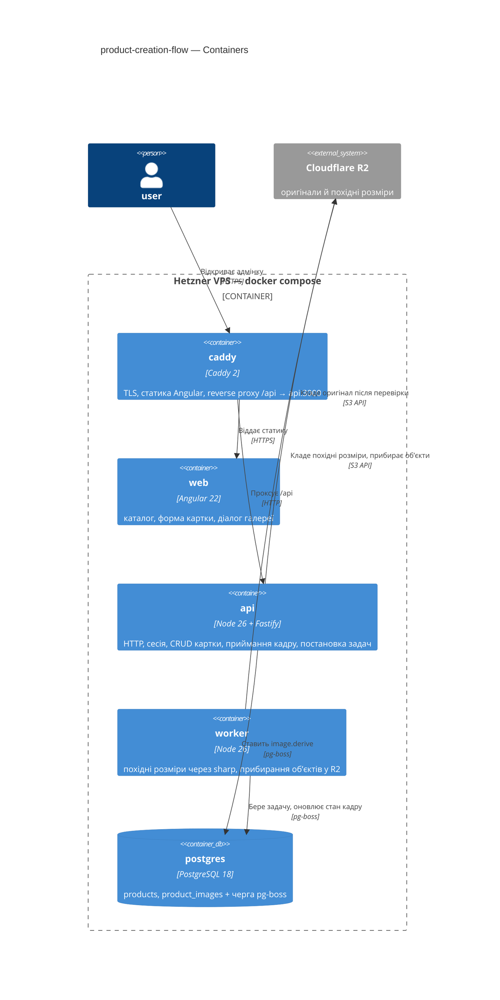

# C4 у Mermaid — довідка для §3 і §5

## TL;DR

C4 — чотири рівні архітектурних діаграм, як масштаб на карті:

- **L1 Context** — система як чорна скринька плюс люди й зовнішні системи. **Це §3.**
- **L2 Container** — що всередині: процеси, БД, черга, статика. **Це §5.**
- L3 Component і L4 Code — поза межами цього skill-а.

**Як читати елементи:**

- `Person(...)` — наш актор. `Person_Ext(...)` — зовнішній.
- `System(...)` — наша система. `System_Ext(...)` — чужа (R2, Anthropic API).
- `Container(...)` — процес або застосунок усередині нашої системи.
  `ContainerDb(...)` — наше сховище. `Container_Boundary(...)` — рамка навколо того,
  що розгортається разом.
- `Rel(звідки, куди, "що робить", "як")` — стрілка з підписом і протоколом.

**Кордон довіри** — лінія, за якою даним не вірять без перевірки. На L1 це межа між нашою
системою і зовнішніми; на L2 — рамка `Container_Boundary`.

---

Skill малює L1 інлайн у §3 і L2 інлайн у §5. Mermaid рендериться в GitHub нативно.

## L1 — System Context (`C4Context`)

У §3. Система однією скринькою плюс люди й зовнішні системи. 5-10 елементів.

**Типи елементів:** `Person`, `Person_Ext`, `System`, `System_Ext`, `SystemDb`,
`Rel(from, to, "підпис", "протокол")`.

**Правила:**

- Свою систему показуй **однією** скринькою. Розкладка — на L2.
- Зовнішня система — це інший власник, інший процес, інший життєвий цикл. Модулі всередині
  моноліту тут не з'являються.
- У цій системі **один актор** — `user`. Ролей немає (CONTEXT), тож `admin`, `manager`,
  `operator` вигадувати не треба.
- Postgres на L1 не показуємо: це наша власна БД усередині нашого ж розгортання, її місце
  на L2. R2 і Anthropic — показуємо: інший власник.
- 5-10 елементів. Більше — показуєш забагато.

## L2 — Container (`C4Container`)

У §5. Що всередині: процеси, сховища, статика.

**Типи елементів:** `Container_Boundary(id, "підпис") { … }`,
`Container(id, "ім'я", "технологія", "призначення")`, `ContainerDb`, `ContainerQueue`.

**Правила для цього проєкту:**

- Контейнер тут дорівнює сервісу з `docker-compose.yml`: `caddy`, `web`, `api`, `worker`,
  `postgres`. Не вигадуй інших.
- `api` і `worker` — **той самий образ з різною командою запуску**, але окремі контейнери:
  їхні життєві цикли різні, і саме це діаграма має показати.
- Черга живе **всередині** `postgres` — окремого `ContainerQueue` немає. Це рішення проєкту
  (без Redis і RabbitMQ), і діаграма не має його приховувати: підпис `postgres` називає
  обидві ролі.
- Модулі моноліту (`products`, `media`, `auth`, `ai`) показуй окремими `Container`
  усередині `api`, **тільки** якщо фіча зачіпає межу між ними й це головна думка §5.
  Інакше вони лише додають коробок.
- R2 і Anthropic — поза рамкою: інший власник.
- Реплік, балансувальника й кластерів немає. Не малюй їх.

## Часті помилки

- **Змішування рівнів.** Клас або функція всередині L2 — це L3. Або відступи на рівень
  вище, або лишай поза діаграмою.
- **Одруки в `Container_Boundary`.** `Container_Bondary`, `ContainerBoundary` — Mermaid
  мовчки малює порожній блок, помилки не буде.
- **`Rel` на ще не оголошений елемент.** Спершу всі `Person` / `Container` / `System*`,
  потім усі `Rel`.
- **Модулі моноліту на L1.** L1 — це бізнес-межа. `products` на L1 означає, що ти вже на L2.
- **`Rel` без підпису або протоколу.** «З'єднано» не каже нічого. Завжди: що робить і як.
- **Заглушки шаблону** — `Person(user, "<User>", "<роль і намір>")` у готовому документі.
  Це ловить і регексна перевірка кроку 8, і критик класом F5.

## Перевірка перед комітом

Найпростіше — відкрити файл на GitHub або в редакторі з рендером Mermaid: обидва падають
голосно на синтаксисі. Регексна перевірка кроку 8 ловить оголошення після `Rel`, одруки в
`Container_Boundary`, обрізані блоки й залишені заглушки.

## Коли діаграма не влазить

- L2 понад 10-15 елементів — швидше за все, фіча описує дві межі й проситься на дві поставки
  (пор. §1: розділення на поставки — легітимне рішення).
- L1 з 15 зовнішніми системами — це вже опис організації, а не фічі. Лиши те, з чим фіча
  говорить напряму.
