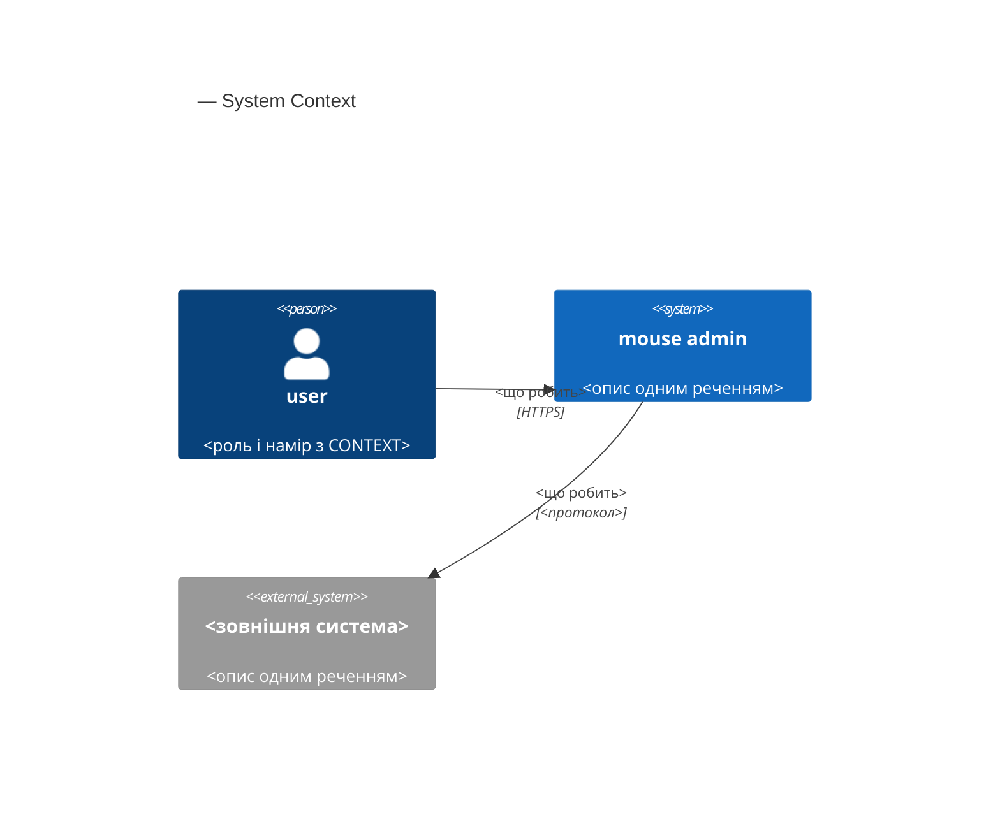
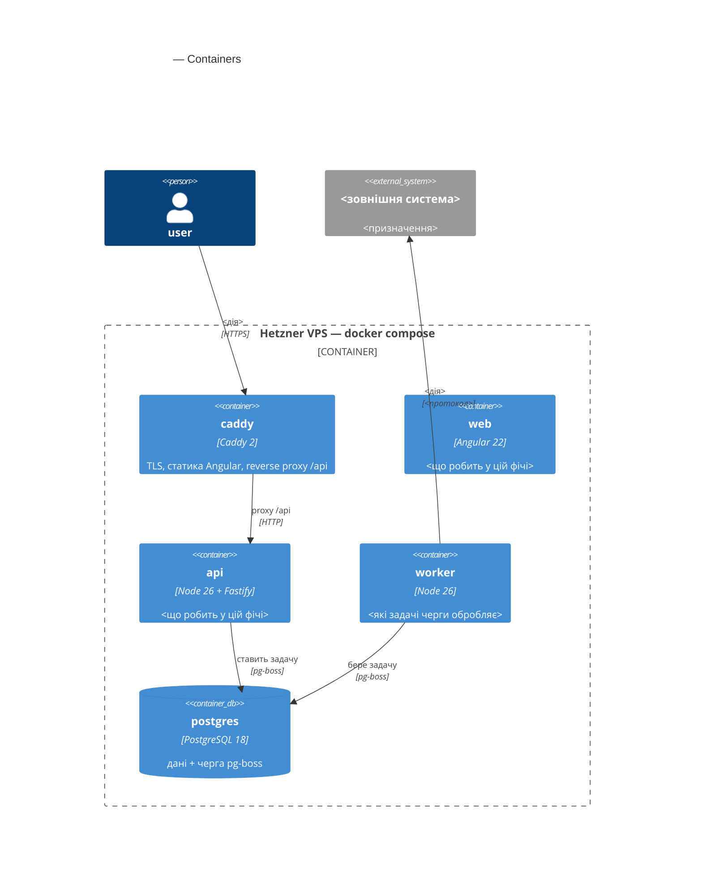
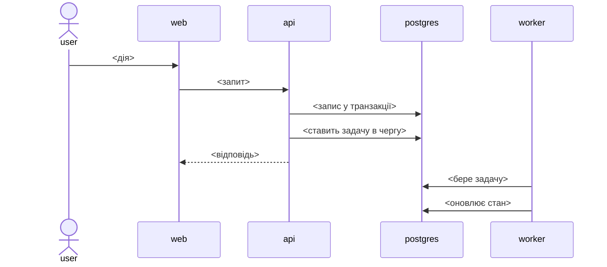

# Software Architecture Document — <slug>

<!-- Етапи 04-05 → ../../../.claude/skills/feature-architecture-design/SKILL.md          -->
<!-- 12 секцій Arc42. Порожня секція — тільки як <!-- N/A: <причина одним рядком> -->.    -->
<!-- C4 Context (L1) інлайн у §3, C4 Container (L2) інлайн у §5. L3/L4 поза межами.      -->
<!-- Тіло документа — українською; заголовки секцій, ключі frontmatter, ідентифікатори   -->
<!-- коду, шляхи, назви таблиць і статуси — англійською.                                 -->
<!-- Заповнений приклад у цьому ж репозиторії: docs/features/product-creation-flow/sad.md -->

> **Стадії SDLC 04-05.** Вхід: [PRD](PRD.md) · [CONTEXT](../../../CONTEXT.md).
> Рішення — у [adr/](adr/), зворотний індекс на них — у §9.
> C4 Context (L1) — інлайн у §3, C4 Container (L2) — інлайн у §5; рівень L3 поза межами документа.

## 1. Introduction and goals

<!-- 🎯 Навіщо: стабільна пам'ять про «що будуємо + три головні якості + хто зацікавлений». -->
<!--           Через рік ніхто не згадає на словах, ЯКІ ТРИ ЯКОСТІ були критичні.           -->
<!-- 📋 Що писати: 1 абзац intent + 3 однорядкові якості + таблиця stakeholders.            -->
<!--           Якщо під час проходу фіча розділилася на поставки — окремий абзац про те,    -->
<!--           що входить у цю, а що виїхало в наступну (і рядок про це в §11).             -->
<!-- 📌 Приклад: «QG-2 Незаблокований інтерфейс — прев'ю ≤ 1 с, форма не блокується».       -->
<!-- ¶4 «Decision overrides» дописує крок 8, коли користувач перекриває знахідку критика.    -->

**Intent.** <Один абзац із PRD §2 Goals — що будуємо і для кого. Посилання на PRD §-и.>

**Top-3 quality goals** (однорядково; повні сценарії — у §10):

1. <напр. «Стійкість до часткової відмови зовнішніх сервісів» — з посиланням на рядок PRD §6>
2. <напр. «Незаблокований інтерфейс під час довгих операцій»>
3. <напр. «Готовність форми даних до наступної поставки»>

**Stakeholders.**

<!-- У цьому проєкті одна людина суміщає всі ролі. Не вигадуй SRE / DevOps / PM.          -->
<!-- `user` з CONTEXT — це роль у продукті (єдиний адмін), а не учасник процесу розробки.   -->

| Role | Interest | Sign-off owner? |
|---|---|---|
| Serhii (Architect / Tech Lead / dev) | <що саме його цікавить у цій фічі> | Yes |
| `user` (єдиний адміністратор адмінки) | <що змінюється в його роботі> | No |

## 2. Constraints

<!-- 🎯 Навіщо: §4 (стратегія) працює тільки коли §2 зафіксувала, ЩО ВЖЕ ЗАФІКСОВАНО.      -->
<!--           Це вхід, не вихід. Джерела: CLAUDE.md, ARCHITECTURE.md, package.json.        -->
<!-- 📋 Що писати: чотири блоки — Технічні / Організаційні / Конвенції / Регуляторні.       -->
<!-- 📌 Приклад: «Postgres 18» (не «Postgres»); «TypeScript 6.0.3 — жорсткий пін».          -->
<!-- Версії бери з CLAUDE.md таблиці стеку й package.json, не з пам'яті.                    -->

**Technical.** <Тільки те, що ця фіча реально зачіпає — не переписуй усю таблицю стеку.>

- Node 26, ESM, Fastify; бекенд збирається `tsc` у `dist/` (декоратори TypeORM).
- TypeScript 6.0.3 — жорсткий пін (Angular 22 вимагає `>=6.0 <6.1`).
- PostgreSQL 18 + TypeORM; `typeorm` і `pg` згадуються тільки в `*Repository.ts` і entity.
- Angular 22 — standalone, signals, zoneless; Angular Material.
- <решта — лише те, що фіча вводить або зачіпає: pg-boss, R2, sharp, Anthropic, Caddy>

**Organisational.**

- Один розробник; обсяг системи — 50-100 товарів на місяць, один-два адміни.
- <Орієнтир зусиль з idea-brief §12 Feasibility, якщо він є. Немає — `<TBD>` + рядок у §11.>

**Conventions.**

- Правила залежностей і межі шарів — `CLAUDE.md` (корінь) + `apps/web/CLAUDE.md`
  + `CLAUDE.md` зачеплених модулів; машинна перевірка — `apps/api/.dependency-cruiser.cjs`.
- Три шари виражені **суфіксом класу** (`*Controller.ts` → `*Service.ts` → `*Repository.ts`),
  а не каталогами; підпапки заводяться, коли в модулі стає понад десяток файлів.
- Залежності приходять конструктором; створює їх тільки composition root
  (`src/api.ts`, `src/worker.ts`, скрипти `db/`).
- <Конвенції, які фіча зачіпає окремо: гроші як десятковий рядок, `timestamptz`, snake_case у SQL.>

**Regulatory / external.**

- <З PRD §6.1: класифікація даних, чи потрібне security review, які abuse cases застосовні.>
- <Якщо персональних даних немає — так і напиши: це теж рішення.>

## 3. Context and scope

<!-- 🎯 Навіщо: малює КОРДОН СИСТЕМИ — хто говорить з нею ззовні, де закінчується довіра.   -->
<!--           Без §3 §5 і §8 (авторизація) розпливаються.                                  -->
<!-- 📋 Що писати: 2-3 речення бізнес-контексту + таблиця зовнішніх систем + C4Context.     -->
<!-- 📌 «Зовнішніх систем ця фіча не вводить» — теж повноцінна відповідь, якщо це правда.   -->
<!-- Кордон довіри — лінія, за якою даним не вірять без перевірки.                          -->

<Бізнес-контекст у 2-3 реченнях: що система робить і для кого.>

**External systems (in / out):**

| Actor or system | Type | Interaction |
|---|---|---|
| `user` | Person | <що робить у межах цієї фічі> |
| <напр. Cloudflare R2> | System (external) | <читання / запис, за яким протоколом> |
| <напр. Anthropic API> | System (external) | <що саме викликається> |

**C4 Context (L1):**

<!-- Актори — з CONTEXT.md глосарію, дослівно. Зовнішні системи — ті, що фіча реально      -->
<!-- зачіпає. 5-10 елементів. Внутрішні модулі моноліту тут НЕ показуються — вони в §5.     -->



## 4. Solution strategy

<!-- 🎯 Навіщо: 3-4 СТРАТЕГІЧНІ СТОВПИ, з яких ростуть усі ADR. Без §4 кожен ADR виглядає  -->
<!--           випадковим. ⭐ Найгустіша секція — ADR-gate спрацьовує тут майже завжди.     -->
<!-- 📋 Що писати: 3-4 вибори. На кожен — заголовок-твердження + 2-3 речення обґрунтування  -->
<!--           з посиланням на конкретну якість §1 і конкретне обмеження §2.                -->
<!-- 📌 Заголовок називає РІШЕННЯ, не тему: «Генерація ніколи не пише в поля картки»,       -->
<!--           а не «Стратегія зберігання згенерованого».                                   -->

**Стратегічні вибори (насіння для ADR):**

### S1. <твердження-рішення>

<2-3 речення: що саме обрано і чому — з посиланням на якість §1 і обмеження §2.>

### S2. <твердження-рішення>

<2-3 речення.>

### S3. <твердження-рішення>

<2-3 речення.>

Кожне тактичне рішення пізніших секцій має зводитися до одного з цих стовпів. Тактичне
рішення, яке стовпу *суперечить*, — червоний прапорець: виноси його в §11.

## 5. Building block view

<!-- 🎯 Навіщо: ВНУТРІШНЯ ДЕКОМПОЗИЦІЯ — модулі, процеси, БД. Статична топологія:          -->
<!--           хто з ким має право говорити. Без §5 у §6 немає словника учасників.          -->
<!-- 📋 Що писати: 1 абзац про стиль + перелік файлів на модуль + C4Container.              -->
<!-- 📌 УВАГА: у цьому проєкті шари — це СУФІКСИ КЛАСІВ у пласкій папці модуля, а не        -->
<!--           каталоги domain/app/infra/ports. Не вигадуй вкладеність, якої тут немає.     -->
<!--           Модуль ходить до модуля тільки через його index.ts; deep import заборонено.  -->

<Один абзац: який модуль розширюємо, який заводимо, чому саме так лягає межа. Посилання
на правило CLAUDE.md, яке цю межу тримає.>

**Файли, які фіча додає або змінює:**

```
apps/api/src/modules/<module>/
├── <Entity>.ts              entity: @Entity, колонки
├── <Entity>Repository.ts    єдине місце, де згадуються typeorm і pg
├── <Entity>Service.ts       бізнес-логіка; про HTTP не знає
├── <Entity>Controller.ts    HTTP: zod-валідація, куки, мапінг у DTO
└── index.ts                 public API модуля

apps/api/src/contracts/
├── <feature>.contract.ts    zod-схеми; фронт бере звідси ТІЛЬКИ типи
└── <feature>-limits.ts      константи контракту; фронт імпортує в рантаймі

apps/api/db/migrations/<timestamp>-<name>.ts
apps/web/src/app/<feature>/...
```

<!-- Перелічуй те, що фіча реально створює. Композиційні точки — api.ts, worker.ts,        -->
<!-- migrations-list.ts — назви окремо: файл легко створити й забути під'єднати.            -->

**C4 Container (L2):**

<!-- Контейнери цієї системи: caddy, api (Fastify), worker, postgres (дані + черга pg-boss),-->
<!-- статика Angular. Модулі моноліту показуй як контейнери всередині межі api, якщо це     -->
<!-- допомагає читанню. Зовнішні сховища й сервіси — поза межею.                            -->



## 6. Runtime view

<!-- 🎯 Навіщо: ПОТІК У RUNTIME для критичних сценаріїв — хто, з ким, коли і в якому        -->
<!--           порядку. Без §6 §5 — купа коробок без життя.                                 -->
<!-- 📋 Що писати: Mermaid sequenceDiagram на сценарій. Учасники — імена з §5, не нові.     -->
<!--           Повідомлення семантичні («ставить задачу image.derive»), БЕЗ HTTP-методів    -->
<!--           і шляхів — ендпоінт-рівневі діаграми народжує етап 10 (api-forge).           -->
<!-- 📌 XS/S — 1 сценарій. M і більше — 3-5, і серед них обов'язково хоча б один про        -->
<!--           відмову: зовнішній сервіс недоступний, задача впала після трьох повторів.    -->

**Сценарій 1: <назва — happy path>**



**Сценарій 2: <відмова — напр. зовнішній сервіс недоступний>**

<Що саме лишається цілим, скільки повторів, у якому стані застрягає об'єкт і чи лишається
він робочим. Числа — з рядка PRD §6 про відмову зовнішнього сервісу.>

## 7. Deployment view

<!-- 🎯 Навіщо: топологія, яку треба знати, не читаючи docker-compose.yml.                  -->
<!-- 📋 Що писати: 2-3 речення про топологію + що змінюється в розгортанні + як помітити    -->
<!--           збій. Джерело — ARCHITECTURE.md ## Розгортання.                              -->
<!-- 📌 УВАГА: тут один VPS і docker compose. Немає Kubernetes, реплік, балансувальника,    -->
<!--           Prometheus, алертів і чергового. Не вигадуй їх і не став порогів             -->
<!--           масштабування «на майбутнє» — при 50-100 товарах на місяць їх нема з чого    -->
<!--           виводити. Якщо стеки метрик і алертів відсутні — так і напиши, і винеси      -->
<!--           це у «Прийнятий борг» §11.                                                   -->

<Топологія у 2-3 реченнях: що фіча додає до наявного розгортання — новий контейнер,
нову змінну оточення, новий том, новий ліміт у Caddy. Нічого не додає — так і напиши.>

**Конфігурація, яку фіча вводить:**

| Що | Рівень | Де живе |
|---|---|---|
| <напр. ліміт розміру тіла запиту> | константа бекенду | `apps/api/src/config.ts` |
| <напр. креденшели R2> | секрет | `process.env`, зразок у `.env.example` |

<!-- Три рівні конфігурації розрізняються жорстко (CLAUDE.md): environment.ts — публічний  -->
<!-- бандл фронту; config.ts — константи в коді; process.env — тільки секрети й машинозалежне.-->
<!-- Критерій: однакове на всіх машинах — це константа, а не env.                           -->

**Як помічається збій:** <стан у БД, видимий у інтерфейсі; `docker compose logs -f worker`;
що саме шукати в pino-логах.>

## 8. Crosscutting concepts

<!-- 🎯 Навіщо: НАСКРІЗНІ ПАТЕРНИ, які перетинають кілька модулів. ⭐ Друга найгустіша.     -->
<!--           Патерн усередині одного модуля — не сюди. Конвенція проєкту загалом — у      -->
<!--           CLAUDE.md, а сюди йде рядок з посиланням на неї.                             -->
<!-- 📋 Що писати: таблиця концепт / конвенція / де визначено. Дефолт — «успадковано з      -->
<!--           CLAUDE.md»; окремий рядок пишеться, тільки коли фіча щось змінює.            -->

| Concept | Convention | Where defined |
|---|---|---|
| Логування | pino, JSON, structured; у логи не потрапляють паролі, токени, ключі, тіла зображень | `CLAUDE.md` · `src/logger.ts` |
| Авторизація | JWT (`jose`, HS256) у httpOnly-cookie; ролей немає, перевірка одна — активна сесія | `modules/auth/CLAUDE.md` |
| Помилки | `AppError` у `src/errors.ts`; доменні — у своєму модулі; один error-handler у `api.ts`; текст користувачу фронт формує за `code` | `CLAUDE.md` · `contracts/error.contract.ts` |
| Валідація | zod-схема на межі, у `*Controller.ts`; схеми — в `contracts/*.contract.ts` | `CLAUDE.md` |
| Гроші | `decimal(12,2)` у БД, десятковий рядок у коді; без transformer'ів і без float | `CLAUDE.md` |
| Час | `timestamptz`, UTC у БД, форматування на клієнті | `CLAUDE.md` |
| Черга | pg-boss поверх Postgres; задачі ідемпотентні | `src/queue.ts` |
| <концепт, який фіча вводить> | <конвенція> | <тут або ADR-NNNN> |

## 9. Architecture decisions

<!-- 🎯 Навіщо: ЗВОРОТНИЙ ІНДЕКС на теку adr/. `ls adr/` дає файли, §9 дає семантику —      -->
<!--           чому вони існують і до якої секції прив'язані.                               -->
<!-- 📋 Що писати: таблиця, рядок на ADR + абзац про рішення, свідомо лишені inline.        -->
<!-- 📌 Нумерація наскрізна на весь репозиторій — продовжує docs/adr/.                      -->

| # | Title | Status | Section |
|---|---|---|---|
| [NNNN](adr/NNNN-<title>.md) | <назва-рішення в наказовій формі> | Accepted | §<N> |

Файли лежать у `docs/features/<slug>/adr/`. Нумерація **наскрізна на весь репозиторій** і
продовжує `docs/adr/` (рішення рівня системи), щоб посилання «ADR NNNN» ніколи не було
двозначним. Наступний вільний номер шукається по обох теках.

Рішення, свідомо лишені inline, без окремого файлу: <перелік із однорядковим поясненням,
чому кожне не пройшло blast-radius gate — зазвичай «зворотне за години» або
«внутрішнє для одного модуля».>

## 10. Quality requirements

<!-- 🎯 Навіщо: ДЕРЕВО ЯКОСТЕЙ — беремо мету з §1 і розкладаємо на те, що можна довести.    -->
<!-- 📋 Що писати: на кожну якість §1 — When / Then / How verify.                           -->
<!-- 📌 Числа беруться з PRD §6 ДОСЛІВНО: не округлюй ≤ 500 мс до ≤ 1 с і не вигадуй p99,   -->
<!--           якщо PRD називає лише p95. Це F6-помилка критика.                            -->
<!-- ⚠ ПРАВИЛО ЦЬОГО ПРОЄКТУ: числовий таргет ставиться лише на власну поведінку системи.   -->
<!--   Латентність, яку визначає мережа користувача або сторонній сервіс (R2, Anthropic),   -->
<!--   таргета не отримує. Її місце — рядок «Спостереження без порога»: величина пишеться   -->
<!--   в логи й переглядається, але провалом не вважається. Замість метрики часу для        -->
<!--   зовнішнього виклику пропонуй метрику надійності («доходить до результату або до      -->
<!--   явної помилки»). Якщо PRD §6 порушує це правило — не копіюй помилку, а винеси        -->
<!--   правку PRD у §11.                                                                    -->

Кожна з якостей §1 розгорнута в повний сценарій. Числа взяті з PRD §6 дослівно.

**QG-1. <назва якості>**

- **When:** <тригер>
- **Then:** <очікувана поведінка з числами з PRD §6>
- **How verify:** <конкретика: який прогін, скільки повторів, звідки береться величина.
  Не «інтеграційний тест», а «20 повторів на стенді, тривалість запиту з pino-логів».>

**QG-2. <назва якості>**

- **When:** / **Then:** / **How verify:**

**QG-3. <назва якості>**

- **When:** / **Then:** / **How verify:**

**Додаткові вимоги поза топ-3** (з PRD §6, без окремого QG): <рядки PRD, які не стали
однією з трьох головних якостей, але лишаються вимогами.>

**Спостереження без порога:** <величини, які пишемо й дивимось, але таргета їм не ставимо,
бо їх визначає не наш код. З поясненням, чому саме.>

## 11. Risks and technical debt

<!-- 🎯 Навіщо: ⭐ збирає все, що може зламатись — і не лише технічне. Без §11 ризики       -->
<!--           губляться, а борг лишається в голові того, хто його прийняв.                 -->
<!-- 📋 Що писати: таблиця ризик — серйозність — мітигація — власник; окремо «Прийнятий     -->
<!--           борг». Severity: Low / Medium / High; для рядків Save-as-OQ — «Open question».-->
<!-- 📌 Сюди ж ідуть РОЗХОДЖЕННЯ З ПІДПИСАНИМИ ДОКУМЕНТАМИ, які прохід виявив:              -->
<!--           рядок PRD, який суперечить ADR; обіцянка SPEC.md, якої архітектура не        -->
<!--           виконує; конвенція CLAUDE.md, яку рішення перекриває. Кожне — з owner і due  -->
<!--           («до `break-tasks`»). Це головний вихід цієї секції, а не формальність.      -->

| Risk / debt | Severity | Mitigation | Owner |
|---|---|---|---|
| <ризик> | High/Medium/Low | <мітигація + **Due:** якщо це розходження, яке треба закрити> | Serhii |
| Open architectural decision: <заголовок> | Open question | Resolve before <етап або YYYY-MM-DD>; <обґрунтування користувача дослівно> | <owner> |

**Прийнятий борг** (свідомо лишений у цій поставці, план виправити пізніше):

- <що саме, чому прийнятно зараз, що коштуватиме виправити й коли тригер перегляду.>

## 12. Glossary

<!-- 🎯 Навіщо: ⭐ словник домену, який припиняє суперечки через рік.                       -->
<!-- 📋 Що писати: терміни з CONTEXT.md дослівно (він канонічний) + терміни, що народилися  -->
<!--           під час проходу, позначені **(новий)**.                                      -->
<!-- 📌 Зберігай форму NOT-перехресних посилань CONTEXT.md («NOT оголошення на майданчику»)  -->
<!--           — вона й відрізняє глосарій від переліку слів.                               -->
<!-- Наприкінці — рядок про те, що терміни **(новий)** варто перенести в CONTEXT.md.         -->

| Term | Meaning |
|---|---|
| <термін з CONTEXT> | <визначення дослівно з CONTEXT, разом з NOT-рядком> (CONTEXT) |
| <новий термін> **(новий)** | <визначення + NOT-рядок> |

Терміни, позначені **(новий)**, варто перенести в `CONTEXT.md` — вони вже вживаються в
цьому SAD і будуть вживатися на етапах 08 і 10.
