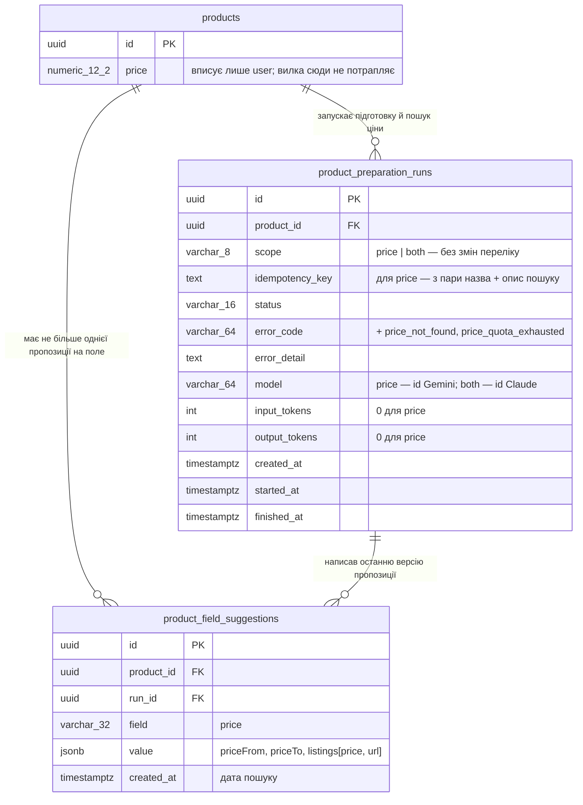

# Data model — price-range-search

Прохід brownfield, і схему він **не змінює**: жодної нової таблиці, колонки, індексу чи
міграції. Усе, що фіча зберігає, лягає в наявні колонки. Вилка з оголошеннями йде в `jsonb`
`product_field_suggestions.value`
([ADR 0022](adr/0022-keep-price-listings-inside-the-price-suggestion.md)), нові коди невдачі — у
`product_preparation_runs.error_code` (`varchar(64)` без CHECK), id моделі Gemini — у
`product_preparation_runs.model`
([ADR 0025](adr/0025-keep-gemini-calls-out-of-the-token-ledger.md)).

Документ фіксує форму `value` для поля `price`. Від неї залежить контракт етапу 10
(`fieldSuggestionSchema` у `products.contract.ts`), а БД цієї форми не перевіряє. Ще документ
закриває питання ADR 0022 №4 про старі рядки `price` без `listings`.

## ER diagram



## Aggregate roots

Корінь — `products`. Запуски й пропозиції видаляються разом з карткою (`on delete cascade` на
обох `product_id`), а пропозиція — ще й разом із запуском, що її написав (`run_id`). Фіча нового
агрегату не заводить.

Оголошення-джерела власного життя не мають: народжуються, замінюються й видаляються разом з
вилкою. Тому вони лежать усередині `value` пропозиції `price`, а не окремою таблицею з FK на
картку. Жоден екран не читає оголошень окремо від вилки, а один upsert замінює вилку й джерела
атомарно (ADR 0022).

Поза агрегатом лишається виклик Gemini: окремого рядка на виклик немає, токени Gemini йдуть лише
в pino-лог `worker` (ADR 0025). Search Suggestions Google не зберігаються ніде
([ADR 0024](adr/0024-show-only-the-range-and-listing-links.md)).

## Entities

### `products` — без змін

Створена міграцією `1787756956906-create-products-tables`. Цей прохід її не змінює: вилка не пише
в `products.price` (AC-06), колонку змінює лише збереження картки user-ом.

### `product_preparation_runs` — без змін схеми, нові значення

Створена міграцією `1789736913481-create-preparation-tables`, `error_detail` — `1790004050193`,
частковий UNIQUE на `idempotency_key` — `1791042544223`. Колонки ті самі, нові лише значення:

| Column | Type | Constraints | Що змінює фіча |
|---|---|---|---|
| `scope` | VARCHAR(8) | NOT NULL, CHECK IN (`texts`, `price`, `both`, `field`) | нічого: `price` і `both` уже в переліку, тепер ведуть на Gemini (ADR 0020) |
| `idempotency_key` | TEXT | NOT NULL, частковий UNIQUE для `queued`/`running` | для `price` рахується з пари назва + опис, що піде в пошук, а не зі збереженої картки ([ADR 0021](adr/0021-search-prices-from-the-run-input-not-the-saved-card.md)) |
| `error_code` | VARCHAR(64) | NULL, **без CHECK** | + `price_not_found`, `price_quota_exhausted` поруч із `price_unavailable`, `preparation_failed` ([ADR 0023](adr/0023-classify-price-search-failures-and-never-retry-them.md)) |
| `model` | VARCHAR(64) | NOT NULL | запуск `price` — `config.ai.priceSearch.model` (`gemini-2.5-flash` чи `gemini-2.5-flash-lite`, ≤ 21 символ); запуск `both` — модель Claude, бо `model` означає «модель текстів» (ADR 0025) |
| `input_tokens`, `output_tokens` | INT | NOT NULL DEFAULT 0 | для `price` лишаються 0: Gemini `recordUsage` не кличе (ADR 0025) |

`error_code` лишається без CHECK, як у міграції, що його створила. Колонку пише лише код через
union `PreparationErrorCode` у `PreparationRun.ts`, а CHECK вимагав би міграції на кожен новий
код. Перелік розширюється в union, а не в БД.

**Access patterns** (sad.md §6):
- Ліміт 20 запусків на картку за годину — `product_id` + `created_at` (сценарій 1) →
  `product_preparation_runs_product_id_idx`, наявний.
- Подвійний клік, поки запуск іде, — `idempotency_key` серед `queued`/`running` (сценарій 4) →
  `product_preparation_runs_idempotency_key_key`, наявний. Після завершення той самий вхід ставить
  новий запуск — AC-07 тримається без змін схеми.
- `startRun`, `finishRun`, опитування запуску — за `id` → PK.

### `product_field_suggestions` — без змін схеми, нова форма `value` для `price`

Створена міграцією `1789736913481-create-preparation-tables`, `product_id` і UNIQUE
(`product_id`, `field`) — `1791042544223`. Колонки ті самі; для `field = 'price'` розширюється
форма `value`:

| Key | Type | Bound | Notes |
|---|---|---|---|
| `priceFrom` | decimal string | `productConstraints.pricePattern`, > 0 | як і зараз |
| `priceTo` | decimal string | `productConstraints.pricePattern`, ≥ `priceFrom` | як і зараз |
| `listings` | array | 1–5 елементів; `maxPriceListings: 5` у `contracts/products-limits.ts` | **новий**; без жодного оголошення вилки немає (AC-10) |
| `listings[].price` | decimal string | `productConstraints.pricePattern` | ціна оголошення в гривнях |
| `listings[].url` | string | лише `http:` / `https:` <!-- TBD --> максимальна довжина | посилання з тексту відповіді моделі — недовірений ввід (PRD §6.1) |

```json
{
  "priceFrom": "1200.00",
  "priceTo": "1800.00",
  "listings": [
    { "price": "1200.00", "url": "https://www.olx.ua/d/uk/obyavlenie/..." },
    { "price": "1800.00", "url": "https://prom.ua/ua/p..." }
  ]
}
```

- `jsonb` лишається виправданим тим самим, чим і раніше: форма `value` залежить від `field`
  (рядок, список ключових слів чи вилка).
- Ціни — десяткові рядки, як `products.price`; ні float, ні transformer.
- **Дата пошуку** — `created_at` пропозиції. Upsert переписує його на кожній генерації
  (`PreparationRepository.ts:188`, `orUpdate([... 'created_at'])`), тож окремого `searchedAt` у
  `value` немає.
- Інваріант вилки тримає код, а не БД: zod-розбір у `GeminiAdapter`, перевірка 1–5 оголошень,
  `priceFrom ≤ priceTo`, обидві > 0 і `http(s)` у `PreparationService` (ADR 0023). CHECK на
  `jsonb`, який знає форму за `field`, був би бізнес-логікою в схемі.
- Пропозиція `price` пишеться лише на успішному пошуку. Невдалий запуск її не чіпає, тож
  попередня вилка лишається (AC-08, AC-10).

**Access patterns** (sad.md §6):
- `finishRun` пише тексти й `price` однією транзакцією, upsert за (`product_id`, `field`)
  (сценарії 1, 2) → `product_field_suggestions_product_field_key`, наявний.
- Читання картки з пропозиціями за `product_id` (сценарій 1, «перечитує картку») → той самий
  UNIQUE, `product_id` у ньому перший.

## Indexes

Новий індекс не потрібен. Кожен запит sad.md §6 обслуговує наявний:

| Index | Table | Columns | Query it serves |
|---|---|---|---|
| `product_preparation_runs_product_id_idx` | `product_preparation_runs` | `product_id` | ліміт 20 запусків на картку за годину (сценарій 1) |
| `product_preparation_runs_idempotency_key_key` | `product_preparation_runs` | `idempotency_key` WHERE `status in ('queued','running')` | подвійний клік знаходить той самий запуск (сценарій 4) |
| `product_field_suggestions_product_field_key` | `product_field_suggestions` | `product_id`, `field` | upsert пропозиції `price` у `finishRun` і читання пропозицій картки (сценарії 1, 2) |

Оголошень SQL-ем ніхто не фільтрує, тож GIN-індексу на `value` немає (ADR 0022 Negative).

## Migrations

Прохід не мігрує нічого, і запланованих міграцій у фічі немає.

| Change | Stage / поставка | Why |
|---|---|---|
| Форма `value` пропозиції `price` + `listings` | без міграції; код — story контракту після go на гейті заміру | `jsonb` приймає нову форму як є (ADR 0022) |
| Нові коди `price_not_found`, `price_quota_exhausted` | без міграції; код — story класифікації відмов після go | `error_code` без CHECK, `varchar(64)` вміщує обидва |
| Старі рядки `price` без `listings` | без міграції | власник підтвердив 2026-10-08, що на проді таких рядків немає; у dev — 0 |

## Test fixtures

Прохід fixtures не додає: CHECK, partial unique чи deferred unique не з'являється, тож у
`apps/api/db/schema.spec.ts` нічого не додаємо. Тест «rejects a suggestion field outside the
listed ones» вставляє `price` у старій формі `{priceFrom, priceTo}` — для схеми це валідно, бо
форму `jsonb` БД не перевіряє, тож тест лишається як є.

Нова форма `value` з'явиться в локальних seed-функціях тих spec-файлів, які її читають чи пишуть:
`PreparationRepository.spec.ts`, `modules/ai/PreparationService.spec.ts`, `ProductController.spec.ts`.
Seed-и додаються в ті story, які змінюють ці файли.

## Open items

- <!-- TBD --> Максимальна довжина `listings[].url` у zod-схемі контракту: обрізати, відкинути
  оголошення чи весь результат як `price_not_found`. Хто вирішує: етап 10 (контракт).
- <!-- TBD --> Чи мусить `listings[].price` лежати в межах [`priceFrom`, `priceTo`]. PRD і SAD
  про це мовчать; інакше вилка може не збігатися з власними джерелами. Хто вирішує: етап 10 разом
  з інваріантом ADR 0023.
