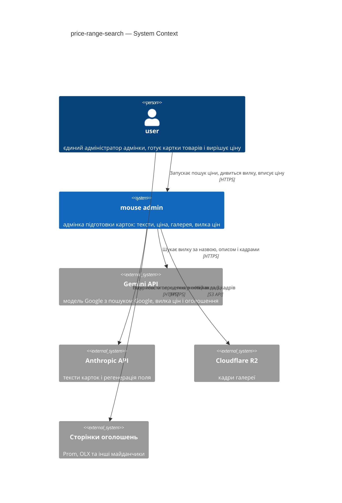
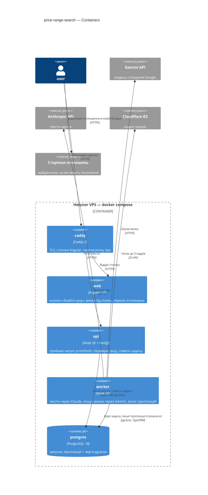
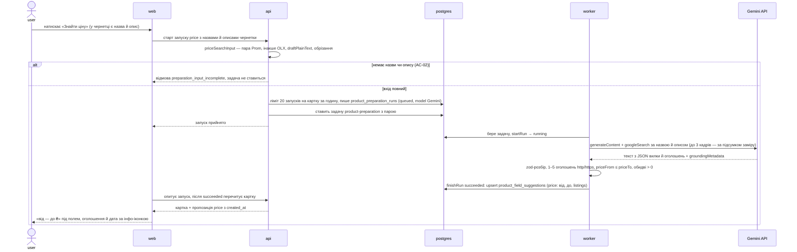
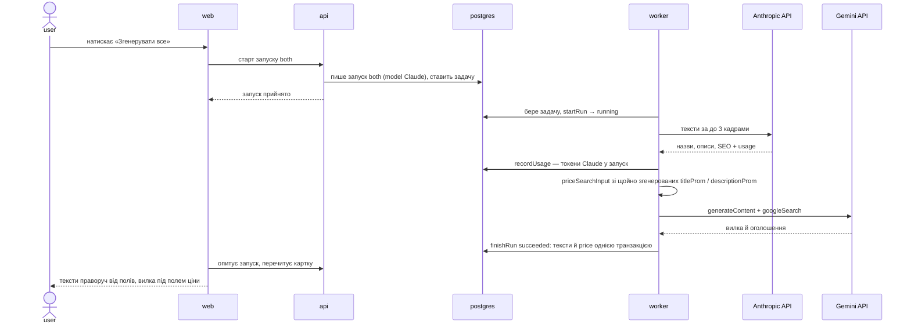
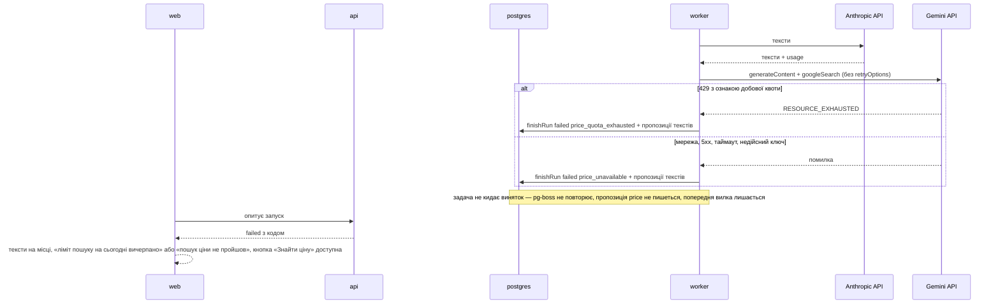
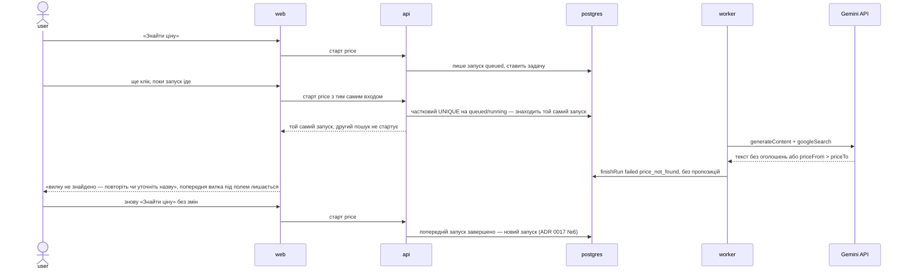

# Software Architecture Document — price-range-search


> **Стадії SDLC 04-05.** Вхід: [PRD](PRD.md) · [CONTEXT](../../../CONTEXT.md).
> Рішення — у [adr/](adr/), зворотний індекс на них — у §9.
> C4 Context (L1) — інлайн у §3, C4 Container (L2) — інлайн у §5; рівень L3 поза межами документа.

## 1. Introduction and goals

**Intent.** User отримує [вилку цін](../../../CONTEXT.md) з оголошеннями-джерелами просто в
картці: окремою кнопкою «Знайти ціну» і всередині «Згенерувати все», без переходу в зовнішній
AI-чат (PRD §2). Вилка лягає пропозицією поля `price`, оголошення з цінами й дату пошуку
відкриває інфо-іконка поруч, а єдину ціну картки вписує й зберігає сам user (PRD §2, AC-06).
Пошук іде через другого постачальника — Gemini API з Grounding with Google Search на
безкоштовному рівні. Пошук ціни через Anthropic, який двічі не дав результату (T54,
[ADR 0019](../product-creation-flow/adr/0019-keep-price-search-out-of-generate-all.md)),
поступається йому місцем.

**Top-3 quality goals** (однорядково; повні сценарії — у §10):

1. **QG-1 Стійкість до відмови пошуку.** Збій постачальника, порожній результат чи вичерпана
   квота не зачіпають підготовлених текстів, полів картки й попередньої вилки; повтор — лише
   дія user-а (PRD §2 ціль 3; PRD §6 рядок «Відмова зовнішнього сервісу»).
2. **QG-2 Без джерел вилки немає.** У картку потрапляє лише вилка з 1–5 оголошеннями, у
   гривнях, з межами, що утворюють вилку; у поле ціни — лише число, яке вписав user (AC-06,
   AC-10; головний ризик idea-brief §10 — правдоподібна, але хибна вилка).
3. **QG-3 Незаблокований інтерфейс.** Запуск пошуку приймається ≤ 500 ms, фонова задача
   стартує ≤ 5 с від постановки; форма лишається робочою, поки пошук іде (PRD §6).

**Поставка з гейтом.** Фіча йде двома кроками, і другий починається лише після go на першому
(idea-brief §13 «спершу замір, потім інтерфейс»):

- **Гейт — адаптер і замір.** `GeminiAdapter` і діагностичний прогін на 10 реальних картках,
  змішано популярних і рідкісних речей, із записом запитів моделі до пошуку
  (`webSearchQueries`) і посилань видачі. Перший виклик прогону перевіряє, чи ключ узагалі
  відкриває `gemini-2.5-flash`: з 2026-10 Google обмежує доступ до моделей 2.5 для нових
  проєктів, а безкоштовний пошук Google є лише на них (§2, §11). Go — вилка з
  оголошеннями-джерелами вживаних речей у гривнях щонайменше для 5 з 10 карток (PRD §7).
- **Після go — контракт, `worker` і UI.** Нові коди результату пошуку, вхід пошуку з чернетки,
  збереження оголошень у пропозиції, кнопка «Знайти ціну», вікно з оголошеннями й
  «Згенерувати все» з пошуком після текстів.

No-go на гейті коштує один-два дні роботи замість двох тижнів, а UI лишається таким, як зараз:
ціну user вписує руками.

**Decision overrides.**

- Страшмен в ADR 0020 — перекрито автором, обґрунтування: опцію «окремий модуль `pricing`»
  показано в питанні S1; її немає в «Чого НЕ робимо», а конвенція каркаса `CLAUDE.md` є
  драйвером проти неї, а не забороною її розглядати.

**Stakeholders.**

| Role | Interest | Sign-off owner? |
|---|---|---|
| Serhii (Architect / Tech Lead / dev) | go/no-go на замірі; нульова вартість пошуку; відповідність умовам Google щодо показу й зберігання результату | Yes |
| `user` (єдиний адміністратор адмінки) | вилка з оголошеннями в картці замість копіювання в зовнішній чат; ціну вирішує сам | No |

## 2. Constraints

**Technical.**

- Node 26, ESM, Fastify; бекенд збирається `tsc` у `dist/` (декоратори TypeORM, [ADR 0003](../../adr/0003-three-layer-classes.md)).
- TypeScript 6.0.3 — жорсткий пін (Angular 22 вимагає `>=6.0 <6.1`).
- PostgreSQL 18 + TypeORM; `typeorm` і `pg` згадуються тільки в `*Repository.ts` і entity.
- pg-boss у тому самому Postgres; виклики AI бувають **тільки** у `worker`, HTTP-процес на
  зовнішній API не чекає (`ARCHITECTURE.md`, «Межі, які тримаємо свідомо»).
- Angular 22 — standalone, signals, zoneless; Angular Material.
- Наявна машинерія запусків, на яку фіча спирається: області `texts` / `price` / `both` /
  `field` у `product_preparation_runs`; частковий UNIQUE на `idempotency_key` лише для
  `queued`/`running` — після завершення той самий вхід ставить новий запуск
  ([ADR 0017](../product-creation-flow/adr/0017-keep-one-latest-suggestion-per-field.md) №6);
  ліміт 20 запусків на картку за годину, спільний для всіх областей (`config.rateLimit.preparation`);
  одна пропозиція на (картка, поле) у `product_field_suggestions.value` (`jsonb`), upsert при
  кожній генерації; код часткової відмови `price_unavailable`.
- **Нова залежність — `@google/genai` 2.28.0** (npm, `node >=20`), лише в `apps/api`. SDK
  **не повторює** запитів, якщо не задано `httpOptions.retryOptions`; `httpOptions.timeout` —
  мілісекунди на спробу, без значення за замовчуванням.
- **Gemini API станом на 2026-10-08** ([pricing](https://ai.google.dev/gemini-api/docs/pricing),
  [models](https://ai.google.dev/gemini-api/docs/models/gemini-2.5-flash),
  [structured output](https://ai.google.dev/gemini-api/docs/structured-output),
  [rate limits](https://ai.google.dev/gemini-api/docs/rate-limits)):
  - пошук Google безкоштовний **лише** на `gemini-2.5-flash` і `gemini-2.5-flash-lite`: до
    500 запитів на добу, спільних для обох моделей; на 3.x у free tier його немає зовсім;
  - ліміти рахуються на проєкт, а не на ключ; добова квота скидається опівночі за
    тихоокеанським часом;
  - доступ до моделей 2.5 Google обмежує тими, хто вже ними користувався, і відсилає нові
    проєкти на 3.x;
  - structured outputs разом із `google_search` працюють лише на Gemini 3 (preview). На 2.5
    JSON відповіді розбирається з тексту;
  - `groundingMetadata.groundingChunks[].web.uri` — редиректи
    `vertexaisearch.cloud.google.com`, а не адреси сторінок. Чи спливає їхній строк, документація
    не каже;
  - `generateContent` лишається повністю підтримуваним, хоча документація за замовчуванням
    показує вже Interactions API.

**Organisational.**

- Один розробник; обсяг системи — 50-100 товарів на місяць, один-два адміни.
- Зусилля — 2 людино-тижні, 8–10 story (idea-brief §11–12); no-go на гейті заміру обмежує
  втрату одним-двома днями (§1).

**Conventions.**

- Правила залежностей і межі шарів — `CLAUDE.md` (корінь) + `apps/api/CLAUDE.md` +
  `apps/web/CLAUDE.md` + `apps/api/src/modules/ai/CLAUDE.md`; машинна перевірка —
  `apps/api/.dependency-cruiser.cjs`. SDK постачальника живе в одному файлі адаптера (правило
  `anthropic-sdk-stays-in-the-adapter`).
- Три шари виражені **суфіксом класу**, а не каталогами; залежності приходять конструктором,
  створює їх тільки composition root (`src/api.ts`, `src/worker.ts`).
- Межі вилки — десяткові рядки, як `PriceRange` у `FieldSuggestion.ts` і `products.price`; без
  float і без transformer'ів.
- Час — `timestamptz`, UTC у БД, форматування на клієнті.
- Конфігурація: ключ Gemini — секрет у `process.env` через `src/config.ts`; id моделі,
  таймаут і ліміти виклику — константи `src/config.ts`, однакові на всіх машинах.

**Regulatory / external** ([Gemini API Additional Terms](https://ai.google.dev/gemini-api/terms),
прочитано 2026-10-08).

- Дані — internal. На безкоштовному рівні Google використовує запити й відповіді для
  покращення своїх продуктів, а рецензенти можуть їх читати. Власник це прийняв: назва, опис і
  кадри однаково стають публічними на майданчиках. Персональних даних покупців у запиті немає
  (PRD §6.1).
- Пункт про ЄЕЗ: «You may use only Paid Services when making API Clients available to users in
  the European Economic Area, Switzerland, or the United Kingdom». Він називає **користувачів**
  застосунку, а не розташування сервера; user-и адмінки — в Україні.
- Grounding with Google Search:
  - Grounded Results показуються лише разом із пов'язаними Search Suggestions;
  - Grounded Results не кешуються, не модифікуються й не перемішуються з іншим вмістом;
  - текст Grounded Results дозволено зберігати до 2 років і лише для трьох цілей: оцінка показу,
    історія розмови end user-а, повторне надсилання;
  - самі умови описують grounding через Gemini API як Paid Service, тоді як сторінка цін дає
    безкоштовні 500 запитів на добу. Розходження винесено в §11.
- Security review — обов'язковий: фіча додає новий секрет і показує в UI посилання, які прийшли
  від моделі (PRD §6.1).

## 3. Context and scope

Адмінка готує картки комісійних товарів для Prom і OLX. Ціну картки user вписує руками, а щоб
її визначити, копіює назву й опис у зовнішній AI-чат (PRD §1). Фіча додає до системи одну нову
зовнішню межу — Gemini API з пошуком Google: він знаходить вилку цін на вживані речі на
українських майданчиках, а оголошення-джерела user відкриває у своєму браузері. Тексти й далі
готує Anthropic; ціну він більше не шукає.

**External systems (in / out):**

| Actor or system | Type | Interaction |
|---|---|---|
| `user` | Person | запускає «Знайти ціну» чи «Згенерувати все», відкриває оголошення за інфо-іконкою, вписує ціну сам |
| Gemini API (Google) | System (external) | `worker` надсилає назву, опис і, за підсумком заміру, до 3 кадрів; отримує вилку, оголошення й Search Suggestions; HTTPS через `@google/genai` |
| Google Search | System (external) | grounding усередині виклику Gemini; напряму система до нього не звертається |
| Anthropic API | System (external) | без змін: тексти «Згенерувати все» і регенерація поля; пошук ціни через `web_search` прибирається |
| Cloudflare R2 | System (external) | `worker` читає до 3 кадрів картки, якщо замір вирішить їх надсилати |
| Сторінки оголошень | System (external) | відкриває браузер user-а в новій вкладці, без доступу до вікна адмінки; система їх не завантажує |

**Кордон довіри.** Відповідь Gemini — числа, URL і текст — недовірений ввід (`AGENTS.md`). У
картку вона потрапляє лише після перевірки в `worker`, а посилання браузер відкриває в новій
вкладці без доступу до вікна адмінки. HTML пошукових підказок (`searchEntryPoint.renderedContent`)
система не зберігає й не показує ([ADR 0024](adr/0024-show-only-the-range-and-listing-links.md)).

**C4 Context (L1):**



## 4. Solution strategy

**Стратегічні вибори (насіння для ADR):**

### S1. Ціну шукає Gemini через `GeminiAdapter` у модулі `ai`; пошук ціни через Anthropic прибирається

`modules/ai/GeminiAdapter.ts` лягає поруч з `AnthropicAdapter.ts` і лишається єдиним файлом, який
знає `@google/genai` (нове правило dep-cruiser, як `anthropic-sdk-stays-in-the-adapter`).
`PreparationService` отримує обидва адаптери конструктором; області `price` і `both` лишаються й
ведуть на Gemini, а `findPriceRange`, `requestPrice`, `config.ai.webSearch` і `effort.price`
зникають з `AnthropicAdapter` — **після** go на гейті заміру (§1), не раніше. Новий модуль не
заводиться: каркас фіксований, і `pricing` за `CLAUDE.md` живе в `ai`. Рішення перекриває дві
конвенції — «той самий Claude» у кореневому `CLAUDE.md` і «`claude-sonnet-5` для всіх викликів» та
пункт про `web_search` в `ai/CLAUDE.md`; їхня правка — у §11. Тримає QG-1 (один шлях ціни, одна
модель відмов) і §2 (SDK в одному файлі). → [ADR 0020](adr/0020-search-price-ranges-through-gemini-in-the-ai-module.md)

### S2. Пошук ціни читає вхід запуску, а не збережену картку

Запуск `price` несе в тілі запиту назви й описи обох майданчиків з **чернетки форми** — так само,
як `field` несе `draftText` ([ADR 0015](../product-creation-flow/adr/0015-add-per-field-text-rewrite-scope.md)).
`api` обирає назву й опис (Prom, інакше OLX), чистить опис через `draftPlainText`, відмовляє, якщо
бракує назви чи опису (AC-02), і рахує ключ ідемпотентності з того, що піде в пошук. Запуск `both`
шукає за назвою й описом, які щойно згенерував виклик текстів того самого запуску, ще до їх
збереження (AC-03). Збережених полів картки пошук не читає ніколи: шукається те, що user бачить у
формі. → [ADR 0021](adr/0021-search-prices-from-the-run-input-not-the-saved-card.md)

### S3. Оголошення живуть у тій самій пропозиції `price`

`value` пропозиції `price` у `product_field_suggestions` розширюється до
`{priceFrom, priceTo, listings: [{price, url}]}` — десяткові рядки, як і раніше. Дата пошуку — це
наявний `created_at` пропозиції, який рухається з кожною генерацією (ADR 0017), тож окремого поля
не дублюємо. Схема БД не змінюється (`jsonb`); новий пошук замінює вилку й оголошення разом,
видалення картки прибирає їх каскадом. Пропозиція `price` пишеться **лише** при успішному пошуку,
тож невдача лишає попередню вилку (AC-08, AC-10, QG-1).
→ [ADR 0022](adr/0022-keep-price-listings-inside-the-price-suggestion.md)

### S4. Три коди невдачі пошуку і жодного автоматичного повтору

`PreparationService` ловить кожну відмову `GeminiAdapter` і закриває запуск `failed` без throw — pg-boss
його не повторює, а SDK працює без `retryOptions`: один запит до постачальника на запуск (PRD §6).
Коди: `price_not_found` — відповідь не розібралась, у ній немає 1–5 оголошень з адресою http/https,
або межі не утворюють вилку в гривнях (нуль, нижня більша за верхню) — AC-10; `price_quota_exhausted`
— 429 добової квоти — AC-09; `price_unavailable` — решта: мережа, 5xx, таймаут, недійсний ключ —
AC-08. У `both` тексти зберігаються в усіх трьох випадках (AC-04). Тримає QG-1 і QG-2.
→ [ADR 0023](adr/0023-classify-price-search-failures-and-never-retry-them.md)

### S5. User бачить лише вилку й оголошення

Під полем ціни — тільки «від — до» в гривнях і інфо-іконка; за нею — оголошення (ціна + посилання,
що відкривається в новій вкладці) і дата пошуку (AC-01, AC-05). Search Suggestions Google
(`searchEntryPoint.renderedContent`) система не зберігає й не показує, а поле ціни вилка не
заповнює й кнопки прийняття не має (AC-06, QG-2). Це свідомо розходиться з умовою Google показувати
Grounded Results разом із Search Suggestions (§2); ризик прийняв власник, рядок — у §11.
→ [ADR 0024](adr/0024-show-only-the-range-and-listing-links.md)

### S6. Виклик Gemini не пише токенів у запуск

`recordUsage` кличеться лише для Claude. Запуск `price` створюється з `model` = id моделі Gemini з
`config.ts` і нульовими токенами, а `config.ai.pricing` отримує рядок цієї моделі з нульовим
тарифом — вартість картки не стає `null`. Запуск `both` лишається з моделлю й токенами Claude, тож
[вартість картки](../../../CONTEXT.md) лишається правдивою без міграції; токени Gemini пишуться лише
в pino-лог воркера. → [ADR 0025](adr/0025-keep-gemini-calls-out-of-the-token-ledger.md)

Кожне тактичне рішення пізніших секцій має зводитися до одного з цих стовпів. Тактичне
рішення, яке стовпу *суперечить*, — червоний прапорець: виноси його в §11.

## 5. Building block view

Межа модулів не змінюється. `ai` знає постачальників моделей і оркеструє виклики у `worker`;
`products/preparation` знає запуски, пропозиції й правила входу. Нова зовнішня межа — Gemini —
лягає одним файлом у `ai` поруч з Anthropic (ADR 0020). Функція вибору пари «назва + опис»
(ADR 0021) живе в `products/preparation` і виходить назовні через `products/index.ts`: `ai` уже
імпортує з нього, тож нової стрілки між модулями немає, а циклу — тим більше (правила 2–3
`apps/api/CLAUDE.md`). У `products/preparation` стає 8 файлів без spec — у межах правила 9.

**Файли, які фіча додає або змінює:**

```
apps/api/src/modules/ai/
├── GeminiAdapter.ts         новий: єдиний імпорт @google/genai; generateContent + googleSearch;
│                            zod-розбір JSON з тексту відповіді; без retryOptions
├── PreparationService.ts    `price`/`both` → Gemini; класифікація відмов (ADR 0023);
│                            інваріант вилки; Gemini не кличе recordUsage (ADR 0025)
├── AnthropicAdapter.ts      після go: без findPriceRange, requestPrice, PriceSchema
└── index.ts                 + GeminiAdapter, типи результату пошуку

apps/api/src/modules/products/
├── index.ts                 + priceSearchInput
└── preparation/
    ├── priceSearchInput.ts      новий: вибір пари (Prom, інакше OLX), draftPlainText, обрізання
    ├── PreparationRunService.ts вхід `price` з тіла запиту; model запуску за областю
    ├── PreparationRun.ts        + price_not_found, price_quota_exhausted
    └── FieldSuggestion.ts       PriceRange + listings

apps/api/src/contracts/
├── ai.contract.ts           тіло `price` (titleProm/titleOlx/descriptionProm/descriptionOlx); нові коди
├── products.contract.ts     форма value пропозиції `price` з listings
└── products-limits.ts       maxPriceListings: 5 — фронт імпортує в рантаймі

apps/web/src/app/products/
├── form/product-form.ts     priceLookupEnabled; гейт «назва + опис» з чернетки; чернетка в
│                            запиті `price`; «Згенерувати все» → scope `both`
├── form/suggestion-field.*  гілка ціни: «від — до ₴» + інфо-іконка
├── form/price-listings.*    новий: перелік оголошень (ціна + посилання в новій вкладці) і дата
└── run-failure-messages.ts  три коди ціни; текст `price_unavailable` залежить від області
```

**Точки збирання, які легко забути:**

- `apps/api/src/config.ts` — `GEMINI_API_KEY` у схемі env; `ai.priceSearch` (`model`, `timeoutMs`,
  `maxFrames`, `maxInputChars`); рядок моделі Gemini в `ai.pricing` з нульовим тарифом.
- `apps/api/src/worker.ts` — створює `GeminiAdapter` і передає його в `PreparationService`.
- `apps/api/.dependency-cruiser.cjs` — правило `google-genai-sdk-stays-in-the-adapter`.
- `apps/api/package.json` — `@google/genai`; `.env.example` — `GEMINI_API_KEY`.
- Міграцій схеми немає (ADR 0022); можлива лише міграція даних для старих рядків `price` — рішення
  етапу 08.

**C4 Container (L2):**



## 6. Runtime view

Учасники — контейнери §5 і зовнішні системи §3. Повідомлення семантичні, без HTTP-методів і
шляхів: ендпоінт-рівневий контракт народжує етап 10. Опитування стану запуску — наявний
`preparation-run-poller` у `web`.

**Сценарій 1: «Знайти ціну» — happy path (US-01, US-03, AC-01, AC-05)**



**Сценарій 2: «Згенерувати все» — тексти, потім вилка за щойно згенерованими текстами (US-02, AC-03)**



**Сценарій 3: відмова пошуку в «Згенерувати все» — збій чи квота (AC-04, AC-08, AC-09)**



Цілим лишається все: тексти щойно запуску — пропозиціями, поля картки — недоторкані, попередня
вилка — на місці. До постачальника пошуку пішов рівно один запит (PRD §6).

**Сценарій 4: вилку не знайдено й подвійний клік (AC-07, AC-10)**



## 7. Deployment view

Топологія не змінюється: один Hetzner VPS, docker compose, `caddy` → `api` / статика, `worker` і
`postgres` з чергою pg-boss (`ARCHITECTURE.md`, «Розгортання»). Нового контейнера, тому чи ліміту
в Caddy фіча не додає. Новий вихідний напрямок — `worker` → Gemini API по HTTPS; `api` до Gemini не
звертається, як і до Anthropic.

`worker` стартує й без ключа Gemini: тоді `worker.ts` не створює `GeminiAdapter`, пише warn у лог,
а запуски `price` і ціна в `both` закриваються `price_unavailable` без запиту до Google. Тексти й
решта адмінки працюють (QG-1; idea-brief §9 «пошук ціни вимикається, решта адмінки працює»).
Вимикач пошуку ціни — прибрати ключ з `.env` і перезапустити `worker`.

**Конфігурація, яку фіча вводить:**

| Що | Рівень | Де живе |
|---|---|---|
| `GEMINI_API_KEY` — ключ проєкту Google AI Studio (free tier) | секрет, опційний | `process.env`, схема в `src/config.ts`, зразок у `.env.example`, передається лише `worker` |
| Модель пошуку (`gemini-2.5-flash` чи `-lite` — обирає замір) | константа бекенду | `config.ai.priceSearch.model` |
| Таймаут одного виклику, мс | константа бекенду | `config.ai.priceSearch.timeoutMs` |
| Кадрів на пошук: 0–3 (обирає замір; PRD §6 — до 3) | константа бекенду | `config.ai.priceSearch.maxFrames` |
| Довжина назви й опису в запиті | константа бекенду | `config.ai.priceSearch.maxInputChars` |
| Тариф моделі Gemini — 0 µ$ на токен | константа бекенду | `config.ai.pricing` (ADR 0025) |
| Оголошень у вилці — не більше 5 | константа контракту | `contracts/products-limits.ts` (`maxPriceListings`) |

Ключа Gemini немає ні в `@environments`, ні в логах (PRD §6.1). Модель — константа, а не env: її
заміна змінює якість вилки й квоту, тож проходить через коміт (`ai/CLAUDE.md`).

**Як помічається збій:**

- Стан запуску в БД: `product_preparation_runs.status = 'failed'` з кодом `price_not_found` /
  `price_quota_exhausted` / `price_unavailable`; user бачить його у формі одразу, а каталог —
  у переліку невдалих запусків картки.
- `docker compose logs -f worker`: запис пошуку з `runId`, моделлю, кодом результату,
  `webSearchQueries` і токенами Gemini (ADR 0025); warn «GEMINI_API_KEY is not set» на старті.
- Метрик, алертів і моніторингу квоти немає: при одному user-і вичерпану квоту він побачить сам
  (AC-09). Це прийнятий борг (§11).

## 8. Crosscutting concepts

| Concept | Convention | Where defined |
|---|---|---|
| Логування | pino, JSON, structured; у логи не потрапляють паролі, токени сесій, ключі R2/Anthropic/**Gemini**, тіла зображень | `apps/api/CLAUDE.md` · `src/logger.ts` |
| Авторизація | сесія в httpOnly-cookie, `sessionGuard` на маршрутах запусків; ролей немає — без змін | `modules/auth/CLAUDE.md` |
| Помилки | `AppError` у `src/errors.ts`; доменні — у своєму модулі; один error-handler у `api.ts`; текст користувачу фронт формує за `code` | `CLAUDE.md` · `contracts/error.contract.ts` |
| Валідація | zod-схема на межі, у `PreparationRunController`; тіло запуску `price` — `ai.contract.ts` | `CLAUDE.md` |
| Гроші | межі вилки й ціни оголошень — десяткові рядки, як `products.price`; без transformer'ів і без float | `CLAUDE.md` · ADR 0022 |
| Час | `timestamptz`, UTC у БД; дата пошуку — `product_field_suggestions.created_at`, форматування на клієнті | `CLAUDE.md` |
| Черга | pg-boss поверх Postgres; задачі ідемпотентні (`startRun` не пускає завершений запуск удруге) | `src/queue.ts` |
| **Відповідь моделі — недовірений ввід** | JSON з тексту відповіді Gemini розбирає zod-схема в `GeminiAdapter`; інваріант вилки (1–5 оголошень, `priceFrom ≤ priceTo`, обидві > 0) перевіряє `PreparationService`; усе інше — `price_not_found`. HTML з відповіді ніде не рендериться; посилання лише `http:`/`https:`, як `<a target="_blank" rel="noopener noreferrer">` | `AGENTS.md` · ADR 0023 · ADR 0024 |
| **Повтори зовнішнього пошуку** | виняток з дефолту «pg-boss повторює задачу, що кинула виняток»: відмова Gemini закриває запуск без throw; SDK без `retryOptions`; один запит на запуск | ADR 0023 |
| **AI-постачальники** | два: Claude — тексти й поле, Gemini — лише вилка; SDK кожного — в одному файлі адаптера, межу тримає dep-cruiser | ADR 0020 · `.dependency-cruiser.cjs` |
| **Облік вартості** | `recordUsage` лише для Claude; запуск `price` має `model` Gemini й нульові токени; тариф Gemini у `config.ai.pricing` — 0 | ADR 0025 |
| **Діагностика пошуку** | `worker` пише в лог `runId`, модель, код результату, `webSearchQueries` і токени виклику Gemini; у БД вони не потрапляють | ADR 0024 · ADR 0025 |

## 9. Architecture decisions

| # | Title | Status | Section |
|---|---|---|---|
| [0020](adr/0020-search-price-ranges-through-gemini-in-the-ai-module.md) | Шукати вилку цін через Gemini в модулі `ai`, а пошук ціни через Anthropic прибрати | Accepted | §4 S1 |
| [0021](adr/0021-search-prices-from-the-run-input-not-the-saved-card.md) | Шукати ціну за входом запуску, а не за збереженою карткою | Accepted | §4 S2 |
| [0022](adr/0022-keep-price-listings-inside-the-price-suggestion.md) | Тримати оголошення всередині пропозиції `price` | Accepted | §4 S3 |
| [0023](adr/0023-classify-price-search-failures-and-never-retry-them.md) | Розрізняти три невдачі пошуку ціни й ніколи не повторювати його автоматично | Accepted | §4 S4 |
| [0024](adr/0024-show-only-the-range-and-listing-links.md) | Показувати лише вилку й посилання на оголошення | Accepted | §4 S5 |
| [0025](adr/0025-keep-gemini-calls-out-of-the-token-ledger.md) | Не записувати виклики Gemini в облік токенів запуску | Accepted | §4 S6 |

Файли лежать у `docs/features/price-range-search/adr/`. Нумерація **наскрізна на весь
репозиторій** і продовжує `docs/adr/` та `docs/features/product-creation-flow/adr/` (останній
номер до проходу — 0019), щоб посилання «ADR NNNN» ніколи не було двозначним.

Рішення, свідомо лишені inline, без окремого файлу:

- **Поставка з гейтом заміру** (§1) — рішення про порядок робіт, а не про форму системи; живе в
  §1 і в розбивці на story.
- **Розкладка файлів і місце `priceSearchInput`** (§5) — межа модулів не змінюється, а напрямок
  стрілки `ai → products` уже існує.
- **`worker` стартує без ключа Gemini** (§7) — зворотне за годину, зачіпає один процес.
- **Модель пошуку (Flash чи Flash-Lite) і кількість кадрів** (§7) — значення константи, які обирає
  замір; переробка — один коміт.
- **`generateContent`, а не Interactions API** (§2, ADR 0020 Neutral) — обидва підтримувані;
  заміна — у межах одного файлу адаптера.

## 10. Quality requirements

Кожна з якостей §1 розгорнута в повний сценарій. Числа взяті з PRD §6 дослівно.

**QG-1. Стійкість до відмови пошуку**

- **When:** пошук ціни запущено кнопкою (`price`) або всередині «Згенерувати все» (`both`), а
  постачальник пошуку недоступний, відповів помилкою чи вичерпаною квотою.
- **Then:** тексти, поля картки й попередня вилка не втрачаються; власного циклу повторів немає,
  повтор — дія user-а; 1 запит до постачальника пошуку на запуск (виняток — збій запису в БД
  після успішної відповіді, див. §11). Запуск закрито `failed` з
  `price_unavailable` або `price_quota_exhausted`, у `both` тексти збережено пропозиціями.
- **How verify:** ручний прогін з недійсним ключем і з вимкненою мережею воркера (PRD §6) — для
  `price` і для `both`; кількість викликів на запуск — з логу воркера; spec `PreparationService`
  з тестовим підкласом `GeminiAdapter`, що кидає помилку мережі, 500 і 429, перевіряє код
  запуску, збережені тексти, незмінну пропозицію `price` і те, що задача не кидає виняток.

**QG-2. Без джерел вилки немає**

- **When:** пошук завершився відповіддю без оголошень-джерел, з межами, що не утворюють вилку в
  гривнях (нижня більша за верхню, нуль), з понад 5 оголошеннями чи з посиланням не `http(s)`.
- **Then:** система не показує такий результат як вилку, закриває запуск `price_not_found`,
  попередня вилка лишається (AC-10). Успішна вилка має 1–5 оголошень; у поле ціни вилка не
  потрапляє, кнопки прийняття немає (AC-06).
- **How verify:** spec `PreparationService` з відповідями-порушниками кожного правила; ручний
  прогін на картці з 10 кадрами й перегляд збереженої пропозиції (PRD §6); Playwright-прохід
  форми: після пошуку поле ціни лишається порожнім, а оголошення відкриваються в новій вкладці;
  замір на 10 реальних картках — вилка з оголошеннями щонайменше для 5 з 10, хибних вилок ≤ 2 з 10
  знайдених за оцінкою user-а (PRD §7). Чи оголошення про ту саму вживану річ — перевіряє лише
  людина на замірі.

**QG-3. Незаблокований інтерфейс**

- **When:** user натискає «Знайти ціну» чи «Згенерувати все».
- **Then:** клік → запуск прийнято ≤ 500 ms; очікування фонової задачі в черзі ≤ 5 с від
  постановки до старту; форма лишається робочою, кнопки запусків картки вимкнені, поки запуск іде.
- **How verify:** тривалість запиту з pino-логів, 10 повторів на стенді; pg-boss enqueue → started
  — `waitMs` запису «job started» у логах воркера.

**Додаткові вимоги поза топ-3** (з PRD §6, без окремого QG):

- ≤ 20 запусків на картку за годину, спільний ліміт усіх областей — ручний прогін 21-го запуску.
- До 3 кадрів на пошук — ручний прогін на картці з 10 кадрами (кількість кадрів у запиті — з логу
  воркера).

**Спостереження без порога:**

- Тривалість виклику Gemini з пошуком — її визначає постачальник пошуку, а не наш код (PRD §6);
  пишеться в лог воркера, провалом не вважається. Межу зверху ставить лише `timeoutMs`, після
  якого запуск закривається `price_unavailable`.
- Кількість пошукових запитів моделі (`webSearchQueries`) і токени Gemini на виклик — їх визначає
  модель; пишуться в лог для заміру й оцінки квоти.
- Залишок добової квоти Google (500 запитів на добу) — API його не повертає; видно лише
  `price_quota_exhausted`.

## 11. Risks and technical debt

Репозиторій прочитано 2026-10-08 (`ARCHITECTURE.md`, `CLAUDE.md` кореня, `apps/api`, `apps/web`,
`modules/ai`, `SPEC.md`, `.dependency-cruiser.cjs`, код `modules/ai` і `products/preparation`,
форма картки у `web`); факти про Gemini — з офіційних сторінок Google того самого дня (§2).

| Risk / debt | Severity | Mitigation | Owner |
|---|---|---|---|
| Ключ, створений 2026-10, може не відкрити `gemini-2.5-flash`: Google обмежує доступ до 2.5 для нових проєктів, а безкоштовний пошук є лише на 2.5 | High | Перший виклик гейта заміру перевіряє доступ (§1); немає доступу → no-go, UI ціни лишається вимкненим. Платний рівень — non-goal PRD §3, тож він став би окремим рішенням власника. **Due:** гейт заміру | Serhii |
| Правдоподібна, але хибна вилка: ціни нових речей, сусідньої моделі чи не в гривнях (idea-brief §10) | High | Без 1–5 оголошень вилки немає (ADR 0023); оголошення відкриваються одним кліком (ADR 0024); замір перевіряє саме гривні й уживані речі, поріг ≤ 2 з 10 хибних (PRD §7) | Serhii |
| Показ без Search Suggestions розходиться з умовою Google «display the Grounded Results with the associated Search Suggestion(s)» ([ADR 0024](adr/0024-show-only-the-range-and-listing-links.md)) — Google може обмежити проєкт чи ключ | High | Ризик свідомо прийняв власник. Наслідок обмежено: пошук вимикається, решта адмінки працює (§7). Запасний варіант — чипи в модалці (опція 2 ADR 0024), кілька годин роботи | Serhii |
| Посилання оголошень бере текст моделі, бо `groundingChunks[].web.uri` — лише редиректи `vertexaisearch`; модель може вигадати адресу | Medium | Лише `http(s)`; замір звіряє посилання з тексту з видачею (`groundingChunks`, `webSearchQueries` у лозі); якщо вигадані — на гейті вирішуємо, чи брати редиректи | Serhii |
| На 2.5 structured outputs не працюють разом із пошуком: JSON з тексту може не розібратися | Medium | zod-розбір у `GeminiAdapter`; збій розбору — `price_not_found`, а не падіння; замір рахує частку збоїв розбору | Serhii |
| Вилка з оголошеннями живе стільки, скільки картка, а умови дозволяють зберігати текст Grounded Results до 2 років і лише для трьох цілей | Medium | Новий пошук замінює попередній, видалення картки прибирає каскадом (ADR 0022). Переглянути, якщо Google заперечить чи з'являться картки старші за 2 роки | Serhii |
| Умови Gemini API описують grounding через API як Paid Service, а сторінка цін дає безкоштовні 500 запитів на добу | Medium | Перечитати умови разом з питанням про ЄЕЗ нижче. **Due:** 2026-10-15 | Serhii |
| Free tier, квоту чи модель 2.5 змінять або знімуть без попередження | Medium | `worker` працює без ключа, запуски ціни — `price_unavailable` (§7); тексти не залежать від Gemini (QG-1) | Serhii |
| Добовий 429 від хвилинного відрізняє лише недокументований `quotaId` | Low | 429 без ознаки добової квоти — `price_unavailable`; замір фіксує реальне тіло помилки (ADR 0023) | Serhii |
| Збій запису в БД (`finishRun`) після успішної відповіді Gemini: задача кидає виняток, pg-boss її повторює, і до Google іде другий запит — PRD §6 «1 запит на запуск» тут не тримається | Low | Прийнято: потрібен збій БД саме в ці мілісекунди; коштує до 2 запитів квоти, не грошей. Наслідок названо в [ADR 0023](adr/0023-classify-price-search-failures-and-never-retry-them.md) Neutral | Serhii |
| Payload задачі черги несе назву й опис з чернетки | Low | Обрізання константою `config.ai.priceSearch.maxInputChars` (ADR 0021) | Serhii |
| Розходження: корінь `CLAUDE.md` — «`pricing` живе всередині `ai` (той самий Claude, інший метод сервісу)» | Low | Правка: «той самий модуль, інший постачальник» з посиланням на ADR 0020. **Due:** до `break-tasks` | Serhii |
| Розходження: `apps/api/src/modules/ai/CLAUDE.md` — «`claude-sonnet-5` для всіх викликів», пункт про `web_search_20260209` для ринкових цін, `effort`/`max_uses` «тексти, ціна, поле», «Кожен виклик записує `usage` і `model`» (ADR 0025 — Gemini токенів не пише), «відповідь запитуємо через structured outputs» (на 2.5 JSON розбирається з тексту, §2) | Low | Правка під ADR 0020, 0023, 0025: Claude — тексти й поле, Gemini — вилка, правила адаптера Gemini. **Due:** до `break-tasks` | Serhii |
| Розходження: `ARCHITECTURE.md` — рядок `ai` у таблиці модулів, крок 6 потоку («другим викликом через `web_search_20260209`»), схема `worker` («Claude API web search») | Low | Правка після go на гейті, разом із кодом. **Due:** до `break-tasks` (story правки документів) | Serhii |
| Розходження: `SPEC.md` рядки 12 і 60–61 — «пошук ціни відкладено», `web_search_20260209` | Low | Правка після go. **Due:** story, що вмикає кнопку ціни | Serhii |
| Розходження: PRD §1 — «сьогодні запуск із тим самим входом повертає попередній запуск… AC-07 свідомо змінює правило». З 2026-10-02 той самий вхід повертає старий запуск лише поки той `queued`/`running`, а після завершення ставить новий ([ADR 0017](../product-creation-flow/adr/0017-keep-one-latest-suggestion-per-field.md) №6); AC-07 правила не змінює | Low | Правка речення PRD §1; код змінювати не треба. **Due:** до `break-tasks` | Serhii |
| Розходження: PRD §8 — питання про підказки Google і про старий пошук закриті (ADR 0024, ADR 0020); дефолт «у тому самому вікні з оголошеннями» замінено рішенням не показувати підказок | Low | Позначити питання закритими з посиланням на ADR. **Due:** до `break-tasks` | Serhii |
| Відкрите питання PRD §8: чи дозволяють умови free tier сервер у ЄС для user-ів в Україні? Знахідка 2026-10-08: пункт називає **користувачів** у ЄЕЗ, а не розташування сервера (§2) | Low | Власник підтверджує читання умов. **Due:** 2026-10-15 | Serhii |
| Відкрите питання PRD §8: Flash чи Flash-Lite і чи надсилати кадри | Low | Константи `config.ai.priceSearch.model` і `maxFrames` (§7) обирає замір. **Due:** гейт заміру | Serhii |

**Прийнятий борг** (свідомо лишений у цій поставці, план виправити пізніше):

- **Немає моніторингу квоти й алертів.** При одному user-і вичерпану квоту видно як
  `price_quota_exhausted` у формі. Тригер перегляду — другий user або регулярні 429.
- **Токени Gemini видно лише в логах воркера** (ADR 0025). Тригер — перехід на платний рівень:
  тоді облік на рівні виклику, ~1–2 story.
- **Search Suggestions не зберігаються** (ADR 0024): якщо Google вимагатиме їх показу, чипи
  з'являться лише для нових пошуків.
- **Можливі старі рядки `price` без `listings`** з часів T54: етап 08 вирішує — міграція даних з
  робочим `down` чи читання як відсутніх (ADR 0022).
- **KPI при no-go.** Якщо гейт заміру дасть no-go, KPI PRD §7 («частка карток з вилкою», «хвилин
  на ціну», «зовнішній чат ≤ 30 %») втрачають предмет: UI ціни не з'являється, і ціну, як і
  зараз, user вписує руками.

## 12. Glossary

| Term | Meaning |
|---|---|
| user | єдина людина в системі: адміністратор адмінки, який готує картки товарів. NOT роль чи набір прав — ролей у системі немає, усі користувачі рівні, розмежування прав не передбачене. (CONTEXT) |
| картка товару | запис про одну річ у каталозі: тексти під обидва майданчики, ціна й галерея до 10 фото. NOT оголошення на майданчику — те, що бачить покупець, створюється вручну копіюванням і живе окремим життям. (CONTEXT) |
| вилка цін | орієнтовний діапазон «від — до» у гривнях, за який схожі вживані речі пропонують на українських майданчиках, разом з оголошеннями, де його знайдено. NOT ціна картки: вилка лише підказує, а ціну вписує й зберігає user; і NOT вартість картки — та рахує витрати на AI, а не ринок. (CONTEXT) |
| вартість картки | сума витрат на AI, потрачених на підготовку однієї картки товару: тексти (з розпізнаванням) плюс пошук ціни плюс будь-яка регенерація окремого поля. NOT місячний рахунок за AI і NOT ціна товару: це собівартість однієї одиниці роботи, за якою вирішують, чи виправдана автоматизація. (CONTEXT) |
| оголошення-джерело **(новий)** | одне оголошення на майданчику, з якого виведено вилку цін: ціна в гривнях і посилання, яке user відкриває в новій вкладці. NOT оголошення картки на майданчику (те, що публікує user) і NOT пошукова підказка Google: це чужа пропозиція, на яку вилка спирається. |
| пошукова підказка Google **(новий)** | блок Search Suggestions, який Gemini повертає разом із результатом пошуку: чипи з пошуковими запитами моделі, що ведуть на google.com. NOT оголошення-джерело і NOT текст промпта; система її не зберігає й не показує (ADR 0024). |
| гейт заміру **(новий)** | перший крок поставки: діагностичний прогін пошуку на 10 реальних картках, після якого вирішується go (≥ 5 з 10 з вилкою) чи no-go для решти фічі. NOT приймальний тест готової фічі: UI на цьому кроці ще немає. |

Терміни, позначені **(новий)**, варто перенести в `CONTEXT.md` — вони вже вживаються в
цьому SAD і будуть вживатися на етапах 08 і 10.
