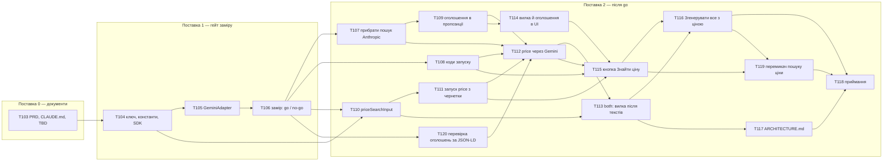

# Task breakdown — price-range-search

> **Вхід:** [PRD](../PRD.md) · [sad.md](../sad.md) · [adr/](../adr/) 0020–0025 · [data-model.md](../data-model.md) · [contracts/openapi.yaml](../contracts/openapi.yaml) · [contracts/api-sync-report.md](../contracts/api-sync-report.md) · [contracts/events.md](../contracts/events.md)
> **Вихід:** цей файл · [tracker.md](tracker.md) · 18 story у цій теці · [CONTEXT.md](../CONTEXT.md) фічі.
> **Скіл:** `feature-break-tasks` (локальний стейдж 06). Перевірка gate:
> `python3 .claude/skills/feature-break-tasks/references/gate-check.py docs/features/price-range-search/tasks/`

## Розріз по поставках

[sad.md §1](../sad.md#1-introduction-and-goals) ділить фічу на гейт заміру і роботу після go.
Розбивка ріже задачі по тому самому рубежу. Поставка 2 не стартує, поки
[T106](measure-price-search-on-ten-cards.md) не дасть go. No-go переводить T107–T118 у
`Deferred`, і втрата обмежується поставками 0–1.

| Група | Обсяг | Задачі | Разом |
|---|---|---|---|
| **Поставка 0** | Борг документів зі строком «до `break-tasks`» ([§11](../sad.md#11-risks-and-technical-debt)), TBD у `data-model.md` і Section C звіту контракту | T103 | ~0.5 д |
| **Поставка 1 — гейт** | Ключ і константи, `GeminiAdapter`, замір на 10 картках з рішенням go/no-go | T104–T106 | ~2 д |
| **Поставка 2 — після go** | Прибрати старий пошук, коди й форма вилки в контракті, вхід з чернетки, `worker` для `price` і `both`, UI, документи, приймання | T107–T118 | ~7.5 д |

Разом ~10 д, тобто 2 людино-тижні з [sad.md §2](../sad.md#2-constraints). Story вийшло 16
замість 8–10 з оцінки idea-brief: п'ять із них XS, бо контракт і точки збирання розрізано так,
щоб кожен PR лишався зеленим на обох застосунках.

## Задачі-гейти

- **Борг «до `break-tasks`»** — [T103](align-documents-with-price-search-architecture.md),
  поставка 0, блокує поставку 1. Закриває чотири рядки §11: PRD §1, PRD §8, кореневий
  `CLAUDE.md`, `ai/CLAUDE.md`. `ARCHITECTURE.md` і `SPEC.md` §11 сам відносить на «після go,
  разом із кодом», тож вони стали [T117](update-architecture-for-gemini.md) і пунктом
  [T115](enable-find-price-button.md).
- **Відкриті питання.** Обидва `## Open items` у `data-model.md` власник закрив 2026-10-08
  (api-sync-report, «Рішення»), але TBD у файлі лишилися. Section C (імена пари в payload) має
  готову пропозицію в `events.md`. Обидва пункти закриває T103 без окремої `decision`-story (див.
  «Розбіжності з дефолтами скіла»).
- **Гейт заміру** — [T106](measure-price-search-on-ten-cards.md), `decision`. Він закриває два
  відкриті питання PRD §8 (Flash чи Flash-Lite, кадри; умови ЄЕЗ) і блокує всю поставку 2.

## Звірка з репозиторієм (2026-10-08)

[sad.md §5](../sad.md#5-building-block-view) звірено з кодом. Підтверджено: у `modules/ai` є
лише `AnthropicAdapter`, `PreparationService`, `index.ts` і `CLAUDE.md`; `@google/genai` у
залежностях немає; у dep-cruiser є правило `anthropic-sdk-stays-in-the-adapter`, а правила для
Google немає; нова entity не потрібна, тож `ENTITIES` не змінюється; міграцій не треба;
`priceLookupEnabled = false` у `product-form.ts`; у `products/preparation/` сім файлів без spec,
з `priceSearchInput.ts` стане вісім, як і рахує §5. SAD не правився. Розійшлося ось що:

1. **Ключ Gemini не «передається лише `worker`»** (§7, таблиця конфігурації). `docker-compose*.yml`
   віддають увесь `.env` кожному контейнеру образу `api` (`env_file: [.env]` у `migrate`, `api`,
   `worker`), так само як `ANTHROPIC_API_KEY`. [T104](add-gemini-config-and-sdk.md) тримає
   наявний патерн, де ключ читає лише `worker.ts`, і не вводить окремого механізму.
2. **§5 не називає трьох файлів, які змінюються.** Це `products/ProductErrors.ts`
   (`PreparationInputIncomplete` приймає одне значення з `'gallery' | 'title' | 'draft'`), 
   `products/preparation/PreparationQueue.ts` (власний тип payload продюсера
   `PreparationRunJob`, поруч із `PreparationJob` споживача, якого називає `events.md`) і
   `apps/api/CLAUDE.md` («Логи» перелічують ключі). Їх забирають [T111](start-price-run-from-draft.md) і T104.
3. **Застаріє CONTEXT.md product-creation-flow.** Його інваріант «вхід пошуку ціни — заголовок
   плюс необов'язковий опис» і рядок `price_unavailable` суперечать AC-02 і ADR 0023, а §11 їх не
   називає. Закриває [T117](update-architecture-for-gemini.md).

## Dependency graph



**Чому саме такі ребра.** T107 → T109 означає «спершу прибрати писаря старої форми»: поки живий
`findPriceRange`, обов'язкові `listings` зламали б typecheck. T108 і T111 несуть правку `web`
у тому самому PR. Тип `Record` над enum коду і тип тіла з `@contracts` не компілюються без неї,
тож це названі винятки атомарності, а не приховані ребра. T114 → T115 — спільний
`app-suggestion-field`, і блок ціни вмикає саме T115. T115 → T116 — спільні `product-form.*`.

**ASCII — той самий граф топологічними рівнями.** Рівень N починається лише після мержу всього
рівня N-1, а всередині рівня задачі незалежні.

```
рівень 0 │ T103                ← поставка 0
рівень 1 │ T104                ← поставка 1
рівень 2 │ T105
рівень 3 │ T106                ← гейт: go / no-go
рівень 4 │ T107 T108 T110 T120 ← поставка 2
рівень 5 │ T109 T111
рівень 6 │ T112 T114
рівень 7 │ T113 T115
рівень 8 │ T116 T117
рівень 9 │ T119
рівень 10 │ T118               ← приймання
```

Одинадцять рівнів дають критичний шлях T103 → T104 → T105 → T106 → T107 → T109 → T112 → T113 →
T116 → T119 → T118. Перемикач [T119](toggle-price-search-in-the-form.md) і перевірку оголошень
[T120](check-listings-against-page-data.md) додано 2026-10-09 рішеннями власника після заміру. Паралельно йдуть контракт кодів (T108), вхід (T110 → T111) і фронт показу (T114).

**Граф ациклічний.** Скрипт перевірив і `blocks`, і `blocked_by` у кожній story: вони точно
обернені одне до одного, висячих ID немає.

## Вісім структурних gate

| # | Gate | Мінімум | Де в story |
|---|---|---|---|
| 1 | Лінк на sequence у `sad.md` §6 | ≥ 1, дослівно | `## Sequence` |
| 2 | Data delta | розділ | `## Data delta` |
| 3 | Excerpt контракту | ≥ 1 ```` ```yaml ````, дослівно | `## API contract excerpt` |
| 4 | AC Given/When/Then | ≥ 2 | `## Acceptance criteria` |
| 5 | Атомарні кроки | ≥ 3 | `## Checklist` |
| 6 | `context_budget` | ≤ 5000, виміряно | frontmatter |
| 7 | `blocks` + `blocked_by` | обидва | frontmatter |
| 8 | Повний frontmatter | 11 ключів | frontmatter |

**`gate_profile`, відмінний від `implementation`:** у T103 і T117 це `docs`, у
[T106](measure-price-search-on-ten-cards.md) — `decision`, у
[T118](verify-price-range-search.md) — `verification`.

## Розбіжності з дефолтами скіла

| Дефолт скіла | Тут | Чому |
|---|---|---|
| Open items і Section C — окрема `decision`-story | закриває `docs`-story T103 | Обидва Open items `data-model.md` власник уже вирішив (api-sync-report, «Рішення»), а Section C має готову пропозицію в `events.md`. Рішення немає, є лише запис уже прийнятого. Окрема story не блокувала б жодної міграції, бо міграцій у фічі немає |
| Нумерація story з T01 | T103–T118 | Продовжує наскрізну нумерацію репозиторію (product-creation-flow закінчився на T102), як і ADR (§9 SAD). Інакше гілка `feat-t05-…` була б двозначною |

## Tasks

### Поставка 0 — документи

| ID | Title | blocked_by | Est | Owner |
|----|-------|------|-----|-------|
| [T103](align-documents-with-price-search-architecture.md) | Узгодити PRD, CLAUDE.md і відкриті пункти контракту з архітектурою | — | S | Serhii |

### Поставка 1 — гейт заміру

| ID | Title | blocked_by | Est | Owner |
|----|-------|------|-----|-------|
| [T104](add-gemini-config-and-sdk.md) | Ключ Gemini, константи пошуку ціни, SDK і правило dep-cruiser | T103 | XS | Serhii |
| [T105](add-gemini-adapter.md) | `GeminiAdapter`: пошук вилки з `googleSearch` і розбір JSON з тексту | T104 | S | Serhii |
| [T106](measure-price-search-on-ten-cards.md) | Гейт заміру на 10 реальних картках: go або no-go | T105 | S | Serhii |

### Поставка 2 — після go

| ID | Title | blocked_by | Est | Owner |
|----|-------|------|-----|-------|
| [T107](remove-anthropic-price-search.md) | Прибрати пошук ціни через Anthropic | T106 | S | Serhii |
| [T108](add-price-search-run-codes.md) | Коди запуску `price_not_found` і `price_quota_exhausted` | T106 | XS | Serhii |
| [T109](add-price-listings-to-suggestion.md) | Оголошення-джерела в пропозиції `price` | T107 | XS | Serhii |
| [T110](add-price-search-input.md) | `priceSearchInput`: пара назва + опис | T104, T106 | XS | Serhii |
| [T111](start-price-run-from-draft.md) | Запуск `price` з чернетки: тіло, ключ, модель запуску | T110 | S | Serhii |
| [T120](check-listings-against-page-data.md) | Перевіряти оголошення Prom, Shafa і Kloomba за JSON-LD сторінки | T106 | S | Serhii |
| [T112](search-price-through-gemini.md) | Запуск `price` через Gemini: три невдачі, інваріант, `worker` | T107, T108, T109, T111, T120 | S | Serhii |
| [T113](search-price-after-texts-in-both.md) | Запуск `both`: вилка після текстів | T110, T112 | S | Serhii |
| [T114](show-price-range-and-listings.md) | Вилка під ціною й оголошення за інфо-іконкою | T109 | S | Serhii |
| [T115](enable-find-price-button.md) | Кнопка «Знайти ціну» і повідомлення трьох невдач | T108, T111, T112, T114 | S | Serhii |
| [T116](generate-all-with-price.md) | «Згенерувати все» стартує `both` | T113, T115 | XS | Serhii |
| [T117](update-architecture-for-gemini.md) | `ARCHITECTURE.md` і CONTEXT product-creation-flow | T113 | XS | Serhii |
| [T119](toggle-price-search-in-the-form.md) | Перемикач «Пошук ціни» у формі картки | T115, T116 | S | Serhii |
| [T118](verify-price-range-search.md) | Приймання: QG-1–QG-3 на живому стеку | T116, T117, T119 | S | Serhii |

**Шкала:** XS ≤ 2 год, S ≤ 1 д; `M` і `L` не ставимо. Власник один на всі story, бо в системі
один-два адміни ([CONTEXT.md](../../../CONTEXT.md), «user»).
