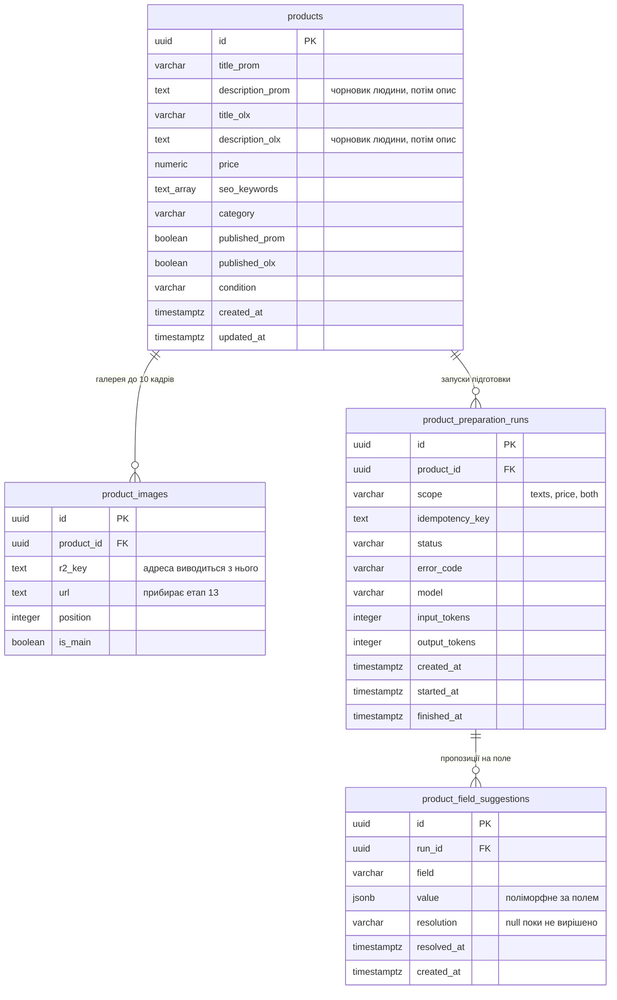

# Data model — product-creation-flow

Прохід **brownfield**: `products` і `product_images` уже створені міграцією
`1787756956906-create-products-tables`, і питання етапу було не «що побудувати», а «що
змінити».

**Головний висновок: поставка 1 не змінює схему взагалі.** Галерея, головний кадр, дві
відмітки присутності, ціна й обидва тексти вже мають свої колонки, готовність
обчислюється при читанні ([ADR 0009](adr/0009-derive-card-readiness-instead-of-storing-it.md)),
а межа в десять кадрів живе константою в контракті. Єдина зміна, яку поставка 1 потребує, —
прибрати `product_images.url` ([ADR 0007](adr/0007-serve-images-from-a-public-bucket.md)), і
вона **не входить у цей етап**: колонку читають `ProductImage` і мапінг у
`ProductController`, а скласти адресу з ключа неможливо, доки в `config` немає домену
бакета. Міграцію пише етап 13 тим самим комітом, що вчить контролер складати адресу.

**Обсяг документа — обидві поставки.** Так вимагає [sad.md §1](sad.md): форму зберігання
згенерованих значень треба спроектувати зараз, бо робити це після появи живих карток коштує
міграції над даними. Створення таблиць лишається поставці 2 —
[ADR 0006](adr/0006-store-generated-values-as-separate-suggestions.md) саме тому й обрав
окрему таблицю, що вона нічого не мігрує.

## ER diagram

## Де живе розпізнавання

Власних колонок під розпізнавання **немає**. Те, що людина дізналася про річ — що це,
хто виробник, які базові характеристики — вона вписує в `description_prom` і
`description_olx`, а підготовка перетворює цей чорновик на опис під кожен майданчик.
`category` і `condition` вводяться при створенні картки й теж є входом.

Ціна рішення названа тут, бо вона не видима з самої схеми: **обидва описи виконують дві
ролі — вхід підготовки і її ціль**. Три наслідки, і всі три належать етапу 10:

1. **Гейт AC-06** («не внесено розпізнавання») читається як «обидва описи порожні». Іншої
   опори в схемі немає.
2. **Обіцянка ADR 0006 про порожню картку втрачає предмет для описів.** Правило звучало
   так: поки поточне значення збігається з останньою прийнятою пропозицією, нова
   застосовується сама. Картка з розпізнаванням ніколи не порожня, тож перша ж пропозиція
   для опису завжди лише пропонується. Для `price` і `seo_keywords` правило працює як
   написане.
3. **Повторний запуск спирається на попередній результат, а не на факти людини**, якщо
   пропозицію вже прийнято: у полі лежить згенерований текст, і саме він піде у промпт.

## Aggregate roots

**Картка — єдиний агрегат фічі.** `products` володіє галереєю (`product_images`) і
запусками (`product_preparation_runs`), обидва — каскадом `on delete cascade`, бо ні кадр,
ні запуск не мають життя без картки
([ADR 0012](adr/0012-delete-permanently-in-the-same-request.md)). Пропозиція належить
запуску, а не картці напряму: `usage` виклику записаний на запуску, і пропозиція без свого
запуску не відповідає, скільки вона коштувала.

Галерея власного сервісу не отримує ([sad.md §5](sad.md)) — межа агрегату проходить по
картці.

## Entities

### `products` — без змін

| Column | Type | Constraints | Notes |
|---|---|---|---|
| `id` | UUID | PK, `default uuidv7()` | Потрібен **до** вставки рядка: ключ R2 — `products/{id}/{кадр}` |
| `title_prom` | VARCHAR(200) | NOT NULL | `productConstraints.titleMaxLength` |
| `description_prom` | TEXT | NOT NULL DEFAULT `''` | Вхід підготовки і її ціль водночас — див. розділ вище |
| `title_olx` | VARCHAR(200) | NOT NULL | |
| `description_olx` | TEXT | NOT NULL DEFAULT `''` | Те саме |
| `price` | NUMERIC(12,2) | NOT NULL DEFAULT 0, CHECK `>= 0` | Десятковий рядок у коді, без `transformer`. `0` предикат готовності читає як «не задано» |
| `seo_keywords` | TEXT[] | NOT NULL DEFAULT `'{}'` | Межа 30 слів — `productConstraints.maxKeywords`, у коді, не в SQL (AC-07) |
| `category` | VARCHAR(120) | NOT NULL | Вхід підготовки |
| `published_prom` | BOOLEAN | NOT NULL DEFAULT false | Незалежна від `published_olx` (AC-13) |
| `published_olx` | BOOLEAN | NOT NULL DEFAULT false | |
| `condition` | VARCHAR(8) | NOT NULL DEFAULT `'used'`, CHECK in (`new`,`used`) | |
| `created_at` | TIMESTAMPTZ | NOT NULL DEFAULT now() | |
| `updated_at` | TIMESTAMPTZ | NOT NULL DEFAULT now() | Наявна колонка, `@UpdateDateColumn` |

**Access patterns:**
- Каталог зі списком, фільтрами й пагінацією → **індексів немає свідомо**: 50-100 карток на
  місяць, а підрядкові фільтри йдуть через `ilike '%…%'`, який B-tree не обслуговує.
- Предикат готовності (обидва описи непорожні, `price > 0`, є кадр) → **колонки немає**,
  рахується при читанні.

### `product_images` — зміна належить етапу 13

| Column | Type | Constraints | Notes |
|---|---|---|---|
| `id` | UUID | PK, `default uuidv7()` | |
| `product_id` | UUID | NOT NULL, FK → `products(id)` ON DELETE CASCADE | |
| `r2_key` | TEXT | NOT NULL, UNIQUE | Повна адреса складається з нього й домену бакета при мапінгу в DTO |
| `url` | TEXT | NOT NULL | **Прибирає етап 13** разом зі складанням адреси з ключа |
| `position` | INTEGER | NOT NULL DEFAULT 0, CHECK `>= 0` | |
| `is_main` | BOOLEAN | NOT NULL DEFAULT false | |

Колонки `created_at` таблиця не має, і фіча її не додає: порядок кадрів несе `position`, а
часу створення кадру ніхто не читає.

**Constraints:** `product_images_r2_key_key` UNIQUE (`r2_key`); `product_images_main_key`
UNIQUE (`product_id`) WHERE `is_main` — рівно один головний кадр (AC-03);
`product_images_position_key` UNIQUE (`product_id`, `position`) DEFERRABLE INITIALLY
DEFERRED — перестановка проходить через стан, де дві позиції збігаються.

Межа в десять кадрів (AC-02) в SQL **не** виражена: для неї потрібен тригер. Її тримає
`productConstraints.maxImagesPerProduct`.

### `product_preparation_runs` — поставка 2, спроектовано

Один запуск підготовки: що просили, чим скінчилось і скільки токенів це коштувало.

| Column | Type | Constraints | Notes |
|---|---|---|---|
| `id` | UUID | PK, `default uuidv7()` | |
| `product_id` | UUID | NOT NULL, FK → `products(id)` ON DELETE CASCADE | |
| `scope` | VARCHAR(8) | NOT NULL, CHECK in (`texts`,`price`,`both`) | Без області AC-10b не має предмета: саму ціну не попросити |
| `idempotency_key` | TEXT | NOT NULL, UNIQUE | Картка + область + версія входу (sad.md §6, сценарій 7) |
| `status` | VARCHAR(16) | NOT NULL, CHECK in (`queued`,`running`,`succeeded`,`failed`) | Джерело для полінгу |
| `error_code` | VARCHAR(64) | NULL | Доменний код при `failed` — той самий, що фронт мапить у текст (AC-10) |
| `model` | VARCHAR(64) | NOT NULL | Без нього токени не перевести в гроші, коли стеля вартості з'явиться (PRD §8) |
| `input_tokens` | INTEGER | NOT NULL DEFAULT 0 | `usage` виклику — вимога `ai/CLAUDE.md` |
| `output_tokens` | INTEGER | NOT NULL DEFAULT 0 | |
| `created_at` | TIMESTAMPTZ | NOT NULL DEFAULT now() | Він же — вхід обмеження частоти запусків |
| `started_at` | TIMESTAMPTZ | NULL | |
| `finished_at` | TIMESTAMPTZ | NULL | |

`updated_at` таблиця не має навмисно: змістовні моменти часу названі своїми іменами.

**Access patterns:**
- Полінг стану запуску (сценарій 7) → по `id`, PK.
- Вартість картки = `sum(input_tokens + output_tokens)` по `product_id` (AC-14) → індекс
  `product_preparation_runs_product_id_idx`.
- Обмеження частоти (§8, PRD §6.1) → `count(*) where created_at > now() - вікно`.
  **Окремої таблиці лічильника не заводимо** — запуски вже записані тут. Індексу під це
  немає: при десятках запусків на місяць скан дешевший за індекс.
- Повторний клік по незміненій картці → `idempotency_key` UNIQUE.

### `product_field_suggestions` — поставка 2, спроектовано

Що модель запропонувала для конкретного поля і що з цим зробила людина.

| Column | Type | Constraints | Notes |
|---|---|---|---|
| `id` | UUID | PK, `default uuidv7()` | |
| `run_id` | UUID | NOT NULL, FK → `product_preparation_runs(id)` ON DELETE CASCADE | Картка досяжна через запуск — `product_id` тут **не** дублюється |
| `field` | VARCHAR(32) | NOT NULL, CHECK in (`description_prom`,`description_olx`,`seo_keywords`,`price`) | |
| `value` | JSONB | NOT NULL | **Єдиний JSONB у схемі.** Значення поліморфне за полем: рядок для описів, масив рядків для ключових слів, `{from, to}` для ціни |
| `resolution` | VARCHAR(16) | NULL, CHECK in (`accepted`,`rejected`) | **NULL = ще не вирішено.** Третього слова немає: «pending» дублював би те, що вже несе відсутність рішення |
| `resolved_at` | TIMESTAMPTZ | NULL | |
| `created_at` | TIMESTAMPTZ | NOT NULL DEFAULT now() | |

**Чому JSONB, попри правило «структуровані поля → першокласні колонки».** Форма значення
залежить від `field`, і окремі колонки дали б `value_text`, `value_keywords`, `price_from`,
`price_to` — чотири, з яких у рядку заповнена одна. Це саме той виняток, який правило
називає: payload, непрозорий для БД. Вона його не фільтрує і не сортує — тільки віддає.

**Чому `product_id` не дублюється сюди.** Звірка AC-11 читає останню прийняту пропозицію
для поля картки, і без дубля це `join` через `runs`. Дубльована колонка скоротила б запит
ціною другого місця, де живе той самий факт, — а розходження між ними нічим не захищене.

**Access patterns:**
- Звірка AC-11 (сценарій 9): `join runs on runs.id = suggestions.run_id where
  runs.product_id = $1 and field = $2 and resolution = 'accepted' order by created_at desc
  limit 1`.
- Непідтверджені пропозиції поруч зі значеннями → те саме, `resolution is null`.

## Indexes

| Index | Table | Columns | Query it serves |
|---|---|---|---|
| `product_images_product_id_idx` | `product_images` | `product_id` | Кадри картки; FK-індекс. **Наявний** |
| `product_images_r2_key_key` | `product_images` | `r2_key` UNIQUE | Один об'єкт R2 належить одній картці. **Наявний** |
| `product_images_main_key` | `product_images` | `product_id` WHERE `is_main` UNIQUE | Рівно один головний кадр (AC-03). **Наявний** |
| `product_images_position_key` | `product_images` | (`product_id`, `position`) UNIQUE DEFERRABLE | Порядок у галереї з дозволеною перестановкою. **Наявний** |
| `product_preparation_runs_product_id_idx` | `product_preparation_runs` | `product_id` | Вартість картки (AC-14) і запуски картки; FK-індекс. **Поставка 2** |
| `product_preparation_runs_idempotency_key_key` | `product_preparation_runs` | `idempotency_key` UNIQUE | Повторний запуск того самого входу не платить двічі. **Поставка 2** |
| `product_field_suggestions_run_field_key` | `product_field_suggestions` | (`run_id`, `field`) UNIQUE | Пропозиції запуску; один запуск дає не більше однієї пропозиції на поле; FK-індекс. **Поставка 2** |

Індексів «про запас» немає жодного: кожен обслуговує названий запит або тримає інваріант.

## Migrations

**Цей етап не додав жодної міграції** — поставка 1 схему не змінює.

| Change | Stage | Why |
|---|---|---|
| `− product_images.url` | **етап 13** | Нероздільна з правкою `ProductImage` і `ProductController`: без домену бакета в `config` адресу з ключа не скласти |
| `+ product_preparation_runs`, `+ product_field_suggestions` | **поставка 2** | Спроектовані тут, створюються разом із чергою й воркером |

Спосіб знайдено експериментально й варто запам'ятати: міграції більше не перелічуються
руками. `db/migrations-glob.ts` віддає директорію цілком, `migrations-list.ts` видалено, а
`db:migrate:new` тепер тільки створює файл. Таблиця `migrations` у БД відповідає на питання
«що вже застосовано», glob — на «що існує», і порядок в обох випадках визначає timestamp у
кінці імені класу.

Парний до цього запобіжник: `build`, `dev` і `test` тепер починаються з `rm -rf dist`. Без
нього осиротілий `.js` від видаленої міграції лишається в `dist/` і glob мовчки бере його в
роботу — це сталося в цьому ж проході й дійшло до застосування на dev-базі.

## Test fixtures

Окремих файлів з фабриками немає: правило 8 `CLAUDE.md` тримає тестові двійники в тому
самому `*.spec.ts`, що й тест. Наявні `ProductRepository.spec.ts` і `db/schema.spec.ts`
містять свої вставки.

Сідів фіча не додає: bootstrap адміна вже робить `1787738400000-create-first-user`, а
довідкових таблиць у схемі немає — `condition`, `scope`, `status` і `field` живуть
константами в коді.

## Open items

- `<!-- TBD -->` **Гейт AC-06 через описи.** «Не внесено розпізнавання» = обидва описи
  порожні. Формулювання PRD цього не каже — рядок для правки.
- `<!-- TBD -->` **Форма `{from, to}` у `value` для поля `price`** — імена ключів фіксує
  етап 10 разом зі схемою відповіді.
- `<!-- TBD -->` **Вікно обмеження частоти запусків** — кількість і період, у `src/config.ts`.
- `<!-- TBD -->` **Що таке «версія входу» в ключі ідемпотентності** — хеш входу
  (`category`, `condition`, обидва описи) чи `updated_at` картки. Впливає на те, чи
  вважається запуск після правки опису новим.
