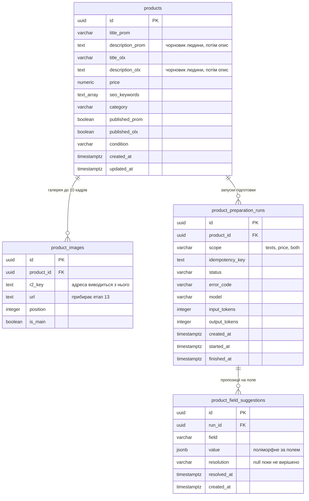

# Data model — product-creation-flow

Прохід **brownfield**: `products` і `product_images` уже створені міграцією
`1787756956906-create-products-tables`, і питання етапу було не «що побудувати», а «що
змінити».

**Головний висновок: поставка 1 не змінює схему взагалі.** Галерея, головний кадр, дві
відмітки присутності, ціна й обидва тексти вже мають свої колонки, готовність
обчислюється при читанні ([ADR 0009](adr/0009-derive-card-readiness-instead-of-storing-it.md)),
а межа в десять кадрів живе константою в контракті. Єдина зміна, яку поставка 1 потребує, —
прибрати `product_images.url` ([ADR 0007](adr/0007-serve-images-from-a-public-bucket.md)), і
вона **не входить у цей етап**: колонку читають `ProductImage` і мапінг у
`ProductController` (`image.url`), а скласти адресу з ключа неможливо, доки в `config` немає
домену бакета (реєстрація №5, [sad.md §5](sad.md)). Міграцію пише етап 13 тим самим комітом,
що вчить контролер складати адресу — розділяти їх означає деплоїти проміжний стан, де
контролер очікує колонку, якої вже нема, або навпаки.

**Обсяг документа — обидві поставки.** Так вимагає [sad.md §1](sad.md): форму зберігання
згенерованих значень треба спроектувати зараз, бо робити це після появи живих карток коштує
міграції над даними. Створення таблиць лишається поставці 2 —
[ADR 0006](adr/0006-store-generated-values-as-separate-suggestions.md) саме тому й обрав
окрему таблицю, що вона нічого не мігрує, і форму («одна на поле чи одна на запуск») делегував
сюди.

## ER diagram

## Де живе розпізнавання

Власних колонок під розпізнавання (US-02) **немає**. Те, що людина дізналася про річ — що
це, хто виробник, які базові характеристики — вона вписує в `description_prom` і
`description_olx`, а підготовка перетворює цей чорновик на опис під кожен майданчик.
`category` і `condition` вводяться при створенні картки й теж є входом.

Ціна названа тут окремо, бо вона не видима зі схеми: **обидва описи виконують дві ролі
водночас — вхід підготовки і її ціль**. Три наслідки, і всі три належать етапу 10, не
цьому:

1. **Гейт AC-06** («не внесено розпізнавання») читається як «обидва описи порожні». Іншої
   опори в схемі немає.
2. **Обіцянка ADR 0006 про порожню картку втрачає предмет для описів.** Правило: поки
   поточне значення поля збігається з останньою прийнятою пропозицією, нова застосовується
   сама. Картка з внесеним розпізнаванням ніколи не порожня, тож перша ж пропозиція для
   опису завжди лише пропонується, а не застосовується автоматично. Для `price` і
   `seo_keywords` правило працює як написано — до першого запуску вони порожні.
3. **Повторний запуск, якщо пропозицію вже прийнято, спирається на згенерований текст, а
   не на факти людини** — у полі лежить те, що написала модель минулого разу, і саме воно
   піде в наступний промпт.

## Aggregate roots

**Картка — єдиний агрегат фічі.** `products` володіє галереєю (`product_images`) і
запусками підготовки (`product_preparation_runs`), обидва — каскадом `on delete cascade`,
бо ні кадр, ні запуск не мають життя без картки
([ADR 0012](adr/0012-delete-permanently-in-the-same-request.md)). Пропозиція належить
запуску, а не картці напряму: `usage` виклику записаний на запуску, і пропозиція без свого
запуску не відповідає, скільки вона коштувала.

Галерея власного сервісу не отримує ([sad.md §5](sad.md)) — межа агрегату проходить по
картці, а не по кожній дитячій таблиці.

## Entities

### `products` — без змін

| Column | Type | Constraints | Notes |
|---|---|---|---|
| `id` | UUID | PK, `default uuidv7()` | Потрібен **до** вставки рядка: ключ R2 — `products/{id}/{кадр}` |
| `title_prom` | VARCHAR(200) | NOT NULL | `productConstraints.titleMaxLength` |
| `description_prom` | TEXT | NOT NULL DEFAULT `''` | Вхід підготовки і її ціль водночас — див. розділ вище |
| `title_olx` | VARCHAR(200) | NOT NULL | |
| `description_olx` | TEXT | NOT NULL DEFAULT `''` | Те саме |
| `price` | NUMERIC(12,2) | NOT NULL DEFAULT 0, CHECK `>= 0` | Десятковий рядок у коді, без `transformer`. `0` предикат готовності (ADR 0009) читає як «не задано» |
| `seo_keywords` | TEXT[] | NOT NULL DEFAULT `'{}'` | Межа 30 слів — `productConstraints.maxKeywords`, у коді, не в SQL (AC-07) |
| `category` | VARCHAR(120) | NOT NULL | Вхід підготовки |
| `published_prom` | BOOLEAN | NOT NULL DEFAULT false | Незалежна від `published_olx` (AC-13) |
| `published_olx` | BOOLEAN | NOT NULL DEFAULT false | |
| `condition` | VARCHAR(8) | NOT NULL DEFAULT `'used'`, CHECK IN (`new`,`used`) | |
| `created_at` | TIMESTAMPTZ | NOT NULL DEFAULT now() | |
| `updated_at` | TIMESTAMPTZ | NOT NULL DEFAULT now() | Наявна колонка, `@UpdateDateColumn` — картка редагується як ціле |

Створена міграцією `1787756956906-create-products-tables`. Цей прохід її не змінює.

**Access patterns:**
- Каталог зі списком, фільтрами й пагінацією → **індексів немає свідомо**: 50-100 карток на
  місяць, а підрядкові фільтри йдуть через `ilike '%…%'`, який B-tree не обслуговує.
- Предикат готовності (обидва описи непорожні, `price > 0`, є хоча б один кадр) → **колонки
  немає**, рахується при читанні ([ADR 0009](adr/0009-derive-card-readiness-instead-of-storing-it.md)).

### `product_images` — зміна належить етапу 13

| Column | Type | Constraints | Notes |
|---|---|---|---|
| `id` | UUID | PK, `default uuidv7()` | |
| `product_id` | UUID | NOT NULL, FK → `products(id)` ON DELETE CASCADE | |
| `r2_key` | TEXT | NOT NULL, UNIQUE | Повна адреса складається з нього й домену бакета при мапінгу в DTO ([ADR 0007](adr/0007-serve-images-from-a-public-bucket.md)) |
| `url` | TEXT | NOT NULL | **Прибирає етап 13** разом зі складанням адреси з ключа в контролері — не цей прохід |
| `position` | INTEGER | NOT NULL DEFAULT 0, CHECK `>= 0` | |
| `is_main` | BOOLEAN | NOT NULL DEFAULT false | |

Створена тією самою міграцією `1787756956906-create-products-tables`. Колонки `created_at`
таблиця не має, і фіча її не додає: порядок кадрів несе `position`, а часу створення кадру
ніхто не читає.

**Constraints:** `product_images_r2_key_key` UNIQUE (`r2_key`) — один об'єкт R2 належить
одній картці; `product_images_main_key` UNIQUE (`product_id`) WHERE `is_main` — рівно один
головний кадр (AC-03); `product_images_position_key` UNIQUE (`product_id`, `position`)
DEFERRABLE INITIALLY DEFERRED — перестановка проходить через стан, де дві позиції
збігаються; `product_images_position_non_negative_check` CHECK `position >= 0`.

Межа в десять кадрів (AC-02) в SQL **не** виражена: для неї потрібен тригер, а тригерів
проєкт не заводить. Її тримає `productConstraints.maxImagesPerProduct` у коді.

**Access patterns:**
- Галерея картки → `product_images_product_id_idx` (наявний, FK-індекс).

### `product_preparation_runs` — поставка 2, спроектовано

Один запуск підготовки: що просили, чим скінчилось і скільки токенів це коштувало.

| Column | Type | Constraints | Notes |
|---|---|---|---|
| `id` | UUID | PK, `default uuidv7()` | |
| `product_id` | UUID | NOT NULL, FK → `products(id)` ON DELETE CASCADE | |
| `scope` | VARCHAR(8) | NOT NULL, CHECK IN (`texts`,`price`,`both`) | Без області AC-10b не має предмета: саму ціну не попросити, не перезапускаючи тексти |
| `idempotency_key` | TEXT | NOT NULL, UNIQUE | Картка + область + версія входу (sad.md §6, сценарій 7) |
| `status` | VARCHAR(16) | NOT NULL, CHECK IN (`queued`,`running`,`succeeded`,`failed`) | Джерело для полінгу (сценарій 7, 8) |
| `error_code` | VARCHAR(64) | NULL | Доменний код при `failed` — той самий, що фронт мапить у текст (AC-10) |
| `model` | VARCHAR(64) | NOT NULL | Без нього токени не перевести в гроші, коли зʼявиться стеля вартості (PRD §8) |
| `input_tokens` | INTEGER | NOT NULL DEFAULT 0 | `usage` виклику — вимога `ai/CLAUDE.md` |
| `output_tokens` | INTEGER | NOT NULL DEFAULT 0 | |
| `created_at` | TIMESTAMPTZ | NOT NULL DEFAULT now() | Він же — вхід обмеження частоти запусків (§8, PRD §6.1) |
| `started_at` | TIMESTAMPTZ | NULL | |
| `finished_at` | TIMESTAMPTZ | NULL | |

`updated_at` таблиця не отримує навмисно: подія, а не сутність, яку редагують як ціле —
змістовні моменти названі своїми іменами (`started_at`, `finished_at`).

Міграція — **поставка 2**, разом із чергою й `worker`: таблиця без процесу, що в неї пише,
не має сенсу створювати заздалегідь.

**Access patterns:**
- Полінг стану запуску (сценарій 7, 8) → по `id`, PK.
- Вартість картки = `sum(input_tokens + output_tokens)` по `product_id` (AC-14) → індекс
  `product_preparation_runs_product_id_idx`.
- Обмеження частоти запусків (§8, PRD §6.1) → `count(*) where product_id = $1 and
  created_at > now() - вікно`. **Окремої таблиці лічильника не заводимо** — запуски вже
  записані тут, а індекс під це не потрібен: при десятках запусків на місяць скан дешевший.
- Повторний клік по незміненому входу не платить двічі → `idempotency_key` UNIQUE.

### `product_field_suggestions` — поставка 2, спроектовано

Що модель запропонувала для конкретного поля картки і що з цим зробила людина.

| Column | Type | Constraints | Notes |
|---|---|---|---|
| `id` | UUID | PK, `default uuidv7()` | |
| `run_id` | UUID | NOT NULL, FK → `product_preparation_runs(id)` ON DELETE CASCADE | Картка досяжна через запуск — `product_id` тут **не** дублюється |
| `field` | VARCHAR(32) | NOT NULL, CHECK IN (`description_prom`,`description_olx`,`seo_keywords`,`price`) | |
| `value` | JSONB | NOT NULL | **Єдиний JSONB у схемі.** Значення поліморфне за `field`: рядок для описів, масив рядків для ключових слів, діапазон для ціни |
| `resolution` | VARCHAR(16) | NULL, CHECK IN (`accepted`,`rejected`) | **NULL = ще не вирішено.** Третього слова немає: `pending` дублював би те, що вже несе відсутність рішення |
| `resolved_at` | TIMESTAMPTZ | NULL | |
| `created_at` | TIMESTAMPTZ | NOT NULL DEFAULT now() | |

Міграція — **поставка 2**, тим самим комітом, що й `product_preparation_runs`: без запуску
пропозиція не має, кому належати.

**Чому JSONB, попри загальне правило «структуровані поля → першокласні колонки».** Форма
значення залежить від `field`, і окремі колонки дали б `value_text`, `value_keywords`,
`price_from`, `price_to` — чотири, з яких у рядку заповнена одна. Це саме той виняток, який
правило називає: payload, непрозорий для БД, яка його не фільтрує й не сортує, а тільки
віддає.

**Чому `product_id` не дублюється сюди.** Звірка AC-11 читає останню прийняту пропозицію
для поля картки, і без дубля це `join` через `runs`. Дубльована колонка скоротила б запит
ціною другого місця, де живе той самий факт, — а розходження між ними нічим не захищене.

**Access patterns:**
- Звірка AC-11 (сценарій 9): `join product_preparation_runs r on r.id = s.run_id where
  r.product_id = $1 and s.field = $2 and s.resolution = 'accepted' order by s.created_at
  desc limit 1` → індекс `product_field_suggestions_run_field_key` (FK-колонка `run_id`
  лідирує в ньому, тож той самий індекс обслуговує і join, і унікальність).
- Непідтверджені пропозиції поруч зі значеннями (сценарій 5, 9) → те саме, `resolution is
  null`.

**Constraints:** `product_field_suggestions_run_field_key` UNIQUE (`run_id`, `field`) —
один запуск дає не більше однієї пропозиції на поле.

## Indexes

| Index | Table | Columns | Query it serves |
|---|---|---|---|
| `product_images_product_id_idx` | `product_images` | `product_id` | Кадри картки; FK-індекс. **Наявний** |
| `product_images_r2_key_key` | `product_images` | `r2_key` UNIQUE | Один об'єкт R2 належить одній картці. **Наявний** |
| `product_images_main_key` | `product_images` | `product_id` WHERE `is_main` UNIQUE | Рівно один головний кадр (AC-03). **Наявний** |
| `product_images_position_key` | `product_images` | (`product_id`, `position`) UNIQUE DEFERRABLE | Порядок у галереї з дозволеною перестановкою. **Наявний** |
| `product_preparation_runs_product_id_idx` | `product_preparation_runs` | `product_id` | Вартість картки (AC-14) і запуски картки; FK-індекс. **Поставка 2** |
| `product_preparation_runs_idempotency_key_key` | `product_preparation_runs` | `idempotency_key` UNIQUE | Повторний запуск того самого входу не платить двічі. **Поставка 2** |
| `product_field_suggestions_run_field_key` | `product_field_suggestions` | (`run_id`, `field`) UNIQUE | Пропозиції запуску; один запуск дає не більше однієї на поле; той самий індекс обслуговує join у звірці AC-11. **Поставка 2** |

`products` не має жодного вторинного індексу — каталог фільтрує через `ilike`, якого
B-tree не обслуговує, а 50-100 карток на місяць роблять послідовний скан дешевшим за
підтримку індексів. Індексів «про запас» немає жодного: кожен обслуговує названий запит
або тримає інваріант.

## Migrations

**Цей прохід не додає жодної міграції** — поставка 1 схему не змінює взагалі.

| Change | Stage / поставка | Why |
|---|---|---|
| `− product_images.url` | **етап 13** | Нероздільна з правкою `ProductImage` і `ProductController`: без домену бакета в `config` адресу з ключа не скласти, а розділяти зміну на два коміти означає проміжний деплой, де щось одне не відповідає іншому |
| `+ product_preparation_runs`, `+ product_field_suggestions` | **поставка 2** | Спроектовані тут повністю (§ Entities), створюються разом із чергою й `worker` — таблиця без процесу, що в неї пише, не має сенсу заводити заздалегідь |

## Test fixtures

Окремих файлів з фабриками немає: правило 8 `CLAUDE.md` тримає тестові двійники в тому
самому `*.spec.ts`, що й тест. Наявні `ProductRepository.spec.ts` (`seedProduct`,
`seedImage`) і `db/schema.spec.ts` (`insertProduct`, `insertImage`) уже покривають схему,
яку цей прохід не змінив.

Сідів фіча не додає: bootstrap адміна вже робить `1787738400000-create-first-user`, а
довідкових таблиць у схемі немає — `condition`, `scope`, `status`, `resolution` і `field`
живуть константами в коді, не рядками таблиці.

## Open items

- `<!-- TBD -->` **Гейт AC-06 через описи.** «Не внесено розпізнавання» = обидва описи
  порожні. Формулювання PRD цього прямо не каже — рядок для правки, власник Serhii.
- `<!-- TBD -->` **Форма значення `value` для поля `price`** (`{from, to}` чи інша) —
  імена ключів JSON-обʼєкта фіксує етап 10 разом зі схемою відповіді; на рівні даних
  зафіксовано лише те, що це JSONB.
- `<!-- TBD -->` **Вікно обмеження частоти запусків** — кількість і період вікна, у
  `src/config.ts`; не впливає на схему, лише на запит з нього.
- `<!-- TBD -->` **Що таке «версія входу» в ключі ідемпотентності** — хеш входу
  (`category`, `condition`, обидва описи) чи `updated_at` картки. Впливає на те, чи
  вважається запуск після правки опису новим входом чи повтором.
