# Software Architecture Document — product-creation-flow


> **Стадії SDLC 04-05.** Вхід: [PRD](PRD.md) · [CONTEXT](../../../CONTEXT.md).
> Рішення — у [adr/](adr/), зворотний індекс на них — у §9.
> C4 Context (L1) — інлайн у §3, C4 Container (L2) — інлайн у §5; рівень L3 поза межами документа.

## 1. Introduction and goals

**Intent.** `product-creation-flow` переносить підготовку картки товару всередину адмінки:
картка стає єдиним місцем, де живуть тексти під обидва майданчики, ціна, галерея до десяти
кадрів і дві незалежні відмітки присутності — `published-prom` і `published-olx` (PRD §2).
Розпізнавання речі за фото лишається ручним кроком (PRD §3): idea-brief §13 назвав вузьким
місцем кроки 2-4, а не крок 1, тож `user` вписує, що це за річ, сам, а система готує з
цього тексти й ціну.

**Обсяг: один документ, дві поставки.** Прохід розділив фічу надвоє, і межа проходить по
зовнішній моделі:

- **Поставка 1 — картка й галерея.** Створення й редагування картки, галерея до десяти
  кадрів з головним, зовнішнє сховище, окремі відмітки присутності. Ні черги, ні другого
  процесу в ній немає — вони переїхали в поставку 2 разом із похідними розмірами
  ([ADR 0011](adr/0011-store-only-the-original-frame.md)).
  Покриває US-01, US-02, US-05 у частині ручного редагування, US-06, US-07.
- **Поставка 2 — модель.** Тексти під обидва майданчики, діапазон ціни, збереження ручних
  правок при повторному запуску, вартість картки, а разом з ними — черга, процес `worker` і
  `sharp` як оптимізація кадру перед викликом. Покриває US-03, US-04, US-05 повністю,
  US-08.

Документ проектує **обидві**, а не лише першу. Причина не в повноті: форма зберігання
згенерованих значень (§4 S3) визначає схему, яку закладає етап 08, і спроектувати її після
того, як у таблиці зʼявляться живі картки, коштує міграції над даними. Порядок поставок —
рішення про послідовність робіт, а не про архітектуру, тому окремого ADR під нього немає;
рядок про відкладене — у §11, і етап 13 має розрізати задачі по цьому ж рубежу.

**Top-3 quality goals** (однорядково; повні сценарії — у §10):

1. **QG-1 Стійкість до часткової відмови зовнішніх сервісів** — усе вже збережене
   лишається цілим, три повтори, далі видима помилка (PRD §6, рядок «Відмова зовнішнього
   сервісу»; AC-10, AC-10b).
2. **QG-2 Незаблокований інтерфейс** — превʼю кадру ≤ 1 с, форма не блокується під час
   вивантаження (PRD §6, рядок другий; AC-01). Рядок PRD про старт фонової задачі ≤ 5 с
   предмета в поставці 1 не має й повертається разом із чергою (§10).
3. **QG-3 Ручна правка остаточна** — повторний запуск підготовки не перезаписує поле, яке
   `user` виправив руками (AC-11, AC-12).

**Stakeholders.**

| Role | Interest | Sign-off owner? |
|---|---|---|
| Serhii (Architect / Tech Lead / dev) | Тривалість. idea-brief §12 лишив Time ☐ саме тому, що фіча вводила чергу, другий процес і зовнішнє сховище водночас; поставка 1 після §4 S1 вводить лише сховище, а решта меж переїхала в поставку 2. Форма зберігання має пережити її без міграції над живими даними | Yes |
| `user` (єдиний адміністратор адмінки) | Зникає цикл «фото → зовнішній чат → буфер обміну → тека на диску»: 15-20 хвилин ручних дій на позицію при 50-100 позиціях на місяць (PRD §1). Часткова готовність картки не блокує роботу з рештою (PRD §2) | No |

## 2. Constraints

**Technical.**

- Node 26, ESM, Fastify 5; бекенд збирається `tsc` у `dist/`, звідки його й запускає Node —
  `@Entity`/`@Column` є декораторами, а Node їх не трансформує ([ADR 0003](../../adr/0003-three-layer-classes.md)).
- TypeScript 6.0.3 — жорсткий пін: Angular 22 вимагає `>=6.0 <6.1`.
- PostgreSQL 18 + TypeORM 1.1; `typeorm` і `pg` згадуються тільки в `*Repository.ts` і в
  entity-класах. Перелік entity в `.dependency-cruiser.cjs` іменний
  (`User|Product|ProductImage`) — нова entity дописується туди явно, і це навмисно:
  додавання entity є рішенням про те, де дозволено зʼявитися ORM.
- Angular 22 — standalone, signals, zoneless; Angular Material.
- Фіча вперше вводить у `package.json` чотири залежності, яких зараз немає: `pg-boss`
  (черга), `sharp` (оптимізація кадру перед викликом моделі — обидва в поставці 2),
  `@aws-sdk/client-s3` (R2, поставка 1) і клієнт Anthropic (поставка 2). Збережених похідних
  розмірів система не робить взагалі ([ADR 0011](adr/0011-store-only-the-original-frame.md)),
  тож `sharp` тут не генератор копій, а перетворювач у момент виклику.
  `sharp` — нативний модуль, як і наявний `argon2`: `node_modules` живуть в
  іменованому томі й не приїжджають з хоста.
- **Успадкована схема.** Таблиці `products` і `product_images` уже створені міграцією
  `1787756956906-create-products-tables`. Фіча успадковує їхні інваріанти, а не вигадує свої:
  частковий унікальний індекс `product_images_main_key` («рівно один головний кадр на
  картку» тримає БД, а не код), відкладений унікальний `product_images_position_key` на
  `(product_id, position)` (перестановка кадрів проходить через стан, де дві позиції
  збігаються), унікальний `product_images_r2_key_key`, `on delete cascade` з картки на кадр
  і `products_price_non_negative_check`.
- Межі полів — константи `contracts/products-limits.ts`: 10 кадрів на картку, 30 ключових
  слів, заголовок 200 знаків, опис 8000, категорія 120, ціна за взірцем
  `^\d{1,10}(\.\d{1,2})?$`.
- **Два обмеження, які фіча мусить посунути:** `config.http.bodyLimitBytes` дорівнює
  256 KiB — «тіла запитів авторизації крихітні, великі файли підуть окремим маршрутом»,
  тоді як PRD §6 називає 10 МБ на файл; той самий ліміт стоїть і в Caddy. Обидва місця
  доводиться правити разом, і про друге легко забути.
- **Модель.** `claude-opus-5` — константа `src/config.ts`, не env-змінна: заміна моделі
  змінює якість, формат відповіді й собівартість, тож проходить через коміт і рев'ю
  (`ai/CLAUDE.md`). Конфігурація вже заточена під ціну: максимум три кадри на запит, sharp
  до 1568 px по довшій стороні («вибір ціни, а не технічна межа»), plain text без Markdown.
  Незакритою лишається вимога idea-brief §1 «безкоштовно або мінімальний cost» — числової
  стелі §2 не вводить, бо її неможливо назвати до першого місяця роботи поставки 2 (рядок
  у §11).

**Organisational.**

- Один розробник, який суміщає всі ролі; обсяг системи — 50-100 товарів на місяць,
  один-два адміни.
- idea-brief §12 Feasibility: Tech ☑, Skills ☑, **Time ☐**. Орієнтир RICE — 2 людино-тижні,
  але отриманий він на роботі з власною базою за відомим шаблоном, без черги, зовнішнього
  сховища й фото. Саме ця невідома й зумовила поділ на дві поставки (§1).

**Conventions.**

- Правила залежностей 1-9 — кореневий `CLAUDE.md`, правила 10-14 фронтенду —
  `apps/web/CLAUDE.md`, правила модулів — `modules/auth/CLAUDE.md` і `modules/ai/CLAUDE.md`.
  Машинна перевірка: `api npm run deps:check` (dependency-cruiser по glob-ах імен класів) і
  `web npm run lint` (межі між фічами). PR з порушенням не мержиться.
- Три шари виражені **суфіксом класу** (`*Controller.ts` → `*Service.ts` → `*Repository.ts`)
  у пласкій папці модуля; підпапки заводяться, коли файлів стає понад десяток (правило 9).
  `products` сьогодні має вісім файлів — фіча підводить його впритул до межі (§5).
- Модуль бачить інший модуль тільки через `index.ts`; deep import заборонено, циклів немає.
- Залежності приходять конструктором, створює їх тільки composition root. Сьогодні він
  один — `src/api.ts`; фіча вводить другий, `src/worker.ts`.
- Гроші — `decimal(12,2)` у БД і десятковий рядок у коді, без `transformer` на колонці й без
  конвертера в репозиторії. Час — `timestamptz`, UTC у БД, форматування на клієнті.
  Snake_case у SQL, camelCase у TS; зміни схеми — тільки міграцією.
- Три рівні конфігурації не змішуються: `@environments/environment` — публічний бандл
  фронту, `src/config.ts` — константи в коді, `process.env` — тільки секрети й
  машинозалежне. Критерій: однакове на всіх машинах є константою, а не env-змінною.

**Regulatory / external.**

- Класифікація даних — internal (PRD §6.1). Персональних даних покупців система не тримає,
  і фіча нових полів з ними не вводить.
- Доступ — активна сесія в httpOnly-cookie. Ролей і розмежування прав немає: за глосарієм
  `CONTEXT.md` `user` — єдина людина, а не роль. Фіча додає нові дії, але перевірка лишається
  одна й та сама; нових привілеїв не зʼявляється.
- **Security review: Required** (PRD §6.1) — фіча вводить дві межі, яких у системі не було:
  зовнішнє файлове сховище й вихід у зовнішній сервіс.
- Abuse cases, які §4 і §8 мусять закрити: неконтрольовані запуски підготовки (це прямі
  гроші — потрібне обмеження частоти, окреме від наявного обмеження на спроби входу);
  небезпечний файл на вході (межа розміру плюс перевірка, що це справді зображення, **до**
  потрапляння у сховище); доступ до кадру за посиланням.

## 3. Context and scope

Адмінка живе на одному домені за Caddy: `user` відкриває її в браузері, збирає картку —
галерею, тексти, ціну — і сам переносить готове на майданчики, повертаючись відмітити
присутність. Кордон довіри проходить по вхідному файлу: байти, що прийшли з браузера,
вважаються неперевіреними, доки `api` не підтвердив, що це справді зображення в межах
розміру (PRD §6.1); тільки після цього вони потрапляють у сховище.

**External systems (in / out):**

| Actor or system | Type | Interaction |
|---|---|---|
| `user` | Person | Створює й редагує картку, вантажить кадри, призначає головний, запускає підготовку, відмічає присутність на кожному майданчику окремо |
| Cloudflare R2 | System (external) | `api` кладе перевірений оригінал і видаляє обʼєкт при видаленні кадру чи картки (S3 API); похідних розмірів система не робить ([ADR 0011](adr/0011-store-only-the-original-frame.md)); браузер читає кадри **напряму**, не через `api` |
| Anthropic API | System (external, поставка 2) | `worker` викликає `claude-opus-5` зі structured outputs — тексти під обидва майданчики; окремим викликом `web_search_20260209` з локацією UA — діапазон ринкових цін |
| Prom · OLX | Поза межею системи | Інтеграції немає і не планується в цій фічі (PRD §3): картку переносить людина вручну, а система лише веде `published-prom` і `published-olx` як дві незалежні відмітки. На діаграмі нижче їх немає навмисно — стрілка до них читалася б як обмін даними, якого не існує |

**C4 Context (L1):**

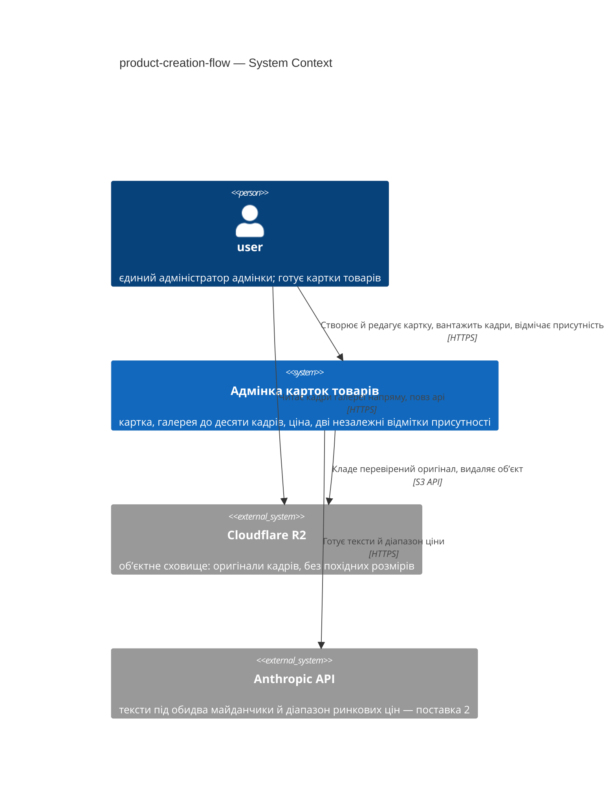

## 4. Solution strategy

**Стратегічні вибори (насіння для ADR):**

### S1. Кадр приймається одним синхронним запитом, похідних розмірів система не робить

Запит перевіряє, що файл справді є зображенням і не більший за 10 МБ, кладе оригінал у R2,
пише рядок у `product_images` і відповідає. Зменшених копій немає взагалі: галерея, картка й
майданчики беруть той самий оригінал за постійною адресою. Наслідок, який і робить цей вибір
стратегічним: похідні розміри були єдиною причиною, заради якої поставці 1 потрібні черга й
другий процес, — тож `pg-boss`, `src/queue.ts`, `src/worker.ts` і четвертий сервіс у
`docker-compose.yml` переїжджають у поставку 2, де `ai/CLAUDE.md` вимагає їх беззастережно
(«виклики AI виконуються тільки у worker»). З чотирьох нових меж, через які idea-brief §12
лишив **Time ☐**, поставка 1 вводить рівно одну — зовнішнє сховище.

Ціну названо в [ADR 0011](adr/0011-store-only-the-original-frame.md) і вона не мала:
браузер тягне повнорозмірні оригінали. Рядок PRD §6 про `p95 ≤ 500 ms` цим не порушується —
він міряє тривалість запиту з pino-логів, тобто час роботи API, — але обсяг трафіку на
каналі користувача зростає, і саме тому S2 стає важливішим, ніж здавався.

Сповіщення фронту про фонову роботу в поставці 1 не потрібне зовсім: фонової роботи немає.
Кадр має два стани — записаний або запит не вдався. Полінг зʼявиться разом із поставкою 2,
де генерація триває десятки секунд; це адитивна зміна без міграції, тож окремого ADR вона не
заслуговує (§9).

### S2. Кадри читаються з публічного бакета, а повна адреса складається з ключа

У `product_images` лежить тільки ключ обʼєкта; повна адреса виводиться з базового домену
бакета й цього ключа в момент мапінгу в DTO. Колонку `url`, яку створила міграція
`1787756956906-create-products-tables`, прибирає міграція цієї фічі: збережена адреса дублює
те, що вже випливає з ключа, і перший же переїзд бакета вимагав би скрипта, що переписує всі
рядки. Постійна адреса дає те, чого підписане посилання дати не може, — кеш браузера, і
після S1 це вже не оптимізація, а компенсація повнорозмірних оригіналів.

Рішення перекриває **три підписані документи** одночасно: `CLAUDE.md` і `ARCHITECTURE.md`
(«тільки R2 + presigned URL») і рядок PRD §6.1 («посилання на кадр обмежене в часі»). Усі
три правки — з власником і строком — у §11.
Деталі: [ADR 0007](adr/0007-serve-images-from-a-public-bucket.md).

### S3. Згенеровані значення живуть окремою таблицею пропозицій, а не в полях картки

Модель ніколи не пише в `products`. Кожен запуск кладе рядки в окрему таблицю — яка картка,
яке поле, запропоноване значення, коли, і `usage` виклику. Це єдина форма, яка закриває три
критерії приймання одразу: AC-11 виконується структурно (генерації фізично нема куди
перезаписати), AC-10b — бо текст і ціна є окремими записами, AC-14 — бо вартість картки є
сумою по цій самій таблиці, а не ще одним збереженим числом.

Порожня картка при цьому не вимагає підтверджень: поки поточне значення поля збігається з
останньою прийнятою для нього пропозицією, нова застосовується сама; щойно розійшлося —
діє AC-11. Окремого прапорця «редаговано вручну» для цього не потрібно.
Деталі: [ADR 0006](adr/0006-store-generated-values-as-separate-suggestions.md).

### S4. Видалення остаточне, і обʼєкт прибирається раніше за рядок

`deleted_at` не зʼявляється: умова «не видалено» додавалася б у кожен запит каталогу й у
кожен унікальний індекс, а мʼяко видалена картка без фото однаково не є готовою.
Порядок дій і є рішенням: спершу обʼєкт у сховищі, потім рядок у базі. У зворотному порядку
збій лишає невидимий обʼєкт-сироту, за який проєкт платить роками; у цьому — рядок, який
показує зображення, якого немає: його видно оком і можна видалити ще раз.

Видалення входить в обсяг попри те, що PRD не має про нього ні user story, ні критерію
приймання: без нього межа AC-02 у десять кадрів стає глухим кутом. Обидва розходження — у §11.
Деталі: [ADR 0012](adr/0012-delete-permanently-in-the-same-request.md).

### S5. Готовність картки — обчислюване правило, а не збережений стан

«Готова» рахується при читанні: обидва описи непорожні, `price > 0`, у галереї є щонайменше
один кадр. Колонки немає, дії «позначити готовою» немає. Підстава — глосарій `CONTEXT.md`,
канонічний для домену: він визначає готовність як **повноту** картки, а не як подію.
Збережений прапорець дублював би те, що вже випливає з полів, і починав би брехати з першого
редагування, яке його не зняло.

Формулювання AC-15 («user позначає картку готовою») цьому не відповідає й потребує правки
PRD — рядок у §11. Побічно тут закривається дрібниця, яка інакше вийшла б на етапі 08:
`price` має `not null default 0`, тож предикат читає нуль як «не задано».
Деталі: [ADR 0009](adr/0009-derive-card-readiness-instead-of-storing-it.md).

---

Кожне тактичне рішення пізніших секцій зводиться до одного з цих пʼяти стовпів. Рішення, яке
стовпу суперечить, — червоний прапорець і привід для рядка в §11.

## 5. Building block view

Межа між модулями лягає так: `products` тримає картку й галерею разом — рядок
`product_images` належить картці, видаляється каскадом разом із нею, і entity вже живе саме
в цьому модулі, тож писати його має його ж репозиторій (правила 5-6 `CLAUDE.md`). `media`
створюється з нуля як **адаптер сховища без домену**: він уміє перевірити байти, покласти
обʼєкт, повернути ключ і видалити обʼєкт, а слова «картка» не знає. Контролера в `media`
немає взагалі — маршрут завантаження є маршрутом галереї картки. Напрямок стрілки й підстава —
[ADR 0013](adr/0013-call-media-from-products-as-a-storage-adapter.md).

Галерея не отримує власного сервісу: `ProductService` тримає і картку, і кадри. Окремий
`ProductImageService` вивів би модуль на десять файлів — межу правила 9 — не купивши нічого,
поки папка плоска. Розкладку на підпапки починає **наступна** фіча в цьому модулі; поставка 2,
яка додає таблицю пропозицій, майже напевно нею і стане.

**Файли, які фіча додає або змінює — поставка 1:**

```
apps/api/src/modules/products/            8 файлів → 9
├── Product.ts                без змін
├── ProductImage.ts           зміна: колонка url зникає (§4 S2)
├── ProductRepository.ts      зміна: створення, оновлення й видалення картки; вставка,
│                             перестановка й видалення кадрів
├── ProductService.ts         зміна: картка, галерея, головний кадр, предикат готовності
├── ProductController.ts      зміна: маршрути запису, приймання кадру, видалення
├── ProductErrors.ts          новий: доменні помилки картки (за взірцем AuthErrors.ts)
├── index.ts                  зміна: розширений public API
└── *.spec.ts                 наявні + нові

apps/api/src/modules/media/               0 файлів → 3
├── MediaService.ts           новий: перевіряє справжній тип за сигнатурою вмісту, кладе
│                             обʼєкт, повертає ключ; видаляє обʼєкт (поштучно й пакетом)
├── ImageStorage.ts           новий: адаптер R2 через S3 API — єдиний файл, де згадується
│                             @aws-sdk/client-s3
└── index.ts                  новий: public API модуля

apps/api/src/contracts/
├── products.contract.ts      + схеми створення й оновлення картки, схема кадру без url,
│                             похідне поле готовності у відповіді
├── products-limits.ts        + межа розміру файлу й перелік дозволених типів зображень
│                             (фронт читає їх у рантаймі, щоб відмовити до вивантаження)
└── error-codes.ts            + доменні коди картки: галерея повна, кадр не знайдено,
                              сховище недоступне

apps/api/db/migrations/<timestamp>-drop-product-image-url.ts
apps/api/src/config.ts        + межа розміру тіла запиту; + envSchema для креденшелів R2
apps/web/src/app/products/form/       product-form.ts/html/css — нова підфіча
apps/web/src/app/products/            зміни в gallery/product-gallery-dialog.*,
                                      products-api.ts, catalog/product-catalog.*
apps/web/src/app/confirm-dialog.ts   новий: спільний, бо підтвердження потрібне у двох місцях
                                     (правило 12 — спільне піднімається на рівень app/)
```

**Поставка 2 додає:** `modules/ai/` (сервіс виклику моделі, адаптер Anthropic), entity й
репозиторій таблиці пропозицій усередині `products`, `src/queue.ts`, `src/worker.ts`,
`contracts/ai.contract.ts`, сервіс `worker` у `docker-compose.yml` і рядок у
`.dependency-cruiser.cjs` — перелік entity там **іменний**, тож нову треба дописати явно.

**Вісім місць реєстрації**, де файл легко створити й забути підʼєднати:

| # | Місце | Що додається |
|---|---|---|
| 1 | `src/api.ts` | `new ImageStorage(...)` → `new MediaService(...)` → передається в `ProductService` |
| 2 | `ProductController.register()` | нові маршрути під тим самим `sessionGuard` |
| 3 | `db/migrations-list.ts` | клас нової міграції (`db:migrate:new` дописує сам) |
| 4 | `.dependency-cruiser.cjs` | іменний перелік entity — у поставці 2 |
| 5 | `envSchema` у `src/config.ts` | креденшели R2 і публічний домен бакета |
| 6 | `.env.example` | ті самі змінні як зразок |
| 7 | `docker-compose.yml` | проброс змінних R2 у сервіс `api` |
| 8 | `infra/caddy/Caddyfile` | ліміт розміру тіла — парний до `config.http.bodyLimitBytes` |

**C4 Container (L2):**

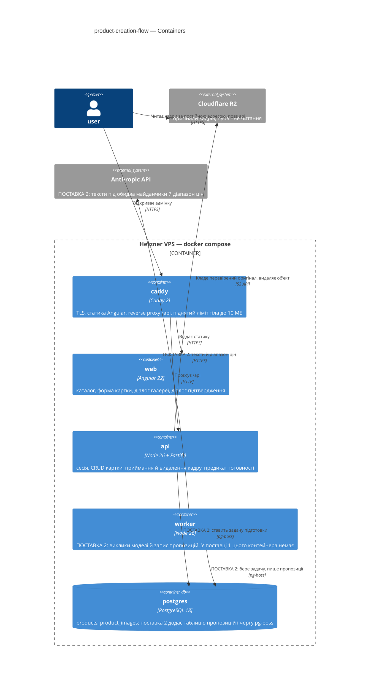

## 6. Runtime view

Учасники — контейнери §5. Повідомлення семантичні: імена ендпоінтів і HTTP-методи народжує
етап 10.

**Сценарій 1 — додавання кадру в галерею (US-01, AC-01, AC-02).**

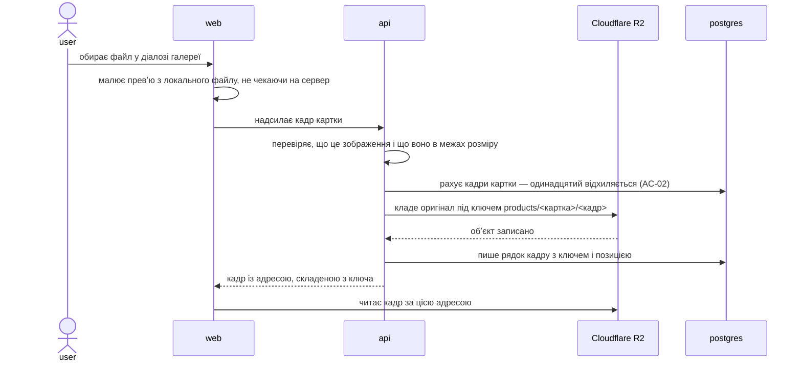

Превʼю ≤ 1 с (QG-2) забезпечує другий рядок, а не швидкість сервера: браузер малює обраний
файл локально ще до відповіді. Форма при цьому лишається придатною до редагування.

**Сценарій 2 — сховище недоступне під час завантаження (QG-1; PRD §6, рядок «Відмова
зовнішнього сервісу»).**

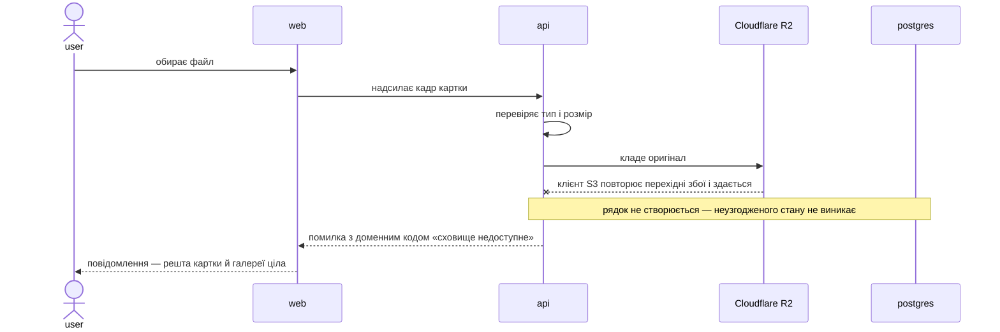

Власного циклу повторів застосунок не має: три спроби робить клієнт S3, і на це витрачається
частина бюджету `config.http.requestTimeoutMs` = 15 с. Далі помилка стає видимою, а повтор —
дією людини. Рядок PRD §6 про «3 повтори» описує рівень клієнта сховища, а не застосунку;
уточнення — у §11.

**Сценарій 3 — призначення головного кадру (AC-03).**

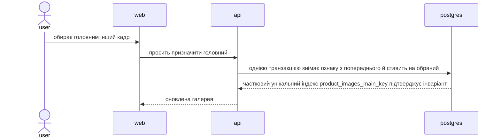

«Головний рівно один» тримає база, а не уважність коду: індекс уже створено міграцією
`1787756956906-create-products-tables`. Перестановка кадрів спирається на відкладене
унікальне обмеження `(product_id, position)` — саме тому воно `deferrable`.

**Сценарій 4 — видалення кадру (§4 S4).**

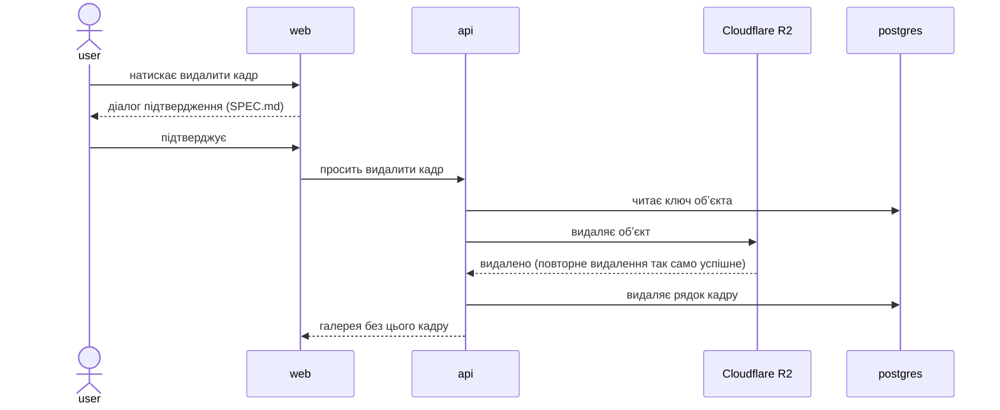

Порядок обовʼязковий: спершу сховище, потім база. Якщо сховище не відповіло — не видалено
нічого, і `user` повторює. Якщо процес упав між двома кроками — лишається рядок без файлу:
видно оком, видаляється ще раз. Видалення картки йде тим самим шляхом, лише обʼєкти
прибираються одним пакетним викликом, а рядки кадрів — каскадом `on delete cascade`.

**Сценарій 5 — поставка 2: підготовка повернула тексти, але не ціну (AC-10b, QG-1).**

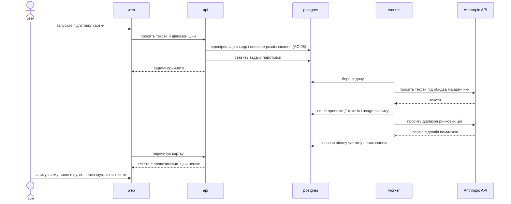

Часткова відмова не втрачає нічого зі здобутого: тексти вже лежать пропозиціями, бо кожен
результат є окремим записом (§4 S3). Полінг стану в поставці 2 стає потрібним — генерація
триває десятки секунд; у поставці 1 його немає, бо фонової роботи немає теж.

**Сценарій 6 — ручне заповнення картки (US-06, US-02, AC-04, AC-09, AC-12).**

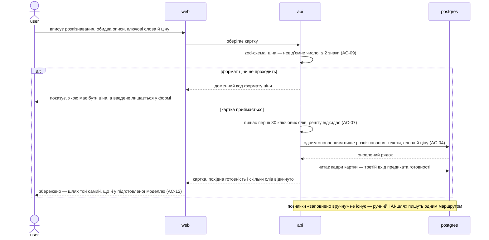

Ручний шлях не має власного маршруту: він пише в ті самі поля тим самим запитом, що й
прийняття пропозиції, і саме тому AC-12 виконується сам собою — «прийняти картку як
підготовлену» окремою дією в системі не існує. Дві межі, видимі тут, належать різним рівням:
формат ціни відхиляє zod на межі контролера (AC-09), а тридцять ключових слів — межа домену,
яка введене не відхиляє, а обрізає й повідомляє про відкинуте (AC-07). Це єдине місце
документа, де межа виправляє введене замість відмовити, і розбіжність зі стилем валідації §8
винесена у звіт аудиту.

**Сценарій 7 — поставка 2: підготовка текстів (US-03, AC-05, AC-06, AC-07).**

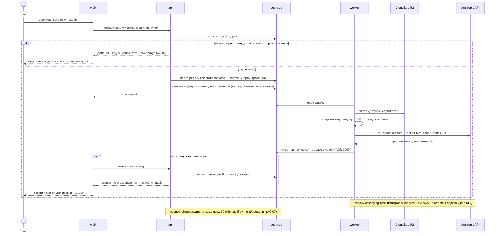

Гейт AC-06 стоїть до постановки задачі, а не всередині воркера: перевірка коштує одного
читання, а запуск коштує грошей. Тією ж логікою поруч стоїть обмеження частоти запусків (§8).
Дві форми, яких §4 не фіксує, з'являються тут уперше й потребують рішення етапу 08: ключ
ідемпотентності задачі і область запуску («тексти», «ціна», «обидва»), без якої AC-10b не має
предмета. Обидві — у звіті аудиту як кандидати в ADR.

**Сценарій 8 — поставка 2: діапазон ціни (US-04, AC-08, AC-10, AC-10b).**

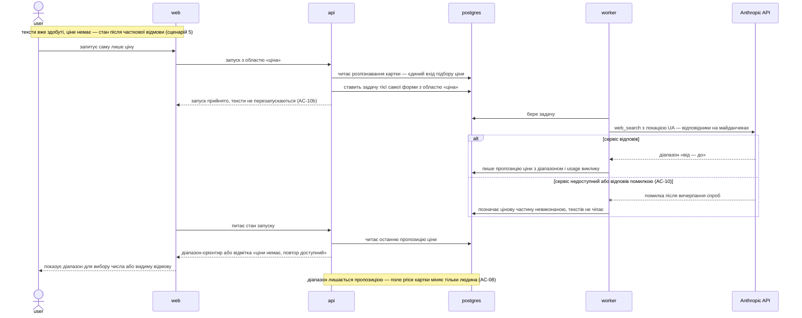

Сценарій починається там, де обірвався п'ятий: область запуску дозволяє попросити саму ціну,
не платячи вдруге за тексти. Форма результату тут інша, ніж у текстів, і це не дрібниця —
пропозиція несе діапазон із двох чисел, тоді як поле `price` картки одне (`decimal(12,2)`,
`not null default 0`). Або таблиця пропозицій уміє тримати діапазон, або діапазон зводиться до
числа ще у воркері, і тоді AC-08 втрачає предмет. Рішення належить етапу 08.

**Сценарій 9 — поставка 2: повторний запуск не перезаписує ручну правку (US-05, AC-11, QG-3).**

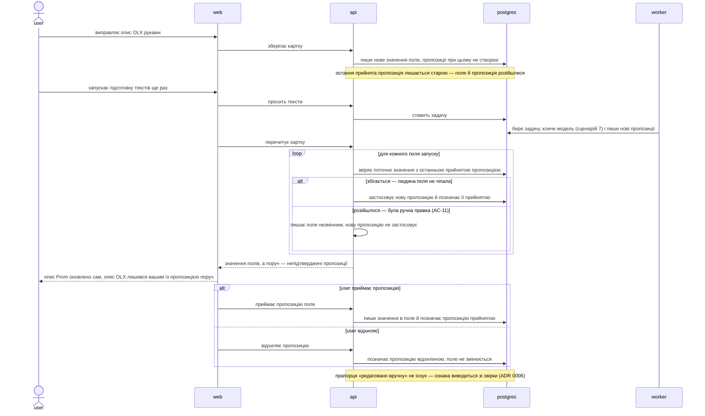

Це QG-3 у дії, і тримається воно без жодного прапорця: ознака «поле чіпала людина» виводиться
зі звірки поточного значення з останньою прийнятою пропозицією
([ADR 0006](adr/0006-store-generated-values-as-separate-suggestions.md)). Порожня картка тому й
не вимагає підтверджень — усі поля збігаються, і перший запуск застосовується сам. Ціна
рішення видима просто в діаграмі: звірка живе на читанні картки, тож читання може писати. Це
вибір, а не недогляд, і у звіті аудиту він стоїть кандидатом у §11 — інакше на рев'ю виглядає
помилкою.

**Готовність картки без власного сценарію.** «Готова» — не збережений стан і не дія, а
правило, яке рахується при читанні: обидва описи непорожні, `price > 0`, у галереї є
щонайменше один кадр ([ADR 0009](adr/0009-derive-card-readiness-instead-of-storing-it.md)).
Послідовності в часі тут немає — є предикат. Формулювання AC-15 («user позначає картку
готовою») цьому не відповідає; рядок про правку PRD — у §11.

## 7. Deployment view

**Поставка 1 не додає жодного контейнера.** Розгортання лишається тим самим, що й сьогодні:
`postgres`, разовий `migrate`, `api`, `web` у compose, і `caddy` як проксі на проді. Це
прямий наслідок §4 S1 — без похідних розмірів фонової роботи немає, тож немає й процесу, який
її виконував би. Змінюється рівно три речі: ліміт розміру тіла в `Caddyfile`, парний до нього
ліміт у `config.http.bodyLimitBytes`, і новий набір змінних оточення для R2.

**Поставка 2 додає** сервіс `worker` — той самий образ із іншою командою запуску
(`dist/worker.js`), ключ Anthropic у змінних і схему pg-boss у тій самій базі. Реплік,
балансувальника й окремого брокера не зʼявляється: черга живе в Postgres.

**Конфігурація, яку фіча вводить:**

| Що | Рівень | Де живе |
|---|---|---|
| Межа розміру файлу і перелік дозволених типів зображень | константа контракту | `apps/api/src/contracts/products-limits.ts` — фронт читає в рантаймі, щоб відмовити ще до вивантаження |
| Ліміт розміру тіла запиту | константа бекенду | `apps/api/src/config.ts`, `http.bodyLimitBytes` (зараз 256 KiB) |
| Той самий ліміт на проксі | конфіг Caddy | `infra/caddy/Caddyfile` — парний до попереднього рядка, і саме про нього легко забути |
| Креденшели R2: account, ключі, імʼя бакета | секрет | `process.env`, валідація в `envSchema`, зразок у `.env.example` |
| Публічний домен бакета, з якого складається адреса кадру | машинозалежне | `process.env`, поруч із креденшелами — один бакет описується в одному місці, інакше запис і читання можуть розійтися по різних бакетах (§4 S2) |
| Модель, кількість кадрів на запит, параметри sharp перед викликом (поставка 2) | константа бекенду | `apps/api/src/config.ts` (`ai/CLAUDE.md`) |
| Ключ Anthropic (поставка 2) | секрет | `process.env` |
| Параметри черги (поставка 2) | константа бекенду | `apps/api/src/config.ts` |

**Як помічається збій.** Стека метрик і алертів у системі немає, і фіча його не вводить —
надсилати алерт нікому, оператор один і він щодня в системі. Сигнал приходить двома шляхами:

- **у самому інтерфейсі** — відмова сховища доходить до `user` як явна помилка з доменним
  кодом у момент його власної дії (§6, сценарій 2), а не тихо в лог;
- **у логах** — `docker compose logs -f api`; у pino шукати рядок із доменним кодом помилки
  сховища. У поставці 2 додається `docker compose logs -f worker` і стан задачі в таблицях
  pg-boss, які лежать у тій самій базі, що й картки.

Відсутність метрик і алертів — свідомо прийнятий борг, а не недогляд; рядок про нього — у §11.

## 8. Crosscutting concepts

Дефолти проєкту застосовуються без змін; окремий рядок написано тільки на те, що фіча
справді вводить.

| Concept | Convention | Where defined |
|---|---|---|
| Логування | pino, JSON, structured; у логи не потрапляють паролі, токени сесій, ключі R2 й Anthropic, повні тіла зображень. Ключ обʼєкта в лог писати можна — він і так їде в браузер | `CLAUDE.md` · `src/logger.ts` |
| Авторизація | JWT (`jose`, HS256) у httpOnly-cookie; ролей немає, перевірка одна — активна сесія. Нові маршрути реєструються під тим самим `authController.sessionGuard`, що й каталог: нових привілеїв фіча не вводить | `modules/auth/CLAUDE.md` · `src/api.ts` |
| Помилки | `AppError` у `src/errors.ts`; доменні — у своєму модулі; один error-handler у `api.ts`; текст користувачеві формує фронт за полем `code` | `CLAUDE.md` · `contracts/error.contract.ts` |
| Валідація | zod-схема на межі, у `*Controller.ts`; схеми — в `contracts/*.contract.ts`, константи — окремими файлами без залежностей | `CLAUDE.md` |
| Гроші | `decimal(12,2)` у БД, десятковий рядок у коді; без `transformer` і без float. Предикат готовності читає `price > 0` як «ціну задано» (§4 S5) | `CLAUDE.md` · [ADR 0009](adr/0009-derive-card-readiness-instead-of-storing-it.md) |
| Час | `timestamptz`, UTC у БД, форматування на клієнті | `CLAUDE.md` |
| **Перевірка вхідного файлу** | Тип визначається за сигнатурою вмісту, а не за розширенням чи заявленим `Content-Type`, і виконується **до** звернення до сховища. Межа розміру — константа контракту, продубльована лімітом тіла в Fastify і Caddy | [ADR 0004](adr/0004-validate-uploads-in-api-before-r2.md) · §7 |
| **Ключі обʼєктів у R2** | `products/<id картки>/<id кадру>` — обидва uuid. Невгадуваність ключа є частиною захисту публічного бакета, тож передбачуваних імен (порядковий номер, оригінальне імʼя файлу) у ключі бути не може | [ADR 0007](adr/0007-serve-images-from-a-public-bucket.md) |
| **Доменні коди помилок картки** | `error-codes.ts` сьогодні містить лише загальні коди. Фіча додає коди картки — галерея повна, кадр не знайдено, сховище недоступне — і фронт мапить їх у текст українською | `contracts/error-codes.ts` |
| **Обмеження частоти запусків підготовки** (поставка 2) | Окреме від наявного обмеження на спроби входу: запуски — це прямі гроші (PRD §6.1). Коли ліміт вичерпано, `user` бачить це явно, а не отримує тишу | PRD §6.1 · `src/config.ts` |
| Черга (поставка 2) | pg-boss поверх Postgres, задачі ідемпотентні; виклики моделі виконуються **тільки** у воркері | `ai/CLAUDE.md` · `src/queue.ts` |

Наскрізного патерну «стан фонової роботи» в поставці 1 немає навмисно: фонової роботи немає
([ADR 0011](adr/0011-store-only-the-original-frame.md)), і кадр має два стани — записаний або
запит не вдався.

## 9. Architecture decisions

| # | Title | Status | Section |
|---|---|---|---|
| [0004](adr/0004-validate-uploads-in-api-before-r2.md) | Приймати кадри через API і перевіряти їх до запису в R2 | Accepted | §3, §8 |
| [0005](adr/0005-upload-original-synchronously-derive-in-worker.md) | Вивантажувати оригінал синхронно, а похідні розміри робити у воркері | Superseded by 0011 | §4 S1 |
| [0006](adr/0006-store-generated-values-as-separate-suggestions.md) | Зберігати згенеровані значення окремими пропозиціями, а не писати їх у поля картки | Accepted | §4 S3 |
| [0007](adr/0007-serve-images-from-a-public-bucket.md) | Віддавати кадри з публічного бакета за постійною адресою, виведеною з ключа | Accepted | §4 S2, §7 |
| [0008](adr/0008-orchestrate-the-gallery-from-products.md) | Оркеструвати галерею з products, а media лишити модулем без домену | Superseded by 0013 | §5 |
| [0009](adr/0009-derive-card-readiness-instead-of-storing-it.md) | Обчислювати готовність картки, а не зберігати її окремим станом | Accepted | §4 S5, §6 |
| [0010](adr/0010-delete-cards-and-frames-permanently.md) | Видаляти картки й кадри остаточно, а обʼєкти сховища прибирати задачею | Superseded by 0012 | §4 S4 |
| [0011](adr/0011-store-only-the-original-frame.md) | Зберігати тільки оригінал кадру і не робити похідних розмірів | Accepted | §4 S1 |
| [0012](adr/0012-delete-permanently-in-the-same-request.md) | Видаляти картки й кадри остаточно, прибираючи обʼєкт у тому самому запиті | Accepted | §4 S4 |
| [0013](adr/0013-call-media-from-products-as-a-storage-adapter.md) | Кликати media з products синхронно, лишивши його адаптером сховища без домену | Accepted | §5 |

Файли лежать у `docs/features/product-creation-flow/adr/`. Нумерація **наскрізна на весь
репозиторій** і продовжує `docs/adr/0001-0003` (рішення рівня системи), щоб посилання
«ADR 0011» ніколи не було двозначним. Наступний вільний номер шукається по обох теках.

**Три файли отримали статус Superseded під час цього проходу.** Причина в усіх трьох одна й
та сама: [ADR 0011](adr/0011-store-only-the-original-frame.md) прибрав похідні розміри, а
разом з ними — чергу й другий процес із поставки 1. ADR 0005 фіксував межу «синхронно /
у воркері», якої більше немає; ADR 0010 доручав прибирання обʼєктів задачі `image.purge`;
ADR 0008 обирав, де живе обробник тієї задачі. Ядро двох останніх рішень збереглося —
видалення лишилося остаточним, напрямок лишився `products` → `media`, — але їхні
розглянуті опції описували форму, якої не існує, тож вони замінені, а не підправлені.
Файли лишаються на місці: вони пояснюють, чому попереднє рішення виглядало правильним.

**Рішення, свідомо лишені inline, без окремого файлу:**

- **Поділ на дві поставки** (§1) — це рішення про послідовність робіт, а не про архітектуру;
  передумати його коштує перепланування, а не переробки коду.
- **Полінгу стану в поставці 1 немає** (§4 S1) — фонової роботи немає, тож нічого й опитувати.
  У поставці 2 полінг зʼявиться; це адитивна зміна вартістю близько дня, без міграції й без
  зміни наявних контрактів.
- **Власного циклу повторів застосунок не має** (§6) — покладаємось на три спроби клієнта S3.
  Це значення налаштування, а не форма системи: перехід на власний цикл — один PR.
- **Галерея живе в `ProductService`**, окремого `ProductImageService` немає (§5) — внутрішнє
  для одного модуля, зворотне за години.
- **`products` лишається пласким** (§5) — це конвенція `CLAUDE.md` (правило 9: підпапки
  заводяться, коли файлів понад десяток), а не вибір цього проходу.
- **Рівень конфігурації для домену бакета** (§7) — уточнення всередині
  [ADR 0007](adr/0007-serve-images-from-a-public-bucket.md), внесене в сам файл.

## 10. Quality requirements

Кожна з трьох якостей §1 розгорнута в повний сценарій. Числа взяті з PRD §6 дослівно.

**QG-1. Стійкість до часткової відмови зовнішніх сервісів**

- **When:** сховище не відповідає під час завантаження кадру або під час видалення; у
  поставці 2 — модель повернула тексти, але не повернула діапазон ціни (AC-10b).
- **Then:** усе вже збережене лишається цілим. При завантаженні не створюється ні обʼєкт, ні
  рядок — неузгодженого стану не виникає; при видаленні не видаляється нічого. Помилка
  доходить до `user` доменним кодом у момент його власної дії, і картка лишається придатною
  для повтору. Перехідні збої сховища клієнт S3 повторює до трьох разів, далі помилка стає
  видимою (PRD §6: «вже збережене не втрачається; 3 повтори, далі видима помилка»).
- **How verify:** ручний прогін з вимкненим сервісом — підміна домену R2 у змінних контейнера
  `api` на недосяжний, потім спроба додати кадр і видалити картку. Перевіряється, що в
  `product_images` не додалося рядка, що у відповіді стоїть доменний код, і що решта картки
  читається. Для поставки 2 — той самий прогін із недосяжним Anthropic: тексти лишаються
  пропозиціями, ціну можна запросити окремо.

**QG-2. Незаблокований інтерфейс**

- **When:** `user` додає до галереї кадр розміром до 10 МБ (PRD §6: «до 10 кадрів на картку,
  ≤ 10 МБ на файл»).
- **Then:** превʼю зʼявляється ≤ 1 с; форма лишається придатною до редагування, поки триває
  вивантаження.
- **How verify:** **два різні виміри, бо в рядку PRD §6 їх злито в один.**
  1. Превʼю — секундоміром у браузері, 20 повторів на стенді. Величина належить клієнту, і це
     все одно власна поведінка системи: єдина умова — малювати обраний файл локально, не
     чекаючи на відповідь сервера.
  2. «Форма не блокується» — тестом фронту: під час вивантаження поля форми лишаються
     редаговними, а не readonly.

  Джерело виміру, назване в PRD §6 («тривалість запиту з pino-логів»), цієї величини не
  описує — у логах сервера моменту появи превʼю немає. Сама тривалість запиту лишається
  корисною, але переїжджає в «Спостереження без порога». Правка рядка PRD — у §11.

**QG-3. Ручна правка остаточна**

- **When:** `user` виправив опис під OLX руками й запустив підготовку ще раз (AC-11); або
  заповнив усю картку сам, не запускаючи підготовки жодного разу (AC-12).
- **Then:** поле, яке `user` змінив, не перезаписується. Нове значення зʼявляється окремою
  пропозицією, і рішення лишається за людиною. Картка, заповнена вручну, приймається так
  само, як підготовлена моделлю.
- **How verify:** тест на сервісі — запис пропозиції не торкається жодної колонки `products`;
  і рев'ю коду на те, що з боку воркера немає шляху запису в поля картки. Це не ловиться
  `deps:check`, бо йдеться не про межу модулів, а про напрямок запису всередині одного.

**Додаткові вимоги поза топ-3** (з PRD §6, без окремого QG):

- **Відкриття каталогу (двадцять карток), p95 ≤ 500 ms** — тривалість запиту з pino-логів,
  20 повторів на стенді. Фіча має цього не зламати: галерея читається другим запитом за
  переліком ідентифікаторів, а не звʼязком з `LIMIT`, інакше розмір сторінки почав би
  означати рядки, а не картки.
- **Обсяг і ліміти вхідних даних** — до 10 кадрів на картку, ≤ 10 МБ на файл; ручний прогін
  на межі ліміту, включно з відхиленням одинадцятого кадру (AC-02).
- **Очікування фонової задачі в черзі ≤ 5 с від постановки до старту** — у поставці 1 предмета
  не має: фонових задач немає ([ADR 0011](adr/0011-store-only-the-original-frame.md)). Рядок
  повертається разом із поставкою 2 і міряється парою подій pg-boss `enqueue` → `started` з
  логів воркера.

**Спостереження без порога** — величини, які пишемо й дивимось, але таргета їм не ставимо, бо
їх визначає не наш код:

- **Тривалість вивантаження кадру в R2** — залежить від каналу VPS і від сховища.
- **Тривалість самого запиту на завантаження** (з pino-логів) — сума мережі користувача й
  вивантаження в R2. Корисна як факт, а не як зобовʼязання.
- **Обсяг трафіку при відкритті каталогу** — після [ADR 0011](adr/0011-store-only-the-original-frame.md)
  браузер тягне повнорозмірні оригінали. Число тут визначає канал користувача; замість
  таргета лишається правило кешування: адреса кадру стала, тож повторне відкриття не тягне
  жодного байта ([ADR 0007](adr/0007-serve-images-from-a-public-bucket.md)).
- **Тривалість підготовки моделлю** (поставка 2) — сторонній сервіс. Замість метрики часу
  ставиться метрика надійності: кожен запуск доходить або до результату, або до явної помилки.
- **Вартість картки** — облік фіча вводить (AC-14), але числової стелі немає: її неможливо
  назвати до першого місяця роботи поставки 2 (§2, PRD §8).

## 11. Risks and technical debt

| Risk / debt | Severity | Mitigation | Owner |
|---|---|---|---|
| **Головна обіцянка PRD §2 не виконується першою поставкою.** «Тексти й ціна одним запуском» — це US-03, US-04 і US-08, які §1 переніс у поставку 2. Разом з ними втрачають предмет **три з чотирьох KPI PRD §7** (≤ 5 хв на картку, ≥ 50% прийнятих без правки, ≥ 80% без виходу в зовнішній чат): усі три міряють ефект від моделі й датовані «за 30 днів після релізу» | High | Три KPI перебазовуються на реліз **поставки 2**; після поставки 1 міряється лише «готових карток на місяць». Поставка 1 при цьому не є напівстаном: ручний шлях PRD називає рівноправним (US-06, AC-12). **Due: до `break-tasks`** — етап 13 має розрізати задачі по тому самому рубежу, інакше поділ існує лише на папері | Serhii |
| ~~**`ARCHITECTURE.md` описував систему, якої не буде:** контейнер `worker` зі sharp і R2 у «Розгортанні», `media` як «sharp-конвеєр, похідні розміри» в таблиці модулів, потік із задачею `product.recognize` і полінгом статусу, вимога presigned URL у «Межах»~~ | ~~High~~ **Закрито 2026-09-01** | Правку внесено: «Розгортання» показує топологію поставки 1 і окремою схемою — що додає поставка 2; таблиця модулів переписана; потік перейменовано на «картка → галерея → тексти» й розкладено на дві поставки; «Межі» розрізняють читання й запис зображень і називають остаточне видалення | Serhii |
| ~~**`SPEC.md` розійшовся у чотирьох місцях:** Technical decision 3 («Двоетапна робота з фото», похідні `ai`/`card`/`thumb`), мʼяке видалення через `deleted_at`, Goal 1 («система розпізнає товар за фото»), таргет «≤ 60 c» на сторонній сервіс~~ | ~~High~~ **Закрито 2026-09-01** | Правку внесено: Goal 1 називає розпізнавання ручним кроком, Goal 2 — остаточне видалення й дві відмітки присутності, TD 3 переписано на «у сховищі лежить тільки оригінал», критерії приймання розділу «Створення товару» переписано під новий потік, а числовий таргет на AI замінено метрикою надійності. Діалог підтвердження перед видаленням лишається чинним і є єдиним запобіжником проти незворотності | Serhii |
| **Рядок `CLAUDE.md` «Не зберігаємо зображення в БД і не проксуємо їх через API — тільки R2 + presigned URL» містить три твердження, і чинні з них не всі.** «Не зберігаємо в БД» — чинне без застережень. «Не проксуємо через API» — чинне для **читання** (браузер іде в R2 напряму), але не для **запису**: кадр проходить через `api` за [ADR 0004](adr/0004-validate-uploads-in-api-before-r2.md), інакше перевірку до сховища виконати неможливо. «Тільки presigned URL» — перекрито [ADR 0007](adr/0007-serve-images-from-a-public-bucket.md) | Medium | Переписати рядок розділу «Чого НЕ робимо» так, щоб він розрізняв читання й запис; ADR 0004 і ADR 0007 лишаються джерелами правди. Той самий рядок продубльовано в `ARCHITECTURE.md`, розділ «Межі, які тримаємо свідомо». **Due: до `break-tasks`** | Serhii |
| **PRD розійшовся з архітектурою у трьох рядках:** §6.1 («посилання на кадр обмежене в часі») проти [ADR 0007](adr/0007-serve-images-from-a-public-bucket.md); AC-15 («user позначає картку готовою») проти [ADR 0009](adr/0009-derive-card-readiness-instead-of-storing-it.md); §6, рядок «Відгук на завантаження кадру» — джерелом виміру названо pino-логи, а превʼю малює браузер із локального файлу, тож у логах сервера цієї величини немає (§10 QG-2) | High | Правка PRD одним комітом. Далі PRD читають етапи 08, 10, 13 і 15 як джерело вимог, і кожне з трьох місць дасть там помилку. **Due: до `break-tasks`** | Serhii |
| **PRD не має ні user story, ні критерію приймання на видалення**, хоча воно входить в обсяг ([ADR 0012](adr/0012-delete-permanently-in-the-same-request.md)) і без нього межа AC-02 у десять кадрів стає глухим кутом. Тією ж дірою бракує AC на відмову сховища при видаленні — AC-10 описує лише завантаження й підготовку | High | Дописати US і AC на видалення картки й кадру та на відмову сховища. Це робота етапу 03, а не перефразування рядка: етап 15 будує тест-план з AC, тож без них ця частина дійде до релізу без жодного тесту. **Due: до `break-tasks`** | Serhii |
| **PRD §6, рядок «3 повтори» описує рівень клієнта сховища, а не застосунку.** Формулювання писалося для черги, яка повторює задачу; після [ADR 0011](adr/0011-store-only-the-original-frame.md) черги в поставці 1 немає, і три спроби робить клієнт S3 (§6, сценарій 2) | Low | Уточнити рядок PRD §6 при правці попередніх трьох. **Due: до `break-tasks`** | Serhii |
| **Два питання PRD §8 мають строк «до підписання PRD», а PRD стоїть Approved.** Перше — `SPEC.md` Goal 1 проти ручного розпізнавання; друге — «предмет з особистої колекції» на комерційному обсязі, що має правові наслідки для статусу продавця (idea-brief §10, §15) і йде саме в текст під OLX, який готує поставка 2 | Medium | Перше закривається правкою `SPEC.md` (рядок вище). Друге лишається відкритим і має бути вирішене **до релізу поставки 2**, бо саме вона формує цей текст | Serhii |
| **idea-brief §15 лишається незакритим:** вимога «безкоштовно або мінімальний cost» проти зафіксованої моделі `claude-opus-5` (§2). Строк цього питання — «до архітектурної фази», тобто цей прохід | Medium | Прохід закрив половину: конфігурація вже заточена під ціну (три кадри, 1568 px, plain text), модель лишається константою, а облік `usage` входить в обсяг (AC-14). Числова стеля **не** ставиться. **Due: після першого місяця роботи поставки 2** | Serhii |
| **Обʼєкти R2 не покриті бекапом, а видалення остаточне** ([ADR 0012](adr/0012-delete-permanently-in-the-same-request.md)). Нічний `pg_dump` поверне рядок, але не фото | Medium | Діалог підтвердження на фронті як єдиний практичний запобіжник; копіювання бакета — окрема робота поза межами поставки | Serhii |
| **Каталог тягне повнорозмірні оригінали** ([ADR 0011](adr/0011-store-only-the-original-frame.md)): двадцять карток із головним кадром до 10 МБ дають до 200 МБ на сторінку | Medium | Постійна адреса кадру ([ADR 0007](adr/0007-serve-images-from-a-public-bucket.md)) робить повторне відкриття безкоштовним — це і є мітигація. Тригер перегляду: якщо перегляд каталогу стане болючим на реальному каналі, повернення до похідних коштує черги, воркера й прогону по вже завантажених обʼєктах | Serhii |
| **Feasibility Time ☐** (idea-brief §12): орієнтир у 2 людино-тижні отримано на роботі без черги, сховища й фото | Medium | Поділ на дві поставки й [ADR 0011](adr/0011-store-only-the-original-frame.md) прибрали з поставки 1 три з чотирьох нових меж — лишилося зовнішнє сховище. Це головне, що зроблено проти цього ризику | Serhii |
| **`products` виростає до девʼяти файлів** — упритул до межі правила 9 кореневого `CLAUDE.md` («понад десяток — розкладаємо на підпапки»), а поставка 2 додасть до нього ще й таблицю пропозицій | Low | Наступна фіча в цьому модулі починається з розкладки на підпапки, а не з нового файлу. Найімовірніше нею стане сама поставка 2 | Serhii |
| **Порядок «спочатку обʼєкт, потім рядок»** (§4 S4) означає, що поки сховище недоступне, картку не можна видалити взагалі | Low | Свідома ціна вибору: видима відмова краща за невидиму сироту. Повторна спроба після відновлення сховища проходить нормально | Serhii |
| **Міграція прибирає колонку `url`** з `product_images`. Чи правити наявну міграцію на місці (як уже зроблено для `published_*`, бо даних у таблиці не було), чи додавати нову — залежить від того, чи застосована наявна на проді | Low | Рішення належить етапу 08 (`generate-data-model`), і воно має спиратися на фактичний стан прода, а не на припущення | Serhii |
| **Скан репозиторію зроблено 2026-09-01.** §5 спирається на стан, де `modules/media` порожній, `modules/ai` має самий `CLAUDE.md`, у `products` вісім файлів і живий лише `GET /products`, а `src/worker.ts`, `src/queue.ts` і сервісу `worker` у compose не існує | Low | Звірити §5 з репозиторієм перед розбивкою на задачі; якщо між SAD і реалізацією модулі змінилися — секція застаріла | Serhii |

**Прийнятий борг** (свідомо лишений у цій поставці, план виправити пізніше):

- **Черга й другий процес відкладені, а не скасовані.** Поставка 2 вводить їх обовʼязково:
  `ai/CLAUDE.md` вимагає виконувати виклики моделі тільки у воркері. Ціна відкладення —
  налагоджувати чергу доведеться одразу на викликах моделі, а не на тривіальній задачі.
- **Полінгу стану немає** (§4 S1). У поставці 1 предмета не має; у поставці 2 зʼявиться
  майже напевно, бо генерація триває десятки секунд. Ціна — новий ендпоінт і таймер на
  фронті, близько дня, без міграції й без зміни наявних контрактів.
- **Похідних розмірів немає** ([ADR 0011](adr/0011-store-only-the-original-frame.md)).
  Повернення коштує черги, воркера й прогону по вже завантажених обʼєктах; схема при цьому
  не змінюється.
- **Стека метрик і алертів немає** (§7). Сигнал про збій приходить двома шляхами: явна
  помилка в інтерфейсі в момент дії й `docker compose logs -f api`. Для системи з одним
  оператором, який щодня в ній працює, цього достатньо — алерт надсилати нікому.
- **Стеля вартості картки не визначена** (PRD §8, §2). Ставиться після першого місяця
  роботи **поставки 2** — до неї витрат на модель немає взагалі.

## 12. Glossary

| Term | Meaning |
|---|---|
| `user` | Єдина людина в системі: адміністратор адмінки, який готує картки товарів. NOT роль чи набір прав — ролей у системі немає, усі користувачі рівні, розмежування прав не передбачене (CONTEXT) |
| картка товару | Запис про одну річ у каталозі: тексти під обидва майданчики, ціна й галерея до 10 фото. NOT оголошення на майданчику — те, що бачить покупець, створюється вручну копіюванням і живе окремим життям (CONTEXT) |
| готова картка | Картка товару, у якої заповнені обидва тексти, ціна й галерея, тож її лишається тільки вивантажити на майданчик. NOT published-prom і NOT published-olx: готовність описує повноту самої картки, а публікація — її присутність на конкретному майданчику (CONTEXT). У цій системі готовність **обчислюється** при читанні, а не зберігається ([ADR 0009](adr/0009-derive-card-readiness-instead-of-storing-it.md)) |
| published-prom | Товар присутній на Prom: картку вивантажено на майданчик і вона видима покупцям. NOT готова картка і NOT published-olx: публікація рахується по кожному майданчику окремо, спільного `published` у товару немає (CONTEXT) |
| published-olx | Товар присутній на OLX: картку вивантажено на майданчик і вона видима покупцям. NOT готова картка і NOT published-prom: публікація рахується по кожному майданчику окремо, спільного `published` у товару немає (CONTEXT) |
| розпізнавання | Визначення за фото, що це за річ, хто виробник і які базові характеристики; вхід для обох текстів і ціни. NOT генерація текстів — це наступний крок, який спирається на результат розпізнавання (CONTEXT). У цій фічі розпізнавання виконує людина й вписує результат руками (PRD §3) |
| вартість картки | Сума витрат на AI, потрачених на підготовку однієї картки товару: розпізнавання плюс обидва тексти плюс пошук ціни. NOT місячний рахунок за AI і NOT ціна товару: це собівартість однієї одиниці роботи, за якою вирішують, чи виправдана автоматизація (CONTEXT) |
| **кадр** **(новий)** | Один файл зображення в галереї картки: оригінал у R2 плюс рядок у `product_images` з ключем і позицією. NOT галерея — галерея є впорядкованим набором кадрів картки, до десяти; і NOT похідний розмір — похідних система не робить узагалі ([ADR 0011](adr/0011-store-only-the-original-frame.md)), тож кадр і оригінал тут одне й те саме |
| **пропозиція** **(новий)** | Значення, яке модель повернула для конкретного поля картки, збережене окремим записом разом із `usage` виклику. NOT значення поля картки: поле міняє тільки людина — явно прийнявши пропозицію або автоматично, поки поле збігається з останньою прийнятою ([ADR 0006](adr/0006-store-generated-values-as-separate-suggestions.md)) |
| **поставка 1 · поставка 2** **(новий)** | Два етапи цієї фічі, межа між якими проходить по зовнішній моделі: поставка 1 — картка, галерея, сховище, відмітки присутності; поставка 2 — модель, тексти, ціна, вартість, а разом з ними черга й процес `worker` (§1). NOT дві фічі й NOT два SAD: обидві спроектовані цим документом, бо форму зберігання під другу закладає етап 08 одразу |

Терміни, позначені **(новий)**, варто перенести в `CONTEXT.md` — вони вже вживаються в цьому
SAD і будуть уживатися на етапах 08 і 10. «Кадр» і «пропозиція» є доменними словами;
«поставка 1 / поставка 2» — словом цього документа, і в глосарій домену його переносити не
треба.

