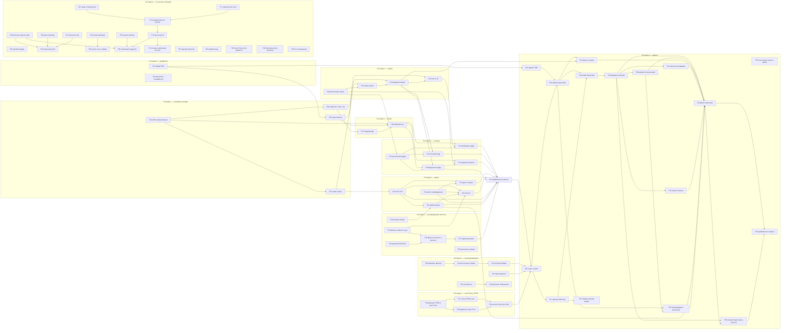

# Task breakdown — product-creation-flow

<!-- Stage 13. Джерела: PRD.md, sad.md, adr/, data-model.md, contracts/openapi.yaml.
     Кожна задача лінкує на розділ джерела і не переписує його. -->

> **Вхід:** [PRD](../PRD.md) · [sad.md](../sad.md) · [adr/](../adr/) · [data-model.md](../data-model.md) · [contracts/openapi.yaml](../contracts/openapi.yaml) · [contracts/api-sync-report.md](../contracts/api-sync-report.md)
> **Вихід:** цей файл · [tracker.md](tracker.md) · 74 story у цій теці · [CONTEXT.md](../CONTEXT.md) фічі.
> **Скіл:** `feature-break-tasks` (локальний стейдж 06). Перевірка gate:
> `python3 .claude/skills/feature-break-tasks/references/gate-check.py docs/features/product-creation-flow/tasks/`

## Розріз по поставках

[sad.md §1](../sad.md#1-introduction-and-goals) розділив фічу надвоє й лишив стейджу 13
пряму вимогу: «етап 13 має розрізати задачі по тому самому рубежу, інакше поділ існує лише
на папері» ([§11](../sad.md#11-risks-and-technical-debt), рядок 1). Розріз виконано.

| Група | Обсяг | Задачі | Разом |
|---|---|---|---|
| **Поставка 0** | Узгодження підписаних документів. Борг зі строком «до `break-tasks`», не закритий на момент цього проходу | T01–T02 | ~1.2 д |
| **Поставка 1** | Картка, галерея, зовнішнє сховище, дві відмітки присутності. Ні черги, ні другого процесу ([ADR 0011](../adr/0011-store-only-the-original-frame.md)) | T03–T23 | ~15 д |
| **Поставка 2** | Модель: тексти, діапазон ціни, пропозиції, вартість картки, черга й `worker` | T24–T33, T50–T55 | ~10.5 д |
| **Поставка 1 — доопрацювання каталогу** | Запит 2026-09-16: фільтр за готовністю, підписи й ширина фільтрів. Quality gate поставки не змінюють, але їхні AC-29…AC-34 належать поставці 1, тож T23 чекає на T37 (а через неї — на T34–T36) і перевіряє їх. T39 — дефект, знайдений прийманням (T23) | T34–T39 | ~2.4 д |
| **Поставка 1 — UI-доопрацювання** | Запит 2026-09-17: компактні фільтри, мітки, висота ціни у формі, єдині кольори бейджа готовності, перегляд фото з каталогу. T23 уже закрито, тож задачі не тримають приймання поставки 1, але тримають старт поставки 2: T25 чекає на T42 і T43. Друга хвиля (T44, T45: лінії діалогу й результат збереження) старт поставки 2 не тримає | T40–T45 | ~2.3 д |
| **Поставка 1 — опис Prom у HTML** | Запит 2026-09-18: міні-редактор HTML з режимом сирого HTML і кнопка «Почистити html» для опису Prom. Рішення T46 (ADR 0016) знімає заборону WYSIWYG з `CLAUDE.md`; `api` чистить HTML під час збереження. Тримає старт поставки 2: T25 чекає на T49 | T46–T49 | ~3.5 д |
| **Поставка 3** | Запит 2026-09-21 після приймання поставки 2: десять правок UI каталогу й форми картки. Пункт 6 (кілька категорій) розрізано на `api` і фронт. Quality gate поставок 1–2 не змінює й від них не залежить. T67 (2026-09-23) — назви Prom/OLX у «Згенерувати все». T68–T74 (2026-09-23) — десять правок форми картки: дефект опису Prom, місце «Згенерувати все», ID з копіюванням, два режими AI для поля з кнопками, остання пропозиція на поле | T56–T74 | ~11 д |

**Поставка 1 не є напівстаном:** PRD називає ручний шлях рівноправним (US-06, AC-12), тож
після T23 система придатна до щоденної роботи. Але три з чотирьох KPI [PRD §7](../PRD.md#7-metrics--kpis)
міряють ефект від моделі й предмета до поставки 2 не мають — їх перебазовує T01.

## Дві знахідки звірки репозиторію (2026-09-05)

[sad.md §11](../sad.md#11-risks-and-technical-debt) останнім рядком вимагав звірити §5 з
репозиторієм перед розбивкою: скан робився 2026-09-01. Звірку виконано, стан §5 підтверджено
(`modules/media` порожній, `modules/ai` має самий `CLAUDE.md`, у `products` вісім файлів,
живий лише `GET /products`, `src/worker.ts` і `src/queue.ts` не існує). Розійшлося двоє:

1. **Місця реєстрації №3 більше не існує.** §5 називав `db/migrations-list.ts` — у
   репозиторії `db/migrations-glob.ts`, тобто glob замість переліку класів, і забути
   реєстрацію міграції технічно неможливо. **Виправлено в `sad.md` §5: місць сім, не вісім**,
   решту перенумеровано; T12 і T26 виходять з нової нумерації.
2. **`modules/ai/CLAUDE.md` називає таблицю `ai_generations`**, у яку кожен виклик пише `usage`.
   [data-model.md](../data-model.md) спроектував замість неї `product_preparation_runs` з
   колонками `model`, `input_tokens`, `output_tokens`. Розходження закриває T26 — правкою
   рядка `ai/CLAUDE.md`, а не переробкою схеми.

## Dependency graph



**Що йде паралельно** (те саме, що показують рівні ASCII нижче)**.** У поставці 1 три гілки не перетинаються до T14: контракти
(T03–T05), конфіг і сховище (T06–T08), запис у базу (T09–T10, T13). T19 не залежить ні
від чого. Фронтова гілка T18→T20/T21/T22 стартує одразу після T05, тобто до того, як
бекенд відповідатиме — контракт уже є. У поставці 2 T24 (рішення) можна вести паралельно
з усією поставкою 1: він нічого не чіпає в коді.

**ASCII — той самий граф топологічними рівнями.** Рівень N починається лише коли весь
рівень N-1 змержено; усередині рівня задачі незалежні одна від одної й ідуть паралельно.

```
поставка 0+1                                                                       поставка 2
рівень  0 │ T01  T02  T04  T09  T19  T34  T36  T38  T39  T40  T43  T44  T46  T55   рівень  7 │ T25
рівень  1 │ T03  T05  T06  T13  T24  T35  T41  T45  T47  T48                       рівень  8 │ T26  T27
рівень  2 │ T07  T10  T18  T37  T42  T49                                           рівень  9 │ T28  T31  T54
рівень  3 │ T08  T11  T20  T21                                                     рівень 10 │ T29
рівень  4 │ T12  T15  T16  T22                                                     рівень 11 │ T30  T51  T52
рівень  5 │ T14  T17                                                               рівень 12 │ T53
рівень  6 │ T23  ← приймання поставки 1                                            рівень 13 │ T32
                                                                                   рівень 14 │ T50
                                                                                   рівень 15 │ T33  ← приймання поставки 2

поставка 3
рівень  0 │ T56  T57  T58  T59  T60  T61  T63  T64  T67  T68  T69  T70  T71
рівень  1 │ T62  T65  T72
рівень  2 │ T73
рівень  3 │ T66  T74
```

**Поставка 3 стоїть на рівнях 0–3** не тому, що йде разом із поставкою 1: її задачі не
залежать від жодної задачі інших поставок, а все, на що вони спираються в коді, уже змерджено.
Рівні 1–3 дає ланцюжок AI-кнопок T67, T71 → T72 → T73 → T66, T74. Усередині
поставки рівень 0 — тринадцять незалежних задач, але спільні файли (`product-catalog.*`,
`product-form.*`, `productListQuerySchema`) задають їм порядок у
[плані виконання](../execution-plan.md), а не в графі.

T24 стоїть на рівні 1, а не 7: він не залежить від коду поставки 1 і ведеться паралельно
з усією нею. Шістнадцять рівнів (0–15) — це і є критичний шлях у 16 задач, від T01 до T33.

**Граф ациклічний.** Перевірено топологічним сортуванням: усі 74 вершини потрапляють у
рівні, жодна не лишається. `blocks` кожної story є точним оберненням `blocked_by` усіх
інших — перевірено скриптом, обидва напрямки; висячих посилань на неіснуючі ID немає.

## Вісім структурних gate

Кожна story проходить вісім перевірок. Курсовий `break-tasks` їх не генерує — у нього
`deps` замість пари `blocks`/`blocked_by`, немає `context_budget`, AC в тілі story немає
взагалі. Gate доданo цим проходом і перевіряються скриптом, не оком.

| # | Gate | Мінімум | Де в story |
|---|---|---|---|
| 1 | Лінк на sequence у `sad.md` §6 | ≥ 1 | `## Sequence` — цитата кроків діаграми, не переказ |
| 2 | Data delta | ≥ 1 розділ | `## Data delta` — таблиця або явне «немає, і ось чому» |
| 3 | Excerpt контракту | ≥ 1 блок ```yaml``` | `## API contract excerpt` — цитата з `openapi.yaml` |
| 4 | AC у формі Given/When/Then | ≥ 2 | `## Acceptance criteria` |
| 5 | Атомарні кроки | ≥ 3 | `## Checklist` — нумерований список |
| 6 | `context_budget` | ≤ 5000 токенів | frontmatter; **виміряно**, не проставлено |
| 7 | `blocks` / `blocked_by` | обидва ключі, лише наявні ID | frontmatter |
| 8 | Повний frontmatter | 11 ключів | frontmatter |

**Фактичний стан (2026-09-23):** 74 з 74 проходять усі вісім — 592 перевірки, нуль
помилок; висячих лінків немає. Прогін:
`python3 .claude/skills/feature-break-tasks/references/gate-check.py docs/features/product-creation-flow/tasks/`. `context_budget` рахується з довжини
файлу (кирилиця, ≈ 2.6 знака на токен) і округлюється вгору до сотні: мінімум 1200,
максимум 4500, середнє 2006 — стеля в 5000 має запас на excerpt-и, які виконавець
підтягне за лінками.

**Напруга, яку варто бачити.** Gate 4 вимагає AC у тілі story, а правило скіла — «story
лінкує, не дублює» (лекція 6.7). Розвʼязано так: AC цитується **стисло** і завжди з
лінком на [PRD §5](../PRD.md#5-acceptance-criteria), який лишається джерелом. Виконавцю
не треба відкривати PRD, щоб зрозуміти межу, але правити її він піде саме туди.

**Шість story мають `gate_profile`, відмінний від `implementation`:** [T01](align-prd-with-architecture.md)
і [T02](rewrite-r2-boundary-rule.md) — `docs`, [T23](verify-delivery-1.md) і
[T33](verify-delivery-2.md) — `verification`, [T24](close-preparation-open-items.md) і
[T46](decide-prom-description-html.md) — `decision`. Вони проходять ті самі вісім gate, але два розділи в них читаються інакше:
`Data delta` каже «немає, і ось наслідок», а `Acceptance criteria` називає AC, які задача
**пише** або **перевіряє**, а не реалізує.

## Tasks

### Поставка 0 — узгодження документів

| ID | Title | blocked_by | Est | Owner |
|----|-------|------|-----|-------|
| [T01](align-prd-with-architecture.md) | Узгодити PRD з архітектурою і дописати відсутні US/AC на видалення | — | S | Serhii |
| [T02](rewrite-r2-boundary-rule.md) | Переписати рядок про R2 в `CLAUDE.md` і `ARCHITECTURE.md` | — | XS | Serhii |

### Поставка 1 — контракти й конфігурація

| ID | Title | blocked_by | Est | Owner |
|----|-------|------|-----|-------|
| [T03](add-product-error-codes.md) | Доменні коди помилок картки і `ProductErrors.ts` | T01 | S | Serhii |
| [T04](add-upload-limits-contract.md) | Межа розміру кадру й перелік типів у `products-limits.ts` | — | XS | Serhii |
| [T05](add-product-write-contracts.md) | Схеми створення й оновлення картки, похідна готовність | T04 | S | Serhii |
| [T06](configure-r2-and-body-limits.md) | Креденшели R2, домен бакета, парні ліміти тіла | T04 | S | Serhii |

### Поставка 1 — модуль media

| ID | Title | blocked_by | Est | Owner |
|----|-------|------|-----|-------|
| [T07](add-image-storage-adapter.md) | `ImageStorage.ts` — адаптер R2 через S3 API | T06 | S | Serhii |
| [T08](add-media-service.md) | `MediaService.ts` — перевірка байтів і запис обʼєкта | T03, T04, T07 | S | Serhii |

### Поставка 1 — картка

| ID | Title | blocked_by | Est | Owner |
|----|-------|------|-----|-------|
| [T09](add-product-write-repository.md) | Створення, оновлення й видалення картки в репозиторії | — | S | Serhii |
| [T10](add-product-card-service.md) | Сервіс картки: обрізання ключових слів і предикат готовності | T03, T09 | S | Serhii |
| [T11](add-product-card-routes.md) | Маршрути `GET /{id}`, `POST`, `PATCH` і реєстрація в `api.ts` | T05, T10 | S | Serhii |
| [T12](drop-product-image-url.md) | Знести `product_images.url` і складати адресу з ключа | T06, T11 | S | Serhii |

### Поставка 1 — галерея

| ID | Title | blocked_by | Est | Owner |
|----|-------|------|-----|-------|
| [T13](add-image-repository.md) | Кадри в репозиторії: вставка, позиція, головний, видалення | T09 | S | Serhii |
| [T14](add-image-upload-endpoint.md) | Приймання кадру: multipart, межа десяти, запис у R2 | T08, T12, T13 | S | Serhii |
| [T15](add-set-main-image-endpoint.md) | Призначення головного кадру | T11, T13 | XS | Serhii |
| [T16](add-delete-image-endpoint.md) | Видалення кадру: спершу обʼєкт, потім рядок | T08, T11, T13 | S | Serhii |
| [T17](add-delete-product-endpoint.md) | Видалення картки: пакетне прибирання обʼєктів і каскад | T08, T09, T16 | S | Serhii |

### Поставка 1 — фронт

| ID | Title | blocked_by | Est | Owner |
|----|-------|------|-----|-------|
| [T18](extend-products-api-client.md) | Методи запису в `products-api.ts` | T05 | S | Serhii |
| [T19](add-confirm-dialog.md) | Спільний `app/confirm-dialog.ts` | — | XS | Serhii |
| [T20](add-product-form-subfeature.md) | Підфіча `products/form/` — форма картки | T18, T38 | S | Serhii |
| [T21](add-gallery-upload-dialog.md) | Секція галереї: локальне превʼю, вивантаження, головний, видалення | T18, T19 | S | Serhii |
| [T22](integrate-catalog-with-form-and-delete.md) | Каталог: готовність, дві відмітки, перехід у форму, видалення | T18, T19, T20, T34 | S | Serhii |

### Поставка 1 — доопрацювання каталогу

Запит 2026-09-16. Колонку `products.is_ready` розглянуто й відхилено на користь предиката
в SQL — [ADR 0009](../adr/0009-derive-card-readiness-instead-of-storing-it.md) прямо
передбачав цей фільтр; аргументи — у [T34](add-readiness-list-filter.md). Нові AC-29…AC-34
кожна story вносить у PRD §5 сама.

| ID | Title | blocked_by | Est | Owner |
|----|-------|------|-----|-------|
| [T34](add-readiness-list-filter.md) | Фільтр списку за готовністю і `isReady` у рядках списку | — | S | Serhii |
| [T35](add-catalog-readiness-filter.md) | Фільтр «Картка готова» в каталозі | T34, T36 | XS | Serhii |
| [T36](relabel-published-filter-options.md) | Варіанти «Всі / Так / Ні» у фільтрах публікації | — | XS | Serhii |
| [T37](resize-catalog-filter-fields.md) | Ширина полів у панелі фільтрів каталогу | T35 | XS | Serhii |
| [T38](allow-empty-product-card.md) | Порожня картка: створення без полів і заголовки в предикаті готовності | — | S | Serhii |
| [T39](name-missing-fields-in-product-form.md) | Відкрита картка називає, чого бракує до готовності | — | XS | Serhii |

T38 додано 2026-09-17, не із запиту 2026-09-16: без порожньої картки діалог T20 не створює нову.
T39 додано 2026-09-17 прийманням поставки 1 ([протокол](../_audit/delivery-1-acceptance-2026-09-17.md)): форма не називає прогалин, хоча AC-15 цього вимагає. Задача нічого не блокує й T23 не тримає.

### Поставка 1 — UI-доопрацювання

Запит 2026-09-17: зробити до поставки 2. Ланцюжок T40 → T41 → T42 не є смисловою залежністю.
Він існує тому, що задачі правлять ті самі файли: `styles.css`, а також `product-form.css`
у T41 і T42. T43 від них не залежить. Нові AC-37…AC-41 кожна story вносить у PRD §5 сама.

| ID | Title | blocked_by | Est | Owner |
|----|-------|------|-----|-------|
| [T40](compact-catalog-filter-fields.md) | Компактні поля фільтрів і світлосірі мітки | — | XS | Serhii |
| [T41](fix-product-form-field-sizing.md) | Висота поля ціни й мітки у формі картки | T40 | XS | Serhii |
| [T42](unify-readiness-badge-colors.md) | Однакові кольори бейджа готовності | T41 | XS | Serhii |
| [T43](add-catalog-image-viewer.md) | Перегляд фото товару з каталогу | — | S | Serhii |
| [T44](divide-product-form-dialog.md) | Розділювачі заголовка й дій у діалозі картки | — | XS | Serhii |
| [T45](close-product-form-on-save.md) | Результат збереження картки: закриття зі сповіщенням або помилка в діалозі | T44 | S | Serhii |

Друга хвиля 2026-09-17: T44 і T45 правлять ті самі `product-form.*`, тому йдуть по черзі. Старт
поставки 2 вони не тримають, бо запит цього не вимагав. T45 знімає другу GWT з T39.

### Поставка 1 — опис Prom у HTML

Запит 2026-09-18: зробити до поставки 2. Запит суперечить правилу «Не додаємо WYSIWYG-редактор»
з кореневого `CLAUDE.md` і plain text з `ai/CLAUDE.md`, тож першою йде задача-рішення T46 з
ADR 0016. Відповідь моделі лишається plain text. HTML чистять і браузер (T49), і `api` (T47).
T49 чекає на T47, бо імпортує перелік тегів з контрактної константи, яку створює T47.
Нові AC-45…AC-48 кожна story вносить у PRD §5 сама.

| ID | Title | blocked_by | Est | Owner |
|----|-------|------|-----|-------|
| [T46](decide-prom-description-html.md) | Рішення: опис для Prom зберігається як HTML | — | S | Serhii |
| [T47](sanitize-prom-description-on-save.md) | Серверна чистка HTML опису для Prom під час збереження | T46 | S | Serhii |
| [T48](add-prom-description-editor.md) | Міні-редактор HTML для опису Prom з режимом сирого HTML | T46 | S | Serhii |
| [T49](add-prom-description-cleanup-button.md) | Кнопка «Почистити html» біля опису для Prom | T47, T48 | S | Serhii |

### Поставка 1 — приймання

| ID | Title | blocked_by | Est | Owner |
|----|-------|------|-----|-------|
| [T23](verify-delivery-1.md) | Прогін QG-1 і QG-2, міграція вниз і вгору, межі вводу, AC доопрацювання каталогу | T14–T22, T37 | S | Serhii |

### Поставка 2 — модель

| ID | Title | blocked_by | Est | Owner |
|----|-------|------|-----|-------|
| [T24](close-preparation-open-items.md) | Закрити чотири TBD і статус запуску при частковій відмові | T01 | S | Serhii |
| [T25](add-queue-and-worker.md) | `queue.ts`, `worker.ts`, pg-boss, сервіс `worker` у compose | T23, T42, T43, T49 | S | Serhii |
| [T26](add-preparation-tables-migration.md) | Міграція таблиць підготовки, entity, перелік у dependency-cruiser | T24, T25 | S | Serhii |
| [T27](add-anthropic-adapter.md) | Адаптер Anthropic і оптимізація кадру через sharp | T25 | S | Serhii |
| [T28](add-preparation-service.md) | Сервіс підготовки: тексти, діапазон ціни, запис `usage` | T26, T27 | S | Serhii |
| [T29](add-preparation-run-endpoints.md) | Запуск підготовки, гейт AC-06, обмеження частоти, полінг | T28 | S | Serhii |
| [T30](add-suggestion-resolution-endpoints.md) | Прийняття й відхилення пропозицій, захист ручної правки | T29 | S | Serhii |
| [T31](add-card-cost-readout.md) | Вартість картки у відповіді | T11, T26 | XS | Serhii |
| [T51](allow-retry-after-failed-run.md) | Повтор підготовки після відмови: частковий UNIQUE ключа ідемпотентності | T29 | S | Serhii |
| [T52](close-stuck-preparation-runs.md) | Закрити завислі запуски підготовки обходом у `worker` | T29 | S | Serhii |
| [T53](expose-pending-suggestions.md) | Непідтверджені пропозиції у відповіді картки | T26, T30 | S | Serhii |
| [T54](bound-the-model-call-timeout.md) | Таймаут виклику моделі під термін задачі черги | T27 | S | Serhii |
| [T32](add-preparation-ui.md) | Фронт підготовки: запуск, полінг, пропозиції, вартість | T20, T29, T30, T31, T51, T52, T53 | S | Serhii |
| [T50](show-preparation-failures-in-catalog.md) | Кількість невдалих запусків у каталозі й попап з текстами помилок | T29, T32 | M | Serhii |
| [T33](verify-delivery-2.md) | Прогін QG-1 з недосяжною моделлю, AC-11 | T32, T50 | S | Serhii |
| [T55](show-applied-suggestions-in-product-form.md) | Форма показує тексти, які `api` застосував сам (дефект T33, AC-05) | — | S | Serhii |

### Поставка 3 — UI каталогу й форми

Запит 2026-09-21 після приймання поставки 2. Ребра графа — здебільшого спільні файли, а не смисл:
T62 повторює патерн chips з T59 і займає в панелі місце, яке звільняє T60, а дані бере з T61;
T65 править сусідні з T64 колонки таблиці; T66 — ті самі блоки `product-form.html`, що T58 і T59.
Ланцюжок T67, T71 → T72 → T73 → T66, T74 змістовний: T72 додає `mode` у той самий хеш ключа, який
чіпають T67 і T71; T73 шле цей `mode` з кнопок; T66 замінює спінером саме дві кнопки T73, а T74
править той самий `app-suggestion-field`. Нові AC-50…AC-69 кожна story вносить у PRD §5 сама; T67
ще й переписує AC-05, T72 — AC-21. T74 замінює в контракті читання картки `pendingSuggestions` на
`latestSuggestions`.

| ID | Title | blocked_by | Est | Owner |
|----|-------|------|-----|-------|
| [T56](highlight-catalog-row-on-hover.md) | Підсвітка рядка каталогу під курсором | — | XS | Serhii |
| [T57](add-top-catalog-paginator.md) | Пагінатор над таблицею каталогу | — | XS | Serhii |
| [T58](wrap-product-titles-in-textarea.md) | Назви для Prom і OLX у багаторядковому полі | — | XS | Serhii |
| [T59](edit-keywords-as-chips.md) | Ключові слова як chips | — | S | Serhii |
| [T60](narrow-catalog-flag-filters.md) | Вужчі фільтри-прапорці в панелі каталогу | — | XS | Serhii |
| [T61](add-category-list-and-multi-filter.md) | `api`: перелік категорій і фільтр за кількома категоріями | — | S | Serhii |
| [T62](pick-catalog-categories-with-autocomplete.md) | Фільтр категорій: кілька значень з автодоповненням | T59, T60, T61 | S | Serhii |
| [T63](search-titles-live-from-three-chars.md) | Живий пошук за назвою й описом від трьох символів | — | S | Serhii |
| [T64](show-published-as-icons.md) | Відмітки публікації як іконки | — | XS | Serhii |
| [T65](edit-price-and-condition-inline.md) | Ціна й стан: редагування прямо в комірці каталогу | T64 | S | Serhii |
| [T66](show-local-ai-progress.md) | Локальний індикатор запиту до AI біля кнопки й поля | T58, T59, T73 | S | Serhii |
| [T67](generate-titles-with-texts.md) | «Згенерувати все» готує й назви для Prom і OLX | — | S | Serhii |
| [T68](keep-prom-description-on-reopen.md) | Опис для Prom не зникає після повторного відкриття картки | — | XS | Serhii |
| [T69](move-generate-all-below-gallery.md) | «Згенерувати все» між галереєю й полями форми | — | XS | Serhii |
| [T70](show-copyable-product-id.md) | ID товару під заголовком картки з кнопкою копіювання | — | XS | Serhii |
| [T71](strip-tags-from-field-draft.md) | Чернетка поля йде до моделі без тегів | — | XS | Serhii |
| [T72](add-improve-and-prompt-field-modes.md) | Два режими запуску поля: покращити чернетку й виконати її як промпт | T67, T71 | S | Serhii |
| [T73](add-improve-button-and-tonal-ai-actions.md) | Три кнопки AI біля поля: промпт, покращити, взяти варіант | T72 | S | Serhii |
| [T74](show-latest-suggestions-in-product-form.md) | Форма показує останню пропозицію моделі для кожного поля | T73 | S | Serhii |

## Estimation legend

- **XS:** ≤ 2 год
- **S:** ≤ 1 робочий день
- **M / L:** заборонені. Задача, яка не влазить у день, розрізається до подання в трекер.

Естімейти — орієнтир одного виконавця, а не бюджет. Разом ≈ 25 людино-днів на обидві
поставки, з яких ≈ 15 на поставку 1. Це вище за орієнтир idea-brief §12 (2 людино-тижні),
і різницю пояснює той самий рядок: орієнтир отримано на роботі без сховища й фото.

## Розбіжності зі скіл-дефолтами

Скіл `plugin:break-tasks` несе дефолти під інший стек і під команду. Де вони розійшлися з
`CLAUDE.md` і з фактичним станом репозиторію — виграв репозиторій, а відступ названо тут.

| # | Дефолт скіла | Що зроблено натомість | Підстава |
|---|---|---|---|
| 1 | Іменний власник на задачу, `<TBD lead>` для відкритих | Усі 74 задачі — Serhii, плейсхолдера немає | PRD §3, `CONTEXT.md`: у системі один-два адміни, ролей немає. Розподіл власників не має предмета |
| 2 | DoD міграції — «applied on staging» | «Міграція вниз і вгору в локальному контейнері» | §7: стенду staging не існує — `postgres`, `migrate`, `api`, `web`, `caddy` на одному VPS. Команди — скіл `mouse-commands` |
| 3 | Експорт тікетів у Jira / Linear / GitHub Issues через MCP | Трекером є [tracker.md](tracker.md) | MCP цих трекерів у сесії не підключено; заводити другий реєстр статусів немає навіщо |
| 4 | Дві шкали естімейтів у самому скілі: протокол каже S = 2 год, M = півдня, L = день; шаблон — XS ≤ 2 год, S ≤ 1 д, M 1-2 д | Взято шкалу шаблону, `M` і `L` заборонені | Вимога «кожна задача ≤ 1 дня» сильніша за назву розміру. Шкала протоколу лишає день у `L`, який шаблон називає обовʼязковим до розрізання |
| 5 | DoD задач лінкує на `test-plan.md` | DoD лінкує на AC PRD напряму | Стейдж 15 для цієї фічі ще не проходив, `test-plan.md` не існує. Лінк на нього додається стейджем 15, а не вигадується тут |
| 6 | Задачі спираються на §5 SAD дослівно, включно з місцем реєстрації `db/migrations-list.ts` | Місць реєстрації сім, не вісім | У репозиторії `db/migrations-glob.ts` — glob, а не перелік класів. Знахідка звірки, розділ вище |
| 7 | Облік `usage` пише в `ai_generations` (`modules/ai/CLAUDE.md`) | Пише в `product_preparation_runs` за [data-model.md](../data-model.md); рядок `ai/CLAUDE.md` правиться в T26 | Схему проектував стейдж 08 і розклав інакше — окремої таблиці на генерацію в ній немає. Мовчазне ігнорування рядка правил гірше за його правку |

## Питання, які лишаються відкритими після цього проходу

Розбивка їх не закриває — вона призначає їм задачу й строк.

- **Стеля вартості картки в грошах** ([PRD §8](../PRD.md#8-open-questions)) — після першого місяця
  роботи **поставки 2**. Жодна задача її не ставить: T26 і T31 дають лічильник токенів, не поріг.
- ~~**«Предмет з особистої колекції» на комерційному обсязі** ([PRD §8](../PRD.md#8-open-questions),
  правові наслідки для статусу продавця)~~ — **закрито 2026-09-21** рішенням власника до прогону
  [T33](verify-delivery-2.md): заяви не вимагаємо, промпт T28 її не містить.
- **Обʼєкти R2 не покриті бекапом** ([sad.md §11](../sad.md#11-risks-and-technical-debt)) —
  копіювання бакета лишається поза межами обох поставок. Єдиний запобіжник у коді — T19.
- **Метрик і алертів немає** ([sad.md §7](../sad.md#7-deployment-view)) — прийнятий борг, задачі не заведено.

## Наступний власник

Tech Lead → стейдж 14 (`claude-context`): CONTEXT картки для виконавця задач.
Паралельно — стейдж 15 (`plan-tests`): тест-план будується з AC PRD, тож він має йти
**після T01**, який дописує AC на видалення. Інакше ця частина дійде до релізу без жодного тесту
([sad.md §11](../sad.md#11-risks-and-technical-debt)).
