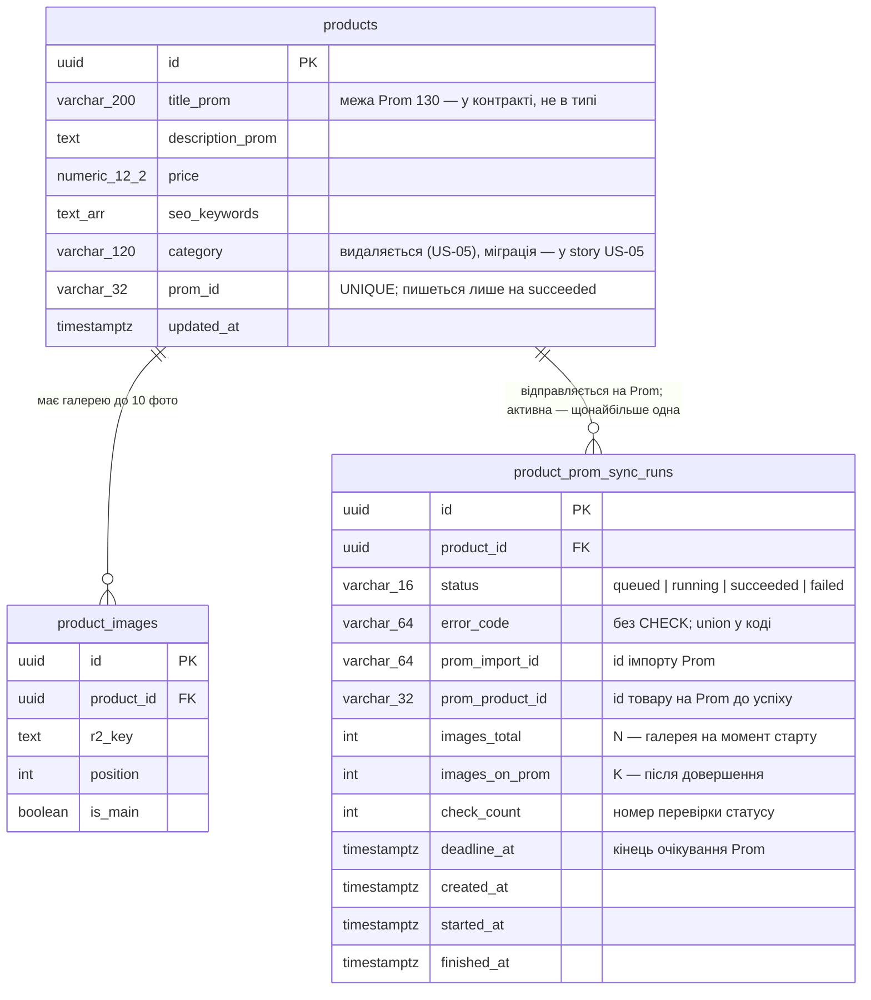

# Data model — prom-draft-sync

Прохід змішаний. Нова таблиця `product_prom_sync_runs` — greenfield, і її поставка починається
зараз, тож міграцію й entity написано в цьому проході
([ADR 0029](adr/0029-record-each-prom-sync-as-its-own-run.md)). `products` — brownfield з
однією зміною: видалення колонки `category` (US-05). Її спроектовано тут, а міграцію відкладено до
story US-05. Колонку читають і пишуть ~15 файлів бекенду (entity, контракт, контролер, репозиторій,
імпорт з Prom, spec-и) і фронт. Міграція без цієї правки зламала б кожне читання картки, тож вони
мають прийти одним PR.

`products.title_prom` лишається `varchar(200)`. Межу Prom у 130 знаків тримає контракт на
збереженні (AC-05) і гейт відправки, а не тип колонки (рішення 2026-10-10, «Decisions» в
[_audit](_audit/data-model-2026-10-10.md)).

## ER diagram



## Aggregate roots

Корінь — `products`. Відправки входять в агрегат картки: `product_id` з `on delete cascade`, як у
галереї й запусків підготовки. Відправка без картки нічого не означає. Товар на Prom після видалення
картки лишається, але адмінка за ним не стежить (одноразова синхронізація, PRD §3).

Відправка не дублює того, що вже є в картці. `products.prom_id` — єдина ознака «товар уже на Prom» і
для 557 імпортованих карток, і для відправлених кнопкою (AC-14). `prom_product_id` відправки — лише
проміжний id на час повтору (AC-11, AC-12). На `succeeded` він переходить у `prom_id`, і далі
читається звідти.

Поза агрегатом лишаються:

- **Файл імпорту в R2.** Ключ виводиться з id відправки (`prom-imports/<id>.xlsx`,
  [ADR 0031](adr/0031-hand-the-import-file-to-prom-from-the-public-bucket.md)), тож колонки під нього
  немає.
- **Лічильники звіту імпорту** «створено / оновлено / не у файлі». Вони йдуть у лог `worker` на
  кожній відправці (ADR 0030), а жоден екран і KPI їх з БД не читає.
- **Задачі pg-boss.** Вони живуть у схемі `pgboss`, і рядок відправки на них не посилається.

## Entities

### `products` — зміна: − `category`, решта без змін

Створена міграцією `1787756956906-create-products-tables`, `prom_id` — `1789712541026`.

| Column | Що змінює фіча |
|---|---|
| `category` VARCHAR(120) NOT NULL DEFAULT '' | **видаляється** разом зі значеннями. Копії немає: джерело значень — експорт Prom, його можна вивантажити знову (PRD §8, закрито 2026-10-10) |
| `title_prom` VARCHAR(200) NOT NULL | без змін. Межу Prom у 130 знаків тримає zod на збереженні й гейт відправки. На dev 2026-10-10 з 559 карток довших за 130 — 0 (максимум 128) |
| `seo_keywords` TEXT[] | без змін. Межі Prom (слово ≤ 50, усі разом ≤ 1024) — гейт відправки, не збереження (AC-06). На dev 9 карток мають слово > 50 знаків. Збереженню це не заважає, а відправлятись їм не треба: вони вже на Prom |
| `prom_id` VARCHAR(32) NULL, UNIQUE | без змін схеми. Тепер його пише ще й `worker`, на `succeeded` відправки. `products_prom_id_key` гарантує, що один товар Prom не належить двом карткам |

Запис `prom_id` через репозиторій рухає `updated_at`: TypeORM ставить `@UpdateDateColumn` і в
`update()`. Так і має бути, бо картка справді змінилась. Проміжні кроки відправки `products` не
чіпають (ADR 0029). На `updated_at` нічого не тримається: оптимістичного блокування в картки немає.

**Access patterns** (sad.md §6):
- Читання картки й перевірка готовності (сценарій 1) → PK.
- Запис `prom_id` на `succeeded` (сценарії 1, 4) → PK + перевірка `products_prom_id_key`.
- Фільтр каталогу за категорією зникає разом з колонкою (AC-16), тож індексу в `products`, як і
  досі, немає.

### `product_prom_sync_runs` — новий

| Column | Type | Constraints | Notes |
|---|---|---|---|
| `id` | UUID | PK, `default uuidv7()` | |
| `product_id` | UUID | NOT NULL, FK → `products` ON DELETE CASCADE | |
| `status` | VARCHAR(16) | NOT NULL, CHECK IN (`queued`, `running`, `succeeded`, `failed`) | той самий перелік, що в підготовки; union `PromSyncStatus` |
| `error_code` | VARCHAR(64) | NULL, **без CHECK** | union `PromSyncErrorCode`: п'ять відмов (`prom_access_denied`, `prom_busy`, `prom_rejected`, `prom_unavailable`, `prom_timeout`) і два часткові результати (`prom_photos_incomplete`, `prom_not_draft`) |
| `prom_import_id` | VARCHAR(64) | NULL | з'являється після подачі імпорту. Після `prom_timeout` лишається, і «Перевірити ще раз» опитує той самий імпорт (сценарій 3) |
| `prom_product_id` | VARCHAR(32) | NULL | тип той самий, що в `products.prom_id`. Пишеться, щойно товар знайдено за зовнішнім id (ADR 0030) |
| `images_total` | INT | NOT NULL, CHECK > 0 | N з «фото K з N» — галерея на момент старту. Пізніше картку можуть змінити, тож N не виводиться з `product_images` |
| `images_on_prom` | INT | NULL, CHECK >= 0 | K. NULL — фото ще не рахували. **Без** верхньої межі `<= images_total`: повторний імпорт може задублювати фото (sad.md §11), а CHECK перетворив би такий звіт на падіння `worker` замість числа на картці |
| `check_count` | INT | NOT NULL DEFAULT 0, CHECK >= 0 | номер перевірки статусу. Входить в id задачі «перевірити», тож кожна перевірка дістає власну задачу ([ADR 0027](adr/0027-poll-prom-through-a-chain-of-short-jobs.md)) |
| `deadline_at` | TIMESTAMPTZ | NULL | подача + 30 хв (`config.prom`). «Перевірити ще раз» ставить новий |
| `created_at` | TIMESTAMPTZ | NOT NULL DEFAULT now() | натискання кнопки |
| `started_at` | TIMESTAMPTZ | NULL | `worker` узяв «подати» |
| `finished_at` | TIMESTAMPTZ | NULL | остаточний стан |

Подія, а не сутність, яку редагують як ціле, тож `updated_at` немає: моменти названо своїми
іменами. Виняток з «завершене — остаточне» один. Відправка `failed` / `prom_timeout` на «Перевірити
ще раз» повертається в `running` з новим `deadline_at` і `finished_at = NULL`, бо імпорт, на який
вона чекає, той самий. Новий рядок означав би нову подачу, а її якраз не має бути (сценарій 3).

`succeeded` означає одне: фото N з N, чернетка, `prom_id` записано. Частковий результат закінчується
`failed` зі своїм кодом (рішення 2026-10-10). Тоді KPI PRD §7 «частка з першого натискання» рахується
як частка `succeeded` серед перших відправок карток.

Помилки `error_detail`, як у підготовки, немає. Текст відповіді Prom — недовірений ввід, і до user-а
не доходить (AC-07, sad.md §8), а в лог іде лише id імпорту, лічильники й код.

**Access patterns** (sad.md §6):
- Старт: «одна активна на картку» (сценарії 1, 4; AC-13) → `product_prom_sync_runs_active_key`.
  Два одночасні старти обидва проминають будь-який пошук, і лише унікальний індекс вирішує, хто
  створить рядок. Повторне натискання дістає наявну активну відправку, як `createRunOnce` у
  підготовці.
- Читання картки й поллер: остання відправка картки, зокрема завершена (сценарії 1–4) →
  `product_prom_sync_runs_product_id_idx` + `order by created_at desc limit 1`. Частковий індекс
  завершених рядків не покриває.
- Кроки `worker` («подати», «перевірити», «довершити») → PK: id відправки приходить у задачі.
- Свіп завислих відправок (ADR 0027): `status in ('queued','running')` і минулий `deadline_at` чи
  старий `created_at` → **окремого індексу немає, свідомо.** Активних рядків щонайбільше стільки,
  скільки карток у роботі (одиниці), а предикат частково збігається з `active_key`.
- Пошук за `prom_import_id` → **без індексу.** Такого запиту немає: id відправки несе задача.

**Constraints:**
- `product_prom_sync_runs_status_check` — закритий перелік статусів.
- `product_prom_sync_runs_images_total_check` — відправка без фото неможлива, бо готовність їх вимагає.
  CHECK лише ловить помилку коду, а не тримає бізнес-правило.
- `product_prom_sync_runs_images_on_prom_check`, `product_prom_sync_runs_check_count_check` —
  лічильники не від'ємні.
- `product_prom_sync_runs_active_key` — частковий UNIQUE (`product_id`) WHERE `status in ('queued','running')`.

## Indexes

`products` нових індексів не отримує, і фільтр за категорією, якого вони могли б стосуватись,
зникає.

| Index | Table | Columns | Query it serves |
|---|---|---|---|
| `product_prom_sync_runs_product_id_idx` | `product_prom_sync_runs` | `product_id` | остання відправка картки для читання картки й поллера (sad.md §6, сценарії 1–4); join-ціль FK, рядків з часом лише більшає |
| `product_prom_sync_runs_active_key` | `product_prom_sync_runs` | `product_id` WHERE `status in ('queued','running')` | друга вкладка не запускає другої відправки (сценарій 4, AC-13) |
| `products_prom_id_key` *(наявний)* | `products` | `prom_id` | запис `prom_id` на `succeeded`: один товар Prom — одна картка |

## Migrations

| Change | Stage / поставка | Why |
|---|---|---|
| + `product_prom_sync_runs` (таблиця, 2 індекси, 4 CHECK) | **цей прохід**, `1791630446458-create-prom-sync-runs` | greenfield, поставка починається зараз. Нічого не читає й не ламає, доки entity не зареєстровано в `api.ts` / `worker.ts` |
| − `products.category` | відкладено на story US-05 | неподільна з правкою ~15 файлів (entity, контракт, контролер, репозиторій, `db/prom-xlsx.ts`, `db/import-prom.ts`, spec-и, форма й каталог web) |

Форма відкладеної міграції (ім'я файлу — через `db:migrate:new -- drop-product-category`):

```ts
async up(queryRunner: QueryRunner): Promise<void> {
  await queryRunner.query(`alter table "products" drop column "category"`);
}

/**
 * Brings back the column's shape, not its values: there is no copy of them (the Prom export is
 * the source). The empty default is what `1789651109349` left on it.
 */
async down(queryRunner: QueryRunner): Promise<void> {
  await queryRunner.query(
    `alter table "products" add column "category" varchar(120) not null default ''`,
  );
}
```

Одна міграція без трифазного розгортання: переносити на живих рядках нічого, значення свідомо
втрачаються (PRD §8).

## Test fixtures

- `apps/api/db/schema.spec.ts` — локальний `insertPromSyncRun()` і шість тестів: «одна активна на
  картку», «рахує по картці, а не по таблиці», CHECK статусу, CHECK лічильників, «K може бути
  більшим за N», каскад з карткою.
- `PromSyncRepository.spec.ts` — seed-функції з'являться в story репозиторію, поруч із самим
  репозиторієм.
- Story US-05 прибирає `"category"` з `insertProduct()` у `schema.spec.ts` і з картки-зразка в
  spec-ах, що її мають (`ProductController.spec.ts`, `ProductService.spec.ts`,
  `ProductRepository.spec.ts`, `PreparationRunController.spec.ts`, `PreparationRunService.spec.ts`,
  `PreparationRepository.spec.ts`, `modules/ai/PreparationService.spec.ts`,
  `products.contract.spec.ts`, `db/prom-xlsx.spec.ts`).

## Open items

- <!-- TBD --> Довжина `prom_import_id`: `varchar(64)` узято із запасом. Формат id імпорту в OpenAPI
  Prom не звірено, бо під час SAD схема була недоступна (sad.md §11). Звірити на етапі 10
  (`feature-api-forge`); ширший тип — одна міграція `alter column type`.
- <!-- TBD --> Код, яким свіп закриває завислу відправку. У підготовки це `preparation_failed`, а з
  семи кодів `PromSyncErrorCode` жоден не означає «впав `worker`». Від наявності `prom_import_id`
  залежить, що пропонує картка: «Перевірити ще раз» чи «Повторити». Вирішує етап 10 разом з
  `error-codes.ts`; БД не зачіпає, бо `error_code` без CHECK.
- **Частково закрито 2026-10-10** (PRD §8, «назви для Prom > 130»). На dev довших за 130 — 0 з 559.
  Колонка лишається 200, тож міграції ці картки не заважають. Порахувати на проді до релізу
  (`select count(*) from products where char_length(title_prom) > 130`) і, якщо такі є, скоротити
  вручну: AC-05 не дасть їх зберегти, доки назву не скорочено.
