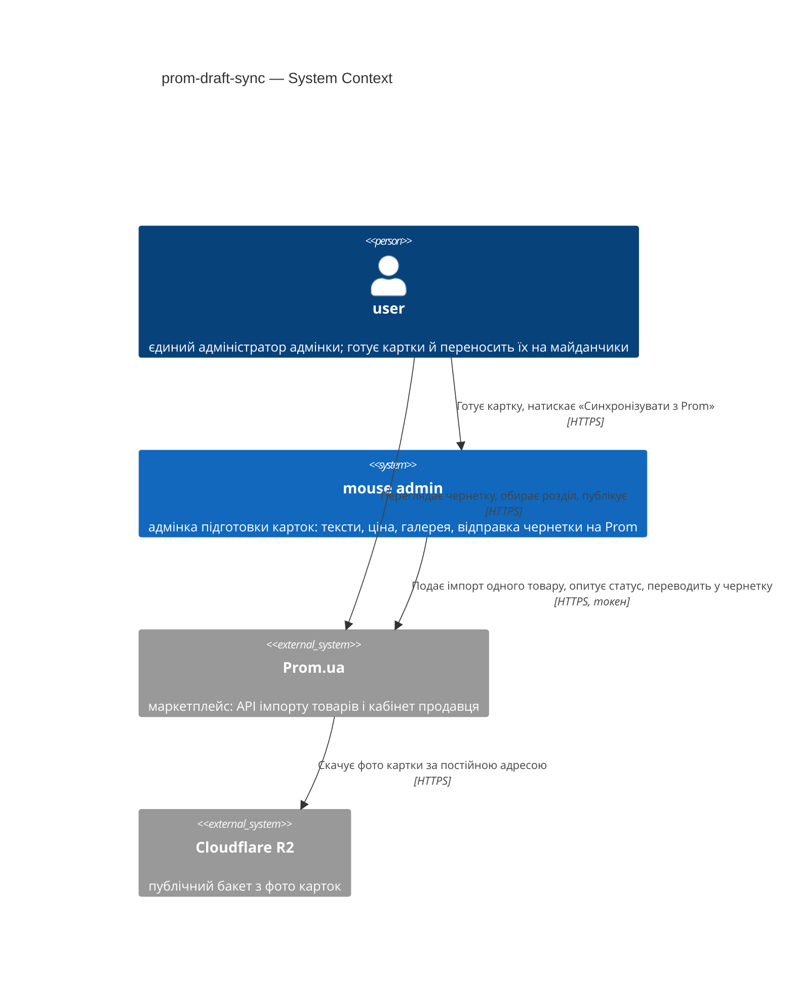
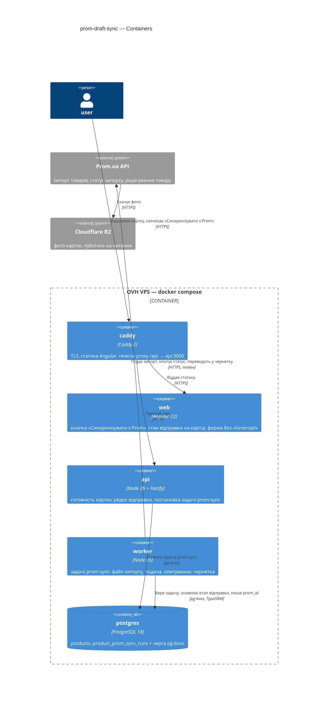
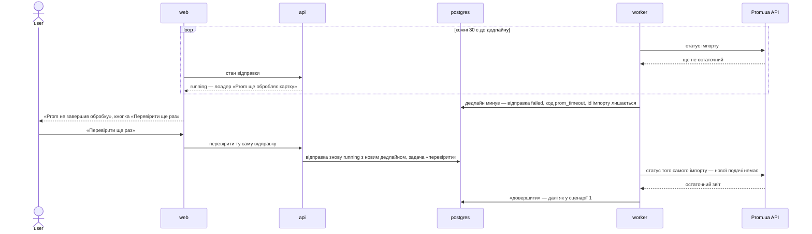

# Software Architecture Document — prom-draft-sync

> **Стадії SDLC 04-05.** Вхід: [PRD](PRD.md) · [CONTEXT](../../../CONTEXT.md) · [CONTEXT фічі](CONTEXT.md) · [idea-brief](idea-brief.md).
> Рішення — у [adr/](adr/), зворотний індекс на них — у §9.
> C4 Context (L1) — інлайн у §3, C4 Container (L2) — інлайн у §5; рівень L3 поза межами документа.

## 1. Introduction and goals

**Intent.** [Готова картка](../../../CONTEXT.md) одним натиском «Синхронізувати з Prom» стає на
Prom [чернеткою Prom](CONTEXT.md) з назвою, описом, ключовими словами, ціною й усіма фото, без
ручного перенесення в кабінет продавця (PRD §2, US-01). Результат відправки видно на самій картці:
прогрес, «чернетка, фото N з N» з посиланням на товар у кабінеті або зрозуміла причина відмови, і
повтор не створює на Prom другого товару (PRD §2, US-03, US-04). Разом з кнопкою з адмінки зникає
поле «Категорія» з фільтром каталогу: [розділ маркетплейсу](CONTEXT.md) user обирає в кабінеті
(US-05). Вектор — Approach C «Одна кнопка з чесним результатом» (idea-brief §13). Обсяг — одна
поставка розміру M; видалення «Категорії» — окрема story тієї ж поставки.

**Top-3 quality goals** (однорядково; повні сценарії — у §10):

1. **QG-1 Недоторканність живого магазину.** Кожна відправка змінює на Prom рівно один товар;
   змінених, прихованих чи видалених інших товарів — 0 (PRD §6 «Недоторканність живого каталогу»,
   AC-03, abuse case PRD §6.1).
2. **QG-2 Чесний і відновлюваний стан на картці.** Кожна відправка доходить до одного з названих
   станів — чернетка N з N, частково K з N, без чернетки, Prom зайнятий, доступ недійсний, Prom не
   завершив за 30 хв; значення картки не змінюються, а повтор не дає другого товару (AC-07…AC-13,
   PRD §6 «Відмова Prom»).
3. **QG-3 Незаблокований інтерфейс.** Постановка відправки ≤ 500 ms, фонова задача стартує ≤ 5 с
   від постановки, далі Prom опитується не частіше разу на 30 с до 30 хв (PRD §6).

**Stakeholders.**

| Role | Interest | Sign-off owner? |
|---|---|---|
| Serhii (Architect / Tech Lead / dev) | безпека живого магазину на ~560 товарів, новий секрет із правом запису, прибирання поля «Категорія» без поломки каталогу | Yes |
| `user` (єдиний адміністратор адмінки) | 5–15 хв ручного перенесення картки замінюються натиском і фінальним переглядом чернетки в кабінеті (PRD §7, ціль ≤ 2 хв) | No |

## 2. Constraints

**Technical.**

- Node 26 (`node:26-slim`), ESM, Fastify; бекенд збирається `tsc` у `dist/` (декоратори TypeORM).
- TypeScript 6.0.3 — жорсткий пін (Angular 22 вимагає `>=6.0 <6.1`).
- PostgreSQL 18 + TypeORM; `typeorm` і `pg` згадуються тільки в `*Repository.ts` і entity
  (перелік entity — у `ENTITIES` `.dependency-cruiser.cjs`).
- Angular 22 — standalone, signals, zoneless.
- pg-boss у схемі `pgboss` тієї ж бази; процес `worker` уже працює й бере задачі по одній
  (`config.queue`).
- `exceljs` уже в залежностях `apps/api`: ним розбирається експорт Prom (`db/prom-xlsx.ts`).
- Фото лежать у публічному бакеті R2 і читаються за постійною адресою
  ([ADR 0007](../product-creation-flow/adr/0007-serve-images-from-a-public-bucket.md)) — Prom може
  скачати їх сам, без проксі через `api`.

**Organisational.**

- Один розробник; обсяг системи — 50–100 нових карток на місяць, один-два адміни.
- Зусилля — M, 3–5 тижнів (idea-brief §7 Approach C, §9); жорсткого дедлайну немає (§12).

**Conventions.**

- Правила залежностей і межі шарів — `CLAUDE.md` (корінь) + `apps/api/CLAUDE.md` +
  `apps/web/CLAUDE.md`; машинна перевірка — `apps/api/.dependency-cruiser.cjs`.
- Три шари виражені **суфіксом класу**, а не каталогами. Модуль `products` уже розкладено на
  підпапки (`preparation/`, `description/`), тож нова підфіча в ньому — нова підпапка (правило 9).
- Залежності приходять конструктором; створює їх тільки composition root (`src/api.ts`,
  `src/worker.ts`, скрипти `db/`).
- Гроші — десятковий рядок без перетворень; ціна йде на Prom з копійками, без округлення (AC-01).
- «Не пишемо інтеграцію з Prom/OLX зараз» (`CLAUDE.md`, «Чого НЕ робимо») ця фіча **знімає** для
  Prom — рішення з ADR і рядком у §11 про правку самого `CLAUDE.md`.

**Regulatory / external.**

- Дані internal, персональних даних покупців фіча не вводить; назовні йдуть лише дані картки й
  публічні адреси фото (PRD §6.1).
- Новий секрет — токен кабінету Prom з правом запису товарів: лише `process.env` через
  `src/config.ts`, не в логах і не у фронті. Security review обов'язкове (PRD §6.1).
- Відповідь Prom — недовірений ввід: її розбирає zod-схема, а користувачу її текст не показується
  (AC-07).

## 3. Context and scope

Адмінка готує картки товарів, а продаються вони на Prom і OLX. Ця фіча вперше проводить з адмінки
вихідний запис у живий магазин Prom: одна готова нова картка стає чернеткою Prom, а розділ
маркетплейсу, переклад і публікацію user робить у кабінеті продавця, як і досі.

**External systems (in / out):**

| Actor or system | Type | Interaction |
|---|---|---|
| `user` | Person | натискає «Синхронізувати з Prom» і дивиться стан на картці; фінальний перегляд, розділ маркетплейсу, переклад і публікацію робить у кабінеті Prom |
| Prom.ua API | System (external) | адмінка подає імпорт одного товару, опитує його статус, знаходить створений товар і переводить його в чернетку; HTTPS з токеном доступу |
| Cloudflare R2 | System (external) | Prom скачує фото картки за постійними публічними адресами; файл імпорту адмінка передає Prom тілом запиту |

Кордон довіри проходить по відповіді Prom: звіт імпорту й дані товару розбираються zod-схемою, а
їхній текст до user-а не доходить.

**C4 Context (L1):**



## 4. Solution strategy

**Стратегічні вибори (насіння для ADR):**

### S1. Усі виклики Prom робить `worker` ланцюгом коротких задач; `api` лише ставить відправку

Запит «Синхронізувати з Prom» створює рядок відправки, ставить задачу «подати імпорт» і одразу
відповідає — так тримається QG-3 (≤ 500 ms на постановку), і HTTP-процес не чекає на зовнішній API
(`ARCHITECTURE.md`, «Межі, які тримаємо свідомо»). Далі в черзі `prom-sync` іде ланцюг: «подати» →
«перевірити статус», яка ставить себе знову через 30 с, доки Prom не дасть остаточного результату
або не мине 30 хв → «довершити» (знайти товар, перевести в чернетку, порахувати фото). Кожна задача
триває секунди, а стан і дедлайн живуть у БД, тож рестарт `worker` посередині очікування нічого не
губить (QG-2). [ADR 0027](adr/0027-poll-prom-through-a-chain-of-short-jobs.md).

### S2. Prom — новий модуль `marketplace`; стан відправки й маршрути — у `products/prom-sync/`

Дзеркало наявної пари `products/preparation` + `ai`: `marketplace` знає Prom API, формат файлу
імпорту й обробляє задачі у `worker`, а entity, репозиторій, сервіс запуску, контролер і черга
відправки лежать у `products/prom-sync/`. Стрілки йдуть лише вниз і лише через `index.ts`:
`marketplace` → `products` (файл імпорту йде до Prom тілом запиту, а не через R2,
[ADR 0032](adr/0032-send-the-import-file-in-the-request-body.md)); `products` про
`marketplace` не знає, тож читання картки віддає стан відправки без циклу. Рішення знімає для Prom заборону
«Не пишемо інтеграцію з Prom/OLX зараз» з `CLAUDE.md` (§2, §11).
[ADR 0028](adr/0028-add-the-marketplace-module-for-prom.md).

### S3. Відправка — окрема подія в таблиці `product_prom_sync_runs`; `prom_id` картки — лише на повному успіху

Кожна відправка чи повтор — рядок з етапом, кодом помилки, ідентифікатором імпорту, id товару на
Prom і лічильником фото; правило в БД дозволяє щонайбільше одну активну відправку на картку
(AC-13, QG-2). `products.prom_id` пишеться лише тоді, коли чернетка створена з усіма фото, — саме він
ховає кнопку (AC-14); проміжний id товару для повтору (AC-11, AC-12) живе в рядку відправки.
[ADR 0029](adr/0029-record-each-prom-sync-as-its-own-run.md).

### S4. Товар на Prom упізнається за зовнішнім ідентифікатором = id картки; кожен крок спершу питає, що вже зроблено

У файл імпорту йде зовнішній ідентифікатор, рівний uuid картки; перед подачею імпорту відправка
шукає товар за ним, і якщо товар уже є — імпорт удруге не подається (AC-13, KPI «0 дублів»),
окрім повтору для фото (K < N): тоді файл картки подається ще раз з примусовим оновленням фото й
наявності, і Prom оновлює саме цей товар за зовнішнім id (контрольна відправка 2026-10-10, §11).
Параметри імпорту — дві константи адаптера без аргументів, обидві з `mark_missing_product_as: none`;
лічильник «не у файлі» звіряється з 0, решта лічильників пишеться в лог на кожній відправці
(QG-1, AC-03). [ADR 0030](adr/0030-identify-the-prom-product-by-the-card-id.md).

Кожне тактичне рішення пізніших секцій має зводитися до одного з цих стовпів. Тактичне
рішення, яке стовпу *суперечить*, — червоний прапорець: виноси його в §11.

## 5. Building block view

Фіча додає п'ятий модуль — `marketplace` — і нову підфічу `products/prom-sync/`, повторюючи форму
пари `products/preparation` + `ai` ([ADR 0028](adr/0028-add-the-marketplace-module-for-prom.md)):
`products` тримає запуск, стан і маршрути, `marketplace` — знання про Prom API й обробник задач у
`worker`. Стрілки йдуть лише вниз і лише через `index.ts` (правила 2–3 `CLAUDE.md`):
`marketplace` → `products` (картка, рядок відправки); до `media` він не звертається, бо файл
імпорту йде до Prom тілом запиту ([ADR 0032](adr/0032-send-the-import-file-in-the-request-body.md)); `products` про
`marketplace` не знає. `products` уже розкладено на підпапки, тож нова підфіча — нова підпапка
(правило 9). Межі Prom (назва 130, ключове слово 50, усі разом 1024, фото 10) — константи контракту
в `products-limits.ts`: з них валідує бекенд і підсвічує поля фронт, тож підказка й гейт відправки
не розійдуться. Готовність до відправки рахує бекенд на збереженій картці; фронт лише підказує.

**Файли, які фіча додає або змінює:**

```
apps/api/src/modules/marketplace/                 НОВИЙ модуль
├── PromAdapter.ts            єдине місце, що знає Prom API: подати імпорт файлом, статус
│                             імпорту, товар за зовнішнім id, переведення в чернетку; параметри
│                             подачі й повтору — дві константи (ADR 0030, ADR 0032)
├── buildPromImportFile.ts    xlsx з одного рядка (exceljs): uk-тексти й у ru-колонках, ціна
│                             рядком, «немає в наявності», зовнішній id = id картки, адреси фото R2
├── PromSyncService.ts        обробник задач prom-sync у worker: подати / перевірити / довершити;
│                             закриває завислі відправки
├── MarketplaceErrors.ts      класи відмов Prom: доступ недійсний, Prom зайнятий, відхилено, недоступний
├── CLAUDE.md                 правила модуля: параметри імпорту — лише константи; подача без повторів;
│                             токен і сирі відповіді Prom не в логах і не в UI
└── index.ts                  public API модуля

apps/api/src/modules/products/prom-sync/          НОВА підфіча
├── PromSyncRun.ts            entity: подія відправки (ADR 0029)
├── PromSyncRepository.ts     рядок відправки; «одна активна на картку» тримає БД
├── PromSyncRunService.ts     старт (готовність, повтор продовжує наявну), читання, «перевірити ще раз»
├── PromSyncRunController.ts  HTTP: zod, sessionGuard, мапінг у DTO
├── PromSyncQueue.ts          постановка задач prom-sync; id задачі — id відправки, крок і номер спроби
│                             кроку (лічильник у рядку відправки)
└── promReadiness.ts          чого бракує: тексти, ціна, фото, межі Prom

apps/api/src/modules/products/                    ЗМІНИ
├── Product.ts · ProductRepository.ts · ProductController.ts   − category, − фільтр і список категорій
└── index.ts                  + експорти prom-sync для marketplace і composition root

apps/api/src/contracts/
├── prom-sync.contract.ts     zod-схеми DTO відправки; фронт бере звідси ТІЛЬКИ типи
├── products-limits.ts        + межі Prom; − categoryMaxLength, categoryFilterMaxItems
├── products.contract.ts      − category; назва Prom ≤ 130 при збереженні (AC-05)
└── error-codes.ts            + коди відмов відправки

apps/api/db/migrations/<timestamp>-drop-product-category.ts
apps/api/db/migrations/<timestamp>-create-prom-sync-runs.ts
apps/api/db/prom-xlsx.ts · import-prom.ts         − «Назва_групи» → category
apps/api/.dependency-cruiser.cjs                  + products/prom-sync/PromSyncRun у ENTITIES

apps/web/src/app/products/
├── prom-sync/                НОВА підфіча: кнопка «Синхронізувати з Prom», стан і підсумок, поллер
├── form/                     − поле «Категорія»; підказки меж Prom біля назви й ключових слів
├── catalog/                  − фільтр за категорією; `?category=` у збереженій адресі ігнорується (AC-16)
└── products-api.ts           + запити відправки
```

**Точки реєстрації, які легко забути:** `src/config.ts` (`prom.*`, `queue.promSync`), `src/queue.ts`
(`promSyncQueue`), `src/worker.ts` (entity, підписка на чергу, свіп завислих), `src/api.ts` (entity,
`PromSyncRunController`), `.env.example` (`PROM_API_TOKEN`), список entity в `ENTITIES`.

**C4 Container (L2):**



## 6. Runtime view

Учасники — контейнери §5 і дві зовнішні системи §3. Повідомлення семантичні; ендпоінти й форму
тіл визначає етап 10. Крок «подати» не повторюється автоматично ([ADR 0027](adr/0027-poll-prom-through-a-chain-of-short-jobs.md)),
кожна відправка спершу питає Prom, чи товар з її зовнішнім id уже є
([ADR 0030](adr/0030-identify-the-prom-product-by-the-card-id.md)).

**Сценарій 1: готова картка стає чернеткою з усіма фото (AC-01, AC-03, AC-15)**

```mermaid
sequenceDiagram
    actor user
    participant web
    participant api
    participant pg as postgres
    participant worker
    participant prom as Prom.ua API

    user->>web: натискає «Синхронізувати з Prom»
    web->>api: запускає відправку картки
    api->>pg: читає збережену картку, перевіряє готовність і межі Prom
    api->>pg: пише рядок відправки queued (одна активна на картку — правило БД)
    api->>pg: ставить задачу «подати»
    api-->>web: відправка queued
    worker->>pg: бере «подати», етап running
    worker->>prom: шукає товар за зовнішнім id = id картки
    prom-->>worker: товару немає
    worker->>prom: подає імпорт файлом: xlsx з одним рядком, mark_missing_product_as: none
    prom-->>worker: id імпорту
    worker->>pg: пише id імпорту й дедлайн (+30 хв), ставить «перевірити» через 30 с
    loop не частіше разу на 30 с, до дедлайну
        worker->>prom: статус імпорту
        prom-->>worker: SUCCESS чи PARTIAL з нулями — не остаточний, чекаємо далі
    end
    worker->>prom: статус імпорту
    prom-->>worker: остаточний звіт: ненульові лічильники, «не у файлі» = 0
    worker->>worker: звіряє лічильники з очікуваними, пише їх у лог
    worker->>pg: ставить «довершити»
    worker->>prom: товар за зовнішнім id
    worker->>prom: статус «чернетка»
    worker->>prom: наявність «в наявності»
    worker->>prom: читає фото товару — K
    worker->>pg: фото N з N, пише products.prom_id, відправка succeeded
    loop поки відправка queued або running
        web->>api: стан відправки
        api-->>web: етап, лічильник фото, посилання на товар у кабінеті
    end
    web-->>user: «Чернетку створено, фото N з N», посилання; published-prom не змінюється
```

**Сценарій 2: відмова на подачі — Prom зайнятий або доступ недійсний (AC-07, AC-08, AC-09)**

```mermaid
sequenceDiagram
    actor user
    participant web
    participant api
    participant pg as postgres
    participant worker
    participant prom as Prom.ua API

    user->>web: натискає «Синхронізувати з Prom»
    web->>api: запускає відправку
    api->>pg: рядок queued, задача «подати»
    api-->>web: відправка queued
    worker->>prom: шукає товар за зовнішнім id
    alt доступ недійсний або без права запису
        prom-->>worker: відмова доступу
        worker->>pg: відправка failed, код prom_access_denied
    else Prom не приймає імпорт: завислий імпорт або вичерпано ліміт ручних імпортів
        worker->>prom: подає імпорт
        prom-->>worker: відмова без id імпорту
        worker->>pg: відправка failed, код prom_busy
    end
    Note over worker,pg: задача завершується без throw — pg-boss її не повторює; поля картки не змінюються
    web->>api: стан відправки
    api-->>web: failed + код
    web-->>user: «доступ до Prom треба поновити» або «Prom зараз не приймає імпорт, спробуйте пізніше»; кнопка доступна
```

Відхилений рядок (Prom відповів остаточним `FATAL`) і недоступний Prom закриваються так само —
кодом, без повтору; текст для user-а фронт формує за кодом, а не з відповіді Prom (AC-07).

**Сценарій 3: Prom обробляє довше за 30 хв (AC-10)**



**Сценарій 4: повтор після часткового результату — без другого товару (AC-11, AC-12, AC-13)**

```mermaid
sequenceDiagram
    actor user
    participant web
    participant api
    participant pg as postgres
    participant worker
    participant prom as Prom.ua API

    Note over pg: попередня відправка: товар створено, але фото K < N або не чернетка; prom_id у картці порожній
    user->>web: «Повторити»
    web->>api: запускає відправку
    alt у картки вже є активна відправка (друга вкладка)
        api->>pg: правило «одна активна» відхиляє другий рядок
        api-->>web: наявна активна відправка — нова не запускається
    else активної немає
        api->>pg: новий рядок queued, задача «подати»
        api-->>web: відправка queued
        worker->>prom: шукає товар за зовнішнім id
        prom-->>worker: товар є — id, статус, фото
        alt товар не чернетка, фото N з N
            worker->>prom: статус «чернетка», наявність «в наявності»
        else фото K < N
            worker->>prom: подає файл картки з примусовим оновленням фото й наявності — Prom оновлює товар за зовнішнім id
            worker->>pg: «перевірити» → «довершити», як у сценарії 1
        end
        worker->>pg: фото N з N — пише products.prom_id, відправка succeeded
    end
    web-->>user: одна чернетка з усіма фото; кнопки більше немає (AC-14)
```

## 7. Deployment view

Топологія не змінюється: ті самі `caddy`, `web`, `api`, `worker`, `postgres` на одному VPS під
docker compose. Нових контейнерів, томів і лімітів Caddy немає. `worker` підписується на другу
чергу — `prom-sync` — і отримує перший вихідний HTTPS до Prom.ua API; `api` до Prom не ходить.
Файл імпорту існує лише в пам'яті `worker` на час подачі й іде до Prom тілом запиту
([ADR 0032](adr/0032-send-the-import-file-in-the-request-body.md)).

**Конфігурація, яку фіча вводить:**

| Що | Рівень | Де живе |
|---|---|---|
| `PROM_API_TOKEN` — токен кабінету Prom з правом «Продукти та групи: читання та запис» | секрет | `process.env`, zod у `src/config.ts`, зразок у `.env.example`. Необов'язковий: без нього `worker` стартує з попередженням у лозі (як без `GEMINI_API_KEY`), а відправка закривається кодом `prom_access_denied` |
| базова адреса Prom API, шаблон адреси товару в кабінеті (`https://my.prom.ua/cms/product/edit/{id}`), крок опитування 30 с, дедлайн очікування 30 хв | константи бекенду | `src/config.ts` (`prom.*`) |
| типові значення чернетки: кількість 1, одиниця «шт.», регіон «Київ», лише роздріб (PRD §8) | константи бекенду | `src/config.ts` (`prom.draftDefaults`) |
| черга `prom-sync`: подача без повторів pg-boss, поріг завислої відправки й період свіпу | константи бекенду | `src/config.ts` (`queue.promSync`) |
| межі Prom: назва 130, ключове слово 50, усі разом 1024, фото 10 | константи контракту | `src/contracts/products-limits.ts` (фронт імпортує в рантаймі) |

**Як помічається збій:** стан і код відправки видно на самій картці. `docker compose logs -f worker`
показує подію на кожен крок `prom-sync` з `runId` та id імпорту, а на остаточному звіті — лічильники
«створено / оновлено / не у файлі»; ненульові «оновлено» чи «не у файлі» на новій картці — сигнал
перевірити кабінет. Протермінований чи відкликаний токен проявляється кодом `prom_access_denied` на
першій же відправці; хто стежить за строком дії — відкрите питання (§11). Метрик і алертів у системі
немає, і фіча їх не вводить.

## 8. Crosscutting concepts

| Concept | Convention | Where defined |
|---|---|---|
| Логування | pino, JSON, structured; у логи не потрапляють паролі, токени, ключі, тіла зображень | `apps/api/CLAUDE.md` · `src/logger.ts` |
| Авторизація | сесія в httpOnly-cookie; ролей немає. Усі нові маршрути відправки — під `sessionGuard`, без винятків: файл імпорту йде до Prom тілом запиту, а не за адресою `api` | `modules/auth/CLAUDE.md` · [ADR 0032](adr/0032-send-the-import-file-in-the-request-body.md) |
| Помилки | `AppError` у `src/errors.ts`; доменні — у своєму модулі; один error-handler у `api.ts`; текст користувачу фронт формує за `code` | `CLAUDE.md` · `contracts/error.contract.ts` |
| Валідація | zod-схема на межі, у `*Controller.ts`; схеми — в `contracts/*.contract.ts` | `CLAUDE.md` |
| Гроші | `decimal(12,2)` у БД, десятковий рядок у коді; у файл імпорту ціна йде тим самим рядком, без `parseFloat` і округлення (AC-01) | `CLAUDE.md` |
| Час | `timestamptz`, UTC у БД, форматування на клієнті; дедлайн очікування — теж `timestamptz` | `CLAUDE.md` |
| Черга | pg-boss поверх Postgres; задачі ідемпотентні — id задачі складається з id відправки, кроку й номера спроби кроку: повторна постановка тієї самої спроби безпечна, а нова перевірка отримує новий id | `src/queue.ts` · [ADR 0027](adr/0027-poll-prom-through-a-chain-of-short-jobs.md) |
| Секрет Prom **(новий)** | `PROM_API_TOKEN` лише в `process.env`; у логи не потрапляють ні токен, ні сирі тіла відповідей Prom — лише id імпорту, лічильники звіту й код | `modules/marketplace/CLAUDE.md` |
| Відповідь Prom **(новий)** | недовірений ввід: розбирається zod-схемою в `PromAdapter`; незнайома форма — код `prom_unavailable`, а не падіння; текст Prom до user-а не доходить (AC-07) | `modules/marketplace/CLAUDE.md` |
| Відмови Prom **(новий)** | класифікуються кодом (`prom_access_denied`, `prom_busy`, `prom_rejected`, `prom_unavailable`, `prom_timeout`) і закривають відправку без throw, тож pg-boss не повторює; повторює лише user (PRD §6) | [ADR 0027](adr/0027-poll-prom-through-a-chain-of-short-jobs.md) · пор. ADR 0023 |
| Захист живого каталогу **(новий)** | параметри імпорту, що можуть зачепити інші товари, — константи адаптера без аргументів; лічильники звіту звіряються й пишуться в лог на кожній відправці | [ADR 0030](adr/0030-identify-the-prom-product-by-the-card-id.md) |
| HTML опису Prom | назовні йде той самий `descriptionProm`, який очистив `cleanDescription` під час збереження картки; окремого шляху запису немає (PRD §6.1) | [ADR 0016](../product-creation-flow/adr/0016-store-the-prom-description-as-html.md) |
| Частота запусків | окремого rate-limit для відправки немає: одну активну відправку на картку тримає БД, Prom сам обмежує ручні імпорти компанії (до 10 на добу, далі раз на 2 години), а виклики безкоштовні. Ліміт підготовки існує, бо її виклики платні | [ADR 0029](adr/0029-record-each-prom-sync-as-its-own-run.md) · `config.rateLimit.preparation` |

## 9. Architecture decisions

| # | Title | Status | Section |
|---|---|---|---|
| [0027](adr/0027-poll-prom-through-a-chain-of-short-jobs.md) | Чекати на Prom ланцюгом коротких задач у черзі `prom-sync` | Accepted | §4 S1 |
| [0028](adr/0028-add-the-marketplace-module-for-prom.md) | Завести модуль `marketplace` для Prom, а стан відправки тримати в `products/prom-sync` | Accepted | §4 S2 |
| [0029](adr/0029-record-each-prom-sync-as-its-own-run.md) | Записувати кожну відправку на Prom окремою подією в `product_prom_sync_runs` | Accepted | §4 S3 |
| [0030](adr/0030-identify-the-prom-product-by-the-card-id.md) | Упізнавати товар на Prom за зовнішнім ідентифікатором, рівним id картки | Accepted | §4 S4 |
| [0031](adr/0031-hand-the-import-file-to-prom-from-the-public-bucket.md) | Передавати файл імпорту Prom через публічний бакет R2 | Superseded by 0032 | §5 |
| [0032](adr/0032-send-the-import-file-in-the-request-body.md) | Передавати файл імпорту Prom тілом запиту | Accepted | §5 |

Файли лежать у `docs/features/prom-draft-sync/adr/`. Нумерація **наскрізна на весь репозиторій** і
продовжує `docs/adr/` (рішення рівня системи), щоб посилання «ADR NNNN» ніколи не було
двозначним. Наступний вільний номер шукається по обох теках.

Рішення, свідомо лишені inline, без окремого файлу:

- **Межі Prom — константи в `products-limits.ts`** (§5): зворотне за години, у межах конвенції
  «константи контракту окремо від схем».
- **Готовність рахує бекенд, фронт лише підказує** (§5): та сама форма, що й у підготовки
  (`PreparationInputIncomplete`), нового контракту між процесами не вводить.
- **Остаточний звіт = ненульові лічильники або `FATAL`; `SUCCESS` чи `PARTIAL` з нулями — чекати далі** (§6):
  правило одного методу `PromSyncService`, змінюється одним PR.
- **Повтор для фото — повторна подача файлу картки з `force_update: true` і `updated_fields:
  ["images_urls", "presence"]`** (§6): тактика всередині ADR 0030. Контрольна відправка 2026-10-10 перевірила `images_urls` з
  `force_update`; `presence` додано після неї (§11).
- **`PROM_API_TOKEN` необов'язковий, без нього — попередження** (§7): значення налаштування старту,
  один рядок у `worker.ts`.
- **Без окремого rate-limit відправки** (§8): додати його пізніше — константа й одна перевірка в
  сервісі.
- **Поле «Категорія» видаляється з колонкою, без копії значень** (§5): рішення ухвалене в PRD §8
  (джерело значень — експорт Prom); форма міграції — етап 08.

## 10. Quality requirements

Кожна з якостей §1 розгорнута в повний сценарій. Таргети взяті з PRD §6 дослівно; обсяг ручної
звірки в QG-1 (перші 5 відправок) — власне число SAD, а не таргет.

**QG-1. Недоторканність живого магазину**

- **When:** user відправляє на Prom будь-яку картку — першу чи повтор.
- **Then:** 0 змінених, прихованих чи видалених товарів, крім відправленого, на кожну відправку;
  імпорт подається лише з `mark_missing_product_as: none`, і жоден виклик адаптера не може подати
  його інакше.
- **How verify:** лічильники звіту імпорту Prom (оновлено / не у файлі) у логах `worker` на кожній
  відправці (PRD §6); unit-тест `PromAdapter` — тіло запиту імпорту завжди містить
  `mark_missing_product_as: none`, а аргументу, яким це можна змінити, у методу немає; на перших
  5 відправках після релізу — кількість товарів магазину в кабінеті до й після, вручну.

**QG-2. Чесний і відновлюваний стан на картці**

- **When:** Prom недоступний, відхилив картку, зайнятий іншим імпортом або доступ недійсний; Prom не
  дав остаточного результату за 30 хв; Prom скачав фото K < N; user повторює відправку чи тисне
  кнопку в другій вкладці.
- **Then:** значення картки в адмінці не змінюються; 0 автоматичних повторів відправки — повторює
  user; кожна відправка доходить або до результату (чернетка N з N, частково K з N, без чернетки),
  або до явного коду відмови, а не зависає; після повтору на Prom один товар.
- **How verify:** ручний прогін: недійсний доступ, паралельний імпорт у кабінеті (PRD §6); unit-тести
  `PromSyncService` на кожен код відмови й на повтор з адаптером-двійником (підклас з `override`);
  «0 дублів» — ручна звірка кабінету наприкінці перших 30 днів після релізу (PRD §7).

**QG-3. Незаблокований інтерфейс**

- **When:** user натискає «Синхронізувати з Prom» і лишається на картці, поки Prom обробляє імпорт.
- **Then:** відгук на натискання (постановка відправки) ≤ 500 ms; очікування фонової задачі в черзі
  ≤ 5 с від постановки до старту; очікування остаточного результату Prom до 30 хв, стан опитується не
  частіше разу на 30 с, далі картка каже, що Prom не завершив обробку, і дає перевірити ще раз.
- **How verify:** тривалість запиту з pino-логів, 20 повторів на стенді; pg-boss: enqueue → started,
  з логів воркера; логи воркера: кількість опитувань і час до остаточного статусу.

**Додаткові вимоги поза топ-3** (з PRD §6, без окремого QG): межі вхідних даних Prom — назва
≤ 130 знаків, ключове слово ≤ 50, усі разом ≤ 1024 знаки, до 10 фото; перевірка — ручний прогін на
межі (130/131, 50/51, 1024/1025).

**Спостереження без порога:** тривалість обробки імпорту на боці Prom (на пробі ~7,5 хв), час, за
який Prom скачує фото, і латентність окремих викликів Prom API. Їх визначає Prom, а не наш код, тож
вони пишуться в логи `worker` і переглядаються, але провалом не вважаються; власна поведінка системи
обмежена тим, скільки вона чекає (30 хв) і як часто питає (раз на 30 с).

## 11. Risks and technical debt

Репозиторій проскановано 2026-10-10 на `465428d` (`origin/main`): `ARCHITECTURE.md`, `SPEC.md`,
`CLAUDE.md` кореня, `apps/api`, `apps/web`, `modules/ai`, `.dependency-cruiser.cjs`, `ls` модулів
`apps/api/src/modules/*` і `apps/web/src/app/*`, код `products/preparation`, `worker.ts`,
`config.ts`. Модуля `marketplace` у коді немає, `products.category` і фільтр за нею — є.

**Розходження з підписаними документами:**

| Risk / debt | Severity | Mitigation | Owner |
|---|---|---|---|
| `CLAUDE.md` «Чого НЕ робимо»: «Не пишемо інтеграцію з Prom/OLX зараз»; «Структура репозиторію» перелічує `modules/{auth,products,media,ai}` — ADR 0028 перекриває обидва для Prom | Medium | Прибрати Prom з рядка «Чого НЕ робимо» (OLX лишається), додати `marketplace` у структуру. **Due:** разом з першим файлом `marketplace` | Serhii |
| `ARCHITECTURE.md`: таблиця модулів — у `products` «категорія», рядка `marketplace` немає; «Межі, які тримаємо свідомо» — «`marketplace` з'явиться разом з першим файлом»; схема розгортання не має вихідного виклику `worker` → Prom | Medium | Оновити таблицю модулів, межі й схему розгортання. **Due:** разом з першим файлом `marketplace` | Serhii |
| `SPEC.md`: Non-goal 1 «Автосинхронізація з Prom/OLX — публікація, оновлення залишків… Наступний етап» — одноразове створення чернетки тепер у межах; AC «Картка створюється без фото: тексти, ціна, категорія і стан речі» — категорії більше немає; Goal 3 «модуль синхронізації додається без переробки `products`» — `products` отримує підпапку `prom-sync/` (без переробки наявного, але не «без змін») | Medium | Переписати Non-goal 1 («публікація, оновлення й двостороння синхронізація — поза межами»), прибрати категорію з AC, уточнити Goal 3. **Due:** до релізу | Serhii |
| PRD product-creation-flow AC-55, AC-56 (поле «Категорія» і фільтр) | Low | Позначити виведеними з посиланням на PRD цієї фічі (PRD §8). **Due:** перед релізом | Serhii |

**Ризики:**

| Risk / debt | Severity | Mitigation | Owner |
|---|---|---|---|
| Повтор для фото (AC-12, §6 сценарій 4) — **перевірено контрольною відправкою 2026-10-10**: з `force_update: true` і `updated_fields: ["images_urls"]` Prom дочитав фото (4 з 4), уже скачаних не задублював, але повернув товар з чернетки на вітрину. Без `force_update` незмінений файл Prom пропускає (`not_changed`) | Low | «Довершити» після повтору знову ставить чернетку; `presence` у `updated_fields` повтору тримає товар «немає в наявності», доки чернетки немає (ADR 0030). `presence` додано після контрольної відправки, живцем не перевірено — перевіряє сценарій 4 приймання | Serhii |
| Лічильники звіту — **з'ясовано 2026-10-10**: `not_in_file` = 0 на всіх імпортах проби й контрольної відправки, каталог (996 товарів) до й після не змінився. `created` / `updated` / `not_changed` дістаються тому з двох паралельних імпортів одного файлу, який устиг першим, тож звіряти з ними нічого | Low | QG-1 звіряє лише `not_in_file == 0`; решта лічильників іде в лог | Serhii |
| Тестової компанії Prom немає: будь-яка жива відправка з дев-стенда пише в живий магазин на ~560 товарів | High | `PROM_API_TOKEN` лише в прод-`.env`, у дев за замовчуванням порожній (§7); тести без мережі — адаптер-двійник; живі відправки з дев-стенда — свідомо й поштучно | Serhii |
| Prom дочитує фото пізніше за остаточний статус імпорту — картка покаже хибне «частково K з N» | Medium | Повтор безпечний (ADR 0030) і дочитує фото; частоту видно в KPI PRD §7 «≥ 90 % з першого натискання» | Serhii |
| Переведення в чернетку не вдалося — товар видимий на Prom зі статусом «немає в наявності» | Medium | Окремий стан на картці (AC-11), повтор робить лише переведення; наявність ставиться тільки після чернетки (§6) | Serhii |
| Prom не приймає імпорт: завислий імпорт тримав блокування понад 15 хв (проба), а ручних імпортів — до 10 на добу, далі один раз на 2 години (довідка Prom). Паралельну подачу Prom приймає без відмови (контрольна відправка). Текст відмови не зафіксовано | Medium | Стан «Prom зайнятий» без повтору (AC-09); відповідь подачі без `id` — `prom_busy`, текст відмови — з першої живої відмови в логах; скасування завислого імпорту — в кабінеті вручну; живі прогони з дев-стенда їдять ту саму добову квоту | Serhii |
| OpenAPI Prom був недоступний під час проходу («no healthy upstream», 2026-10-10) — **звірено** на етапі 10: кожен виклик `PromAdapter` є в OpenAPI (`contracts/api-sync-report.md`) | Low | — | Serhii |
| Відповіді Prom «товару немає» (404) і «доступ недійсний» (401) приходять HTML-сторінкою, а не JSON (контрольна відправка) | Low | `PromAdapter` розрізняє їх за HTTP-статусом до zod-розбору тіла | Serhii |
| `PARTIAL` у статусі імпорту не означає часткової невдачі: він приходить і без помилок, і з `not_changed`. Нескачане фото видно лише в `errors[].download_images` (код 2004, `extra.status_code`), а `with_errors_count` при цьому 0 | Low | K рахує «довершити» за `images` товару (головне фото входить у `images`), а не за статусом імпорту | Serhii |
| Комірка `Ціна` у файлі імпорту — рядок, а проба подавала число; рядок живцем не перевірено | Low | Сценарій 1 приймання звіряє ціну на Prom з карткою до копійок; якщо Prom рядка не прийме, тип комірки змінює одна функція `buildPromImportFile` | Serhii |
| Кабінет показує на імпорті картки «1 позиція містить невірні дані», а API повертає `with_errors_count: 0` і порожні `errors`; що саме Prom вважає невірним, не з'ясовано | Medium | Розгорнути «Докладніше» у звіті імпорту в кабінеті й виправити колонку файлу. **Due:** до story `buildPromImportFile` | Serhii |
| Токен потрапив у лог розмови; хто стежить за строком дії (≤ 1 року) — не вирішено (PRD §8) | High | Перевипустити з одним правом «Продукти та групи: читання та запис»; призначити нагляд за строком. **Due:** 2026-10-17 | Serhii |
| Наявні картки з назвою для Prom > 130 знаків не збережуться після появи межі (PRD §8, AC-05) | Medium | Перед міграцією порахувати; якщо є — скоротити вручну до релізу. **Due:** етап 08 (data-model) | Serhii |
| Підготовка назви AI і PRD product-creation-flow не знають межі 130 — AI може пропонувати довшу назву (PRD §8) | Medium | Узгодити межу в підготовці назви (`modules/ai`) і в PRD product-creation-flow. **Due:** перед релізом | Serhii |

Відкрите питання PRD §8 «Модуль `marketplace` і правка "Чого НЕ робимо" в `CLAUDE.md`» закрито
[ADR 0028](adr/0028-add-the-marketplace-module-for-prom.md); правка самого `CLAUDE.md` — перший рядок
таблиці розходжень.

**Прийнятий борг** (свідомо лишений у цій поставці, план виправити пізніше):

- Метрик і алертів немає: збій видно на картці й у `docker compose logs`. Тригер перегляду —
  друга зовнішня інтеграція з записом (OLX).
- Окремого rate-limit відправки немає (§8): одну активну відправку тримає БД, а добову квоту
  імпортів — Prom. Тригер — повторні `prom_busy` від власних відправок у логах.
- Одна картка за раз, без пакетної відправки (PRD §3, idea-brief §14 B). Тригер — обсяг понад
  300 карток на місяць.

Обсяг PRD у цій поставці не скорочено, тож KPI PRD §7 предмета не втрачають.

## 12. Glossary

| Term | Meaning |
|---|---|
| user | єдина людина в системі: адміністратор адмінки, який готує картки товарів. NOT роль чи набір прав — ролей у системі немає, усі користувачі рівні, розмежування прав не передбачене. (CONTEXT) |
| картка товару | запис про одну річ у каталозі: тексти під обидва майданчики, ціна й галерея до 10 фото. NOT оголошення на майданчику — те, що бачить покупець, створюється вручну копіюванням і живе окремим життям. (CONTEXT) |
| готова картка | картка товару, у якої заповнені обидва тексти, ціна й галерея, тож її лишається тільки вивантажити на майданчик. NOT published-prom і NOT published-olx: готовність описує повноту самої картки, а публікація — її присутність на конкретному майданчику. (CONTEXT) |
| published-prom | товар присутній на Prom: картку вивантажено на майданчик і вона видима покупцям. NOT готова картка (заповнені тексти, фото й ціна — це ще не вивантаження) і NOT published-olx: публікація рахується по кожному майданчику окремо, спільного `published` у товару немає. (CONTEXT) |
| чернетка Prom | товар, створений на Prom зі статусом «чернетка»: він є в кабінеті продавця, але покупці його не бачать. NOT published-prom: публікацію на вітрину робить user у кабінеті, і лише тоді товар стає published-prom. (CONTEXT фічі) |
| синхронізація з Prom | одноразове створення чернетки Prom з готової нової картки натисканням кнопки. NOT двостороння синхронізація: зміни з кабінету назад в адмінку не повертаються, а вже створений на Prom товар кнопка не оновлює. (CONTEXT фічі) |
| розділ маркетплейсу | рубрика каталогу Prom, обов'язкова для товару; Prom пропонує її автоматично, а user обирає в кабінеті. NOT група магазину (власна, необов'язкова структура сайту продавця) і NOT колишнє поле «Категорія» адмінки. (CONTEXT фічі) |
| відправка на Prom **(новий)** | одна спроба синхронізації з Prom для однієї картки — від натискання до підсумкового стану; повтор — нова відправка тієї самої картки. NOT товар на Prom: відправок у картки може бути кілька, а товар — один. |
| зовнішній ідентифікатор **(новий)** | службова позначка товару на Prom, рівна id картки, за якою адмінка знаходить «свій» товар після збою. NOT `prom_id`: той — id товару в Prom, і в картці він з'являється лише після повного успіху. |

Терміни, позначені **(новий)**, варто перенести в `CONTEXT.md` фічі — вони вже вживаються в
цьому SAD і будуть вживатися на етапах 08 і 10.
