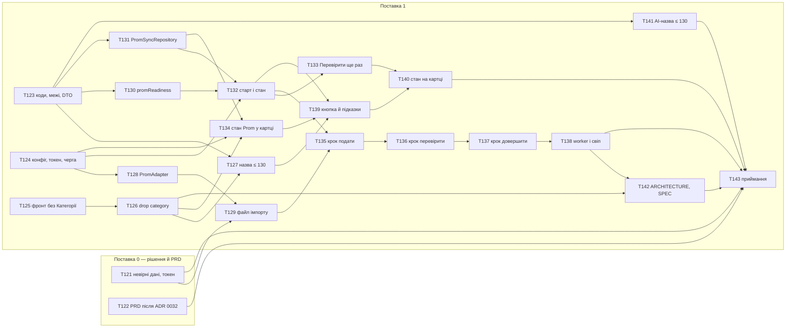

# Task breakdown — prom-draft-sync

> **Вхід:** [PRD](../PRD.md) · [sad.md](../sad.md) · [adr/](../adr/) 0027–0032 · [data-model.md](../data-model.md) · [contracts/openapi.yaml](../contracts/openapi.yaml) · [contracts/api-sync-report.md](../contracts/api-sync-report.md) · [contracts/events.md](../contracts/events.md)
> **Вихід:** цей файл · [tracker.md](tracker.md) · 23 story у цій теці.
> **Скіл:** `feature-break-tasks` (локальний стейдж 06). Перевірка gate:
> `python3 .claude/skills/feature-break-tasks/references/gate-check.py docs/features/prom-draft-sync/tasks/`

## Розріз по поставках

[sad.md §1](../sad.md#1-introduction-and-goals) описує одну поставку розміру M, а видалення
«Категорії» — окремими story тієї ж поставки. Розбивка додає попереду поставку 0: два пункти, які
вирішує власник, а не код.

| Група | Обсяг | Задачі | Разом |
|---|---|---|---|
| **Поставка 0** | «Невірні дані» в звіті імпорту, токен і його нагляд; PRD після ADR 0032 | T121–T122 | ~0.5 д |
| **Поставка 1** | Контракт і конфігурація, видалення «Категорії», `marketplace`, маршрути, три кроки `worker`, фронт, AI-межа назви, документи, приймання | T123–T143 | ~11–15 д |

Разом ~3 тижні, у межах M «3–5 тижнів» з [sad.md §2](../sad.md#2-constraints). Story 23 замість
8–10 з оцінки idea-brief: дев'ять із них XS, бо контракт, конфігурацію, кожен крок `worker` і
кожен маршрут розрізано так, щоб PR лишався зеленим на обох застосунках.

## Задачі-гейти

- **Борг «до `break-tasks`»** з [§11](../sad.md#11-risks-and-technical-debt) закрито до розбивки
  контрольною відправкою 2026-10-10 і комітами `82786b9`, `87af1c2`: повтор для фото, лічильники
  звіту, звірка OpenAPI. Story під них не потрібна.
- **Відкриті питання.** Обидва Open items `data-model.md` і Section C звіту контракту (шаблон адреси
  кабінету, формат id імпорту) закрито тими самими комітами. Нові відкриті пункти —
  [T121](resolve-prom-import-questions.md), `decision`: «1 позиція містить невірні дані» у звіті
  кабінету блокує набір колонок файлу ([T129](build-prom-import-file.md)), а токен і його нагляд —
  приймання ([T143](verify-prom-draft-sync.md)).
- **PRD** ще описує «імпорт за посиланням»: [T122](align-prd-with-control-submission.md), `docs`.

## Звірка з репозиторієм (2026-10-10)

[sad.md §5](../sad.md#5-building-block-view) звірено з кодом на `87af1c2`. SAD не правився.
Розійшлося ось що:

1. **Частину §5 уже зроблено.** `products/prom-sync/PromSyncRun.ts`, міграція
   `1791630446458-create-prom-sync-runs.ts` і `PromSyncRun` в `ENTITIES` `.dependency-cruiser.cjs`
   є з PR #158. Story під них немає.
2. **Union `PromSyncErrorCode` має сім кодів, контракт — вісім.** Бракує `prom_sync_failed`
   (рішення №1 звіту контракту). Колонка без CHECK, тож це правка TypeScript у
   [T123](add-prom-sync-codes-and-limits.md), без міграції.
3. **`MarketplaceErrors.ts` з §5 не потрібен.** Відмови Prom — результати адаптера, а не винятки
   ([events.md](../contracts/events.md): «Жодна відмова Prom не кидається»). HTTP-класи відправки
   живуть у `products/ProductErrors.ts`, бо маршрути — у `products/prom-sync/`.
4. **Підготовка AI обрізає обидві назви до 200** (`PreparationService.singleLineTitle`,
   промпт `AnthropicAdapter`). §11 називає ризик, а §5 файлів не перелічує — це
   [T141](keep-ai-title-within-prom-limit.md).
5. **`api-error-message.ts` фронту — мапа на кожного викликача**, а не `Record` над усіма кодами.
   Нові HTTP-коди в T123 не змушують правити `web` у тому ж PR.
6. **Токен у дев-`.env`** (`PROM_TOKEN`) лишився після контрольної відправки, а §11 тримає його
   лише в проді. Прибирає [T121](resolve-prom-import-questions.md).

## Dependency graph



**Чому саме такі ребра.** T125 → T126: фронт перестає використовувати `category`, поки тип її ще
має, і жоден PR не ламає typecheck `web`. T126 → T127 і T126 → T134 — файлові, а не логічні: усі
три правлять `products.contract.ts` і мапінг картки. T121 → T129: набір колонок файлу залежить від
того, що кабінет назвав «невірними даними». T127 → T139: обидві правлять `product-form`.

**ASCII — той самий граф топологічними рівнями.** Рівень N починається лише після мержу всього
рівня N-1, а всередині рівня задачі незалежні.

```
рівень 0 │ T121 T122 T123 T124 T125   ← поставка 0 і основа поставки 1
рівень 1 │ T126 T128 T130 T131 T141
рівень 2 │ T127 T129 T132 T134
рівень 3 │ T133 T135 T139
рівень 4 │ T136 T140
рівень 5 │ T137
рівень 6 │ T138
рівень 7 │ T142
рівень 8 │ T143                       ← приймання
```

Критичний шлях — T124 → T128 → T129 → T135 → T136 → T137 → T138 → T142 → T143: адаптер і три кроки
`worker` ідуть строго один за одним. Паралельно йдуть «Категорія» (T125 → T126 → T127), маршрути
(T130, T131 → T132 → T133) і фронт (T139 → T140).

**Граф ациклічний.** Скрипт перевірив і `blocks`, і `blocked_by` у кожній story: вони точно
обернені одне до одного, висячих ID немає.

## Вісім структурних gate

| # | Gate | Мінімум | Де в story |
|---|---|---|---|
| 1 | Лінк на sequence у `sad.md` §6 | ≥ 1, дослівно | `## Sequence` |
| 2 | Data delta | розділ | `## Data delta` |
| 3 | Excerpt контракту | ≥ 1 ```` ```yaml ````, дослівно | `## API contract excerpt` |
| 4 | AC Given/When/Then | ≥ 2 | `## Acceptance criteria` |
| 5 | Атомарні кроки | ≥ 3 | `## Checklist` |
| 6 | `context_budget` | ≤ 5000, виміряно | frontmatter |
| 7 | `blocks` + `blocked_by` | обидва | frontmatter |
| 8 | Повний frontmatter | 11 ключів | frontmatter |

**`gate_profile`, відмінний від `implementation`:** у [T121](resolve-prom-import-questions.md) це
`decision`, у T122 і [T142](update-architecture-for-prom.md) — `docs`, у
[T143](verify-prom-draft-sync.md) — `verification`.

## Розбіжності з дефолтами скіла

| Дефолт скіла | Тут | Чому |
|---|---|---|
| Борг «до `break-tasks`» стає story поставки 0 | закрито до розбивки двома `docs`-комітами | Контрольна відправка на живому магазині вже відбулася й дала результати. Story «записати вже записане» нічого б не блокувала |
| Open items і Section C — окрема `decision`-story | закрито тими самими комітами; нова `decision`-story T121 — під нові пункти | Старі пункти власник вирішив, і відповідь уже в документах |
| `ARCHITECTURE.md` — «разом з першим файлом `marketplace`» (sad.md §11) | окрема story T142 після коду; кореневий `CLAUDE.md` — у T128 | `CLAUDE.md` прямо забороняє код Prom, тож без нього T128 не пройде рев'ю. Таблиця модулів `ARCHITECTURE.md` описує змерджене, тож її правлять після коду, як T117 у price-range-search |
| `CONTEXT.md` фічі — п'ять розділів | лишається з одним Glossary | Скіл пише `CONTEXT.md` лише тоді, коли його немає. Файл є з етапу 03, а інваріанти фічі вже живуть у ADR і `data-model.md` |
| Нумерація story з T01 | T121–T143 | Продовжує наскрізну нумерацію репозиторію (price-range-search закінчився на T120) |

## Tasks

### Поставка 0 — рішення й PRD

| ID | Title | blocked_by | Est | Owner |
|----|-------|------|-----|-------|
| [T121](resolve-prom-import-questions.md) | Розібрати «невірні дані» імпорту Prom і закрити питання токена | — | XS | Serhii |
| [T122](align-prd-with-control-submission.md) | Узгодити PRD з ADR 0032 і закритими питаннями | — | XS | Serhii |

### Поставка 1

| ID | Title | blocked_by | Est | Owner |
|----|-------|------|-----|-------|
| [T123](add-prom-sync-codes-and-limits.md) | Коди, межі Prom і DTO відправки в контракті | — | S | Serhii |
| [T124](add-prom-config-and-queue.md) | Конфігурація Prom, токен і черга prom-sync | — | XS | Serhii |
| [T125](remove-category-from-web.md) | Прибрати поле «Категорія» і фільтр каталогу з фронту | — | S | Serhii |
| [T126](drop-product-category.md) | Видалити `products.category` з БД, контракту й API | T125 | S | Serhii |
| [T127](limit-prom-title-on-save.md) | Назва для Prom ≤ 130 знаків при збереженні картки | T123, T126 | XS | Serhii |
| [T128](add-prom-adapter.md) | Модуль `marketplace` і `PromAdapter` | T124 | S | Serhii |
| [T129](build-prom-import-file.md) | `buildPromImportFile`: xlsx з одного рядка картки | T121, T128 | S | Serhii |
| [T130](add-prom-readiness.md) | `promReadiness`: чого бракує картці для Prom | T123 | XS | Serhii |
| [T131](add-prom-sync-repository.md) | `PromSyncRepository` і «одна активна на картку» | T123 | S | Serhii |
| [T132](start-prom-sync-run.md) | Старт і стан відправки | T124, T130, T131 | S | Serhii |
| [T133](recheck-prom-sync-run.md) | «Перевірити ще раз» для `prom_timeout` | T132 | XS | Serhii |
| [T134](show-prom-state-on-card-read.md) | Картка віддає `promId`, посилання й останню відправку | T124, T126, T131 | S | Serhii |
| [T135](submit-prom-import.md) | Крок «подати» | T129, T132 | S | Serhii |
| [T136](check-prom-import-status.md) | Крок «перевірити» | T135 | S | Serhii |
| [T137](finish-prom-draft.md) | Крок «довершити» | T136 | S | Serhii |
| [T138](close-stuck-prom-sync-runs.md) | `worker`: підписка на prom-sync і свіп | T137 | XS | Serhii |
| [T139](add-prom-sync-button.md) | Кнопка «Синхронізувати з Prom» і підказки меж | T127, T132, T134 | S | Serhii |
| [T140](show-prom-sync-result.md) | Стан відправки на картці | T133, T139 | S | Serhii |
| [T141](keep-ai-title-within-prom-limit.md) | Підготовка назви для Prom AI тримає межу 130 | T123 | XS | Serhii |
| [T142](update-architecture-for-prom.md) | `ARCHITECTURE.md`, `SPEC.md` і PRD product-creation-flow | T126, T138 | XS | Serhii |
| [T143](verify-prom-draft-sync.md) | Приймання: QG-1–QG-3 | T121, T122, T138, T140, T141, T142 | S | Serhii |

**Шкала:** XS ≤ 2 год, S ≤ 1 д; `M` і `L` не ставимо. Власник один на всі story, бо в системі
один-два адміни ([CONTEXT.md](../../../../CONTEXT.md), «user»).
